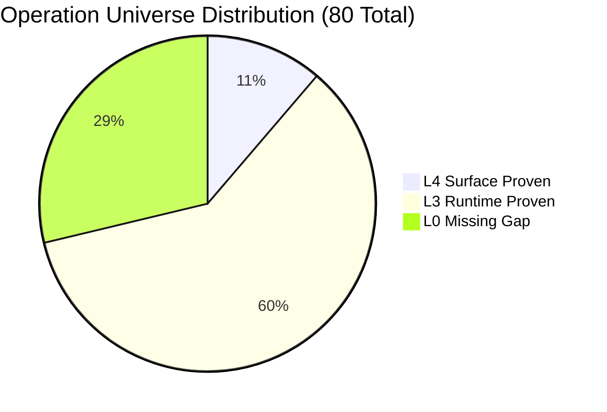
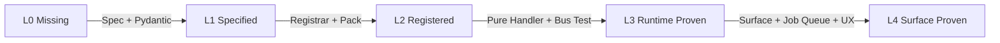

# L0–L4 Operation Capability Maturity Model

This document establishes the capability maturity ladder for the Nagar creative studio operations in the Nexus AI Agent architecture.

## 1. Maturity Level Definitions

| Level | Name | Definition | Required Evidence | System Visibility |
|---|---|---|---|---|
| **L0** | **NOT_IMPLEMENTED** | Operation is defined in the Product Catalog specification (`docs/NAGAR_70_OPERATIONS_TDD.md`) but has no runtime representation. | Product specification text only. | `EvidenceClass.MISSING` |
| **L1** | **SPECIFIED** | Typed Command schema defined (Pydantic model, input/output boundary, permission level). | Valid schema test in unit test suite. | Not in runtime registry |
| **L2** | **REGISTERED** | Registered in `CapabilityRegistry` with domain, capability, and registrar. | Entry in `build_runtime_registry().list_operations()`. | In-memory allow-list |
| **L3** | **RUNTIME_PROVEN** | Pure domain reducer implemented, deterministic outcome verified, command bus dispatched, history journaled. | Unit tests proving determinism and non-destructive immutability. | Tested runtime capability |
| **L4** | **SURFACE_PROVEN** | End-to-end user-reachable via Telegram commands, durable job queue, worker execution, or CLI invocation. | Integration test with simulated updates and render artifacts. | End-to-end production |

---

## 2. Evidence Classification Rules

Every operation record in `OPERATION_MATRIX.json` and `RECONCILIATION.json` is mapped to an authoritative `evidence_class`:

1. **`EvidenceClass.VERIFIED`**:
   - The operation is registered in the runtime registry (`build_runtime_registry()`).
   - Pure handler function exists and is callable.
   - Pydantic input model enforces `extra="forbid"`.
   - Unit tests execute the operation through `CommandBus` or direct handler calls with deterministic outcome assertion.
   - Currently applies to **57 operations** (48 L3, 9 L4).

2. **`EvidenceClass.MISSING`**:
   - The operation is documented in `docs/NAGAR_70_OPERATIONS_TDD.md` but does not exist in `build_runtime_registry()`.
   - No mock or fake stub is created.
   - Currently applies to **23 operations** (10 portrait, 10 scene, 3 color).

3. **`EvidenceClass.INFERRED`**:
   - Operation registered by name but missing direct execution proof in test suites.
   - Currently **0 operations** (all 57 registered operations have verified test coverage).

4. **`EvidenceClass.BLOCKED`**:
   - Operation whose execution or registration is blocked by external architectural conflicts (e.g., `BLOCKED_BY_CONTRACT_RECONCILIATION`).

---

## 3. Distribution Summary

### Breakdown by Category

| Category | Total Universe | L4 Surface Proven | L3 Runtime Proven | L0 Missing Gap |
|---|---:|---:|---:|---:|
| **timeline** | 11 | 3 | 8 | 0 |
| **caption** | 10 | 1 | 9 | 0 |
| **motion** | 10 | 0 | 10 | 0 |
| **audio** | 10 | 0 | 10 | 0 |
| **color** | 7 | 1 | 3 | 3 |
| **delivery** | 3 | 2 | 1 | 0 |
| **slideshow** | 6 | 2 | 4 | 0 |
| **media** | 2 | 0 | 2 | 0 |
| **system** | 1 | 0 | 1 | 0 |
| **portrait** | 10 | 0 | 0 | 10 |
| **scene** | 10 | 0 | 0 | 10 |
| **Total** | **80** | **9** | **48** | **23** |

---

## 4. Promotion Criteria: Advancing from L0 to L4

To advance an operation across maturity levels, the following evidence gate must be satisfied:

### L0 -> L1 (Specification Gate)
- Pydantic BaseModel input schema with `model_config = ConfigDict(extra="forbid")`.
- Permission level assignment (Level A Immediate, Level B Reversible, Level C Confirmation, Level D Denied).
- Reference resolution requirements defined.

### L1 -> L2 (Registration Gate)
- Declared in pack manifest `capabilities` list.
- Registered inside `nexus_ai_agent.creative.packs.<pack>.operations.register_*_operations`.
- Pack composed in `nexus_ai_agent.creative.packs.runtime.COMPOSITION`.
- `composition_issues()` returns empty findings.

### L2 -> L3 (Runtime Verification Gate)
- Pure handler function `(Project, OperationContext) -> OperationOutcome`.
- Immutability check: input `Project` is unchanged after execution.
- Determinism check: identical input yields byte-identical output or SHA-256 hash.
- Unit test suite executing command through `CommandBus.dispatch`.

### L3 -> L4 (Surface Verification Gate)
- Pure request mapping in `CreativeSurfaceMapper` (e.g., `bot/creative_surface.py`).
- Durable job queue registration with message-anchored idempotency key.
- Worker execution lane routing to render lane / ffmpeg executor.
- User feedback localized through `i18n` catalog (no raw error keys).
