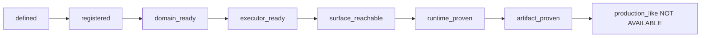

# L0–L4 Operation Capability Maturity Model

> **Corrected by Gate 2.2 (2026-09-24).** This page previously asserted that nine
> surface operations were `L4`/`SURFACE_PROVEN` and that all 57 registered
> operations were `runtime_proven`. Measurement falsified both; see
> [`audits/GATE22_OPERATION_TRUTH_AUDIT_2026-09-24.md`](audits/GATE22_OPERATION_TRUTH_AUDIT_2026-09-24.md)
> §6 and §8. The ladder below is kept as a **definition** and is fingerprinted by
> the gate, but it is no longer used to publish a level per operation: the
> machine-readable truth is the eight evidence layers in
> [`../OPERATION_TRUTH.json`](../OPERATION_TRUTH.json), each with its own
> predicate.

## 1. This ladder is one of three, and they disagree

The repository currently defines `L0..L4` three times, for three different
things, with incompatible semantics:

| Level | This page (operation maturity) | `architecture/COMMAND_CAPABILITY_CONTRACT.md` (contract slice) | `architecture/MODULE_MAP.md` (module maturity) |
|---|---|---|---|
| L0 | NOT_IMPLEMENTED — catalogue text only | design only | — |
| L1 | SPECIFIED — typed schema exists | code + unit/contract evidence | vocabulary, ports, studio core |
| L2 | REGISTERED — in the registry | reachable through a real entry point | packs |
| L3 | RUNTIME_PROVEN — pure reducer + bus dispatch | operational with real execution | core, application, observability |
| L4 | SURFACE_PROVEN — Telegram-reachable | production-like | — |

The first two columns are genuinely incompatible: `timeline.trim` is `L4` here
and `L2` there. **This is an open contract drift**, recorded in the projection
(`contract_drift → maturity_ladder_conflict`) and unresolved: choosing between a
*reachability* ladder and an *execution* ladder is an owner decision, not a
measurement.

`nexus_ai_agent.nagar.truth.MATURITY_VOCABULARY_SOURCES` fingerprints every
definition line in the three sources, so none of them can be edited — and no
fourth ladder can be added — without turning CI red.

## 2. The eight evidence layers actually used

Gate 2.2 replaced the single level token with eight independent predicates. A
layer is a *measurement*, not a stored flag, and each names the source that
decided it.

| Layer | Predicate | Measured (PR #70 baseline) |
|---|---|---|
| `defined` | the id is a row of the catalogue's seven pack tables | 70 |
| `registered` | `build_runtime_registry()` lists the id | 57 |
| `domain_ready` | its spec has a typed `extra="forbid"` input model, a named handler, and `deterministic = true` | 57 |
| `executor_ready` | the render lane has a `canonical_id == …` execution branch | 7 |
| `surface_reachable` | a live user-facing entrypoint reaches it | 12 |
| `runtime_proven` | Gate 4 recorded `Runtime = PASS` | **1** |
| `artifact_proven` | Gate 4 recorded `Artifact = PASS` | **1** |
| `production_like` | — | **NOT AVAILABLE** (no source defines it) |

The counts live in the generated projection, never in this page or in test code:
a hard-coded count turns a *correct* tree red the moment a sibling change lands
(the audited baseline's `57` becomes `77` once the vision packs land — see the
audit §9).

## 3. Claims, and their verification state

Every statement of fact about Nagar operations must carry one of five states:

| State | Meaning |
|---|---|
| `VERIFIED` | independently measured, and the measurement is reproducible |
| `PARTIALLY VERIFIED` | measured for part of the claim's scope, `NOT VERIFIED` for the rest |
| `INFERRED` | follows from a measurement but was not itself measured |
| `NOT VERIFIED` | asserted, but this gate could not measure it |
| `MISSING` | no implementation exists |
| `NOT AVAILABLE` | no source exists to measure it from |

Applied to the claims this page previously made:

| Previous claim | State | Corrected statement |
|---|---|---|
| "67 of 70 registered, 77 operations in 8 packs" (PR #69 appendix) | `VERIFIED` for PR #67/#69; not this tree | measured 77/67/3 by building the registry on those branches |
| "57 operations, 47 overlap, 23 gaps" (PR #70) | `VERIFIED` **on this baseline only** | same measurement, different tree |
| "9 surface operations verified in CI, L4" | `NOT VERIFIED` | the `9` was not derivable from any source; the derived surface is 12, and `artifact_proven` is 1 |
| "48 operations are L3 / RUNTIME_PROVEN" | `NOT VERIFIED` | the L3 predicate describes a pure reducer; it is not runtime proof. 56 of 57 registered operations have no runtime artifact |
| "all 57 registered operations have verified test coverage" | `PARTIALLY VERIFIED` | all 57 declare test files that literally name the operation (re-measured); "named in a test" is not "asserted end-to-end" |
| "`EvidenceClass.INFERRED` currently applies to 0 operations" | `INFERRED` | true only under the *test-naming* reading above |

## 4. Promotion gates

The gates are unchanged as *criteria*; what changed is that none of them may be
satisfied by a document.

* **→ `defined`** — the id is a row of a pack table in
  `NAGAR_70_OPERATIONS_TDD.md`.
* **→ `registered`** — `build_runtime_registry().list_operations()` contains it;
  `composition_issues() == ()`.
* **→ `domain_ready`** — a typed input model with `extra="forbid"`, a named
  handler, `deterministic = true`.
* **→ `executor_ready`** — the render lane has an execution branch for it
  (`render_jobs.py`), verified by executing the lane.
* **→ `surface_reachable`** — a live entrypoint reaches it through the
  `CommandBus`; verified by the surface probes, and by running the real path.
* **→ `runtime_proven` / `artifact_proven`** — Gate 4 records `PASS` for the
  Runtime / Artifact cell. No level token, no prose, and no registry entry can
  substitute.
* **→ `production_like`** — undefined. No repository source defines it and no
  measurement exists, so the layer reports `NOT AVAILABLE` for all 80
  operations. Closing it requires an owner to define it first.



**Each arrow is a separate measurement.** `registered` does not imply
`runtime_proven`, and `surface_reachable` does not imply `artifact_proven`; both
are asserted as *reachable counterexamples* in
`tests/architecture/test_operation_truth_gate.py`, so the gate fails if the
layers are ever collapsed into one.

## 5. Reproducing the numbers

```bash
python -m nexus_ai_agent.nagar            # summary
python -m nexus_ai_agent.nagar --check    # drift gate (must pass)
pytest -q tests/architecture/test_operation_truth_gate.py
```
