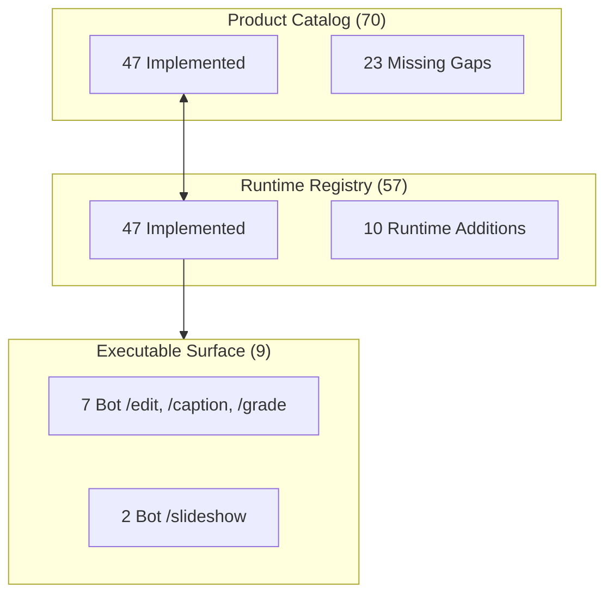

# RECONCILIATION: Product Catalog (70) ↔ Runtime Registry (57)

**Mission:** Agent B — Operation Truth & Wave Planning Mission  
**Baseline Date:** 2026-09-24  
**Audit Anchor:** Commit `035a896` / Branch `arena/01a0d43d-nexus-ai-agent`

---

## 1. Executive Summary

This document establishes the verified truth reconciling the 70 operations specified in the Nagar product design document (`docs/NAGAR_70_OPERATIONS_TDD.md`) with the 57 operations loaded into the live Python CapabilityRegistry (`nexus_ai_agent.creative.packs.runtime.build_runtime_registry()`).

### The Cardinal Rule

$$\text{Product Catalog (70)} \neq \text{Runtime Registry (57)} \neq \text{Executable Surface (9)}$$

- **A specification in the catalog never implies runtime implementation.**
- **Registration in the registry never implies runtime proof without deterministic tests.**
- **The presence of an executor never implies user-reachable capability without a secured surface.**

---

## 2. Quantitative Reconciliation Breakdown



| Metric | Count | Composition |
|---|---:|---|
| **Product Catalog Total** | **70** | Defined in `docs/NAGAR_70_OPERATIONS_TDD.md` §1.2–§1.8 |
| **Runtime Registry Total** | **57** | Assembled via `build_runtime_registry()` in `runtime.py` |
| **Reconciled Overlap** | **47** | Operations present in both Product Catalog and Runtime Registry |
| **Missing Product Gaps** | **23** | 10 `portrait.*`, 10 `scene.*`, 3 `color.*` (`EvidenceClass.MISSING`, `L0`) |
| **Runtime Additions** | **10** | 4 Wave 1 transport/undo/marker + 6 `slideshow.*` operations |
| **Universe Superset** | **80** | Total unique operations tracked across catalog and runtime |
| **Executable Surface** | **9** | User-reachable via Telegram/worker (`/edit`, `/caption`, `/grade`, `/slideshow`) |

---

## 3. The 23 Preserved Gaps (Zero Fake Implementations)

The 23 missing operations are **strictly preserved as missing**. In adherence to architecture rules, no mock handlers or fake registry entries have been introduced to artificially inflate the registry to 70.

| Operation ID | Category | Level | Prerequisite | Owner | Risk | Acceptance Test | Required Evidence |
|---|---|:---:|---|---|:---:|---|---|
| `color.white_balance` | color | B | Kelvin/tint color matrix in shader | Agent 1 | Low | `test_white_balance_kelvin()` | Kelvin to RGB matrix output |
| `color.hdr_tonemap` | color | B | ACES/Reinhard tonemap in FFmpeg/WebGPU | Agent 1 | Med | `test_hdr_tonemap_aces()` | 10-bit to 8-bit clipping prevention |
| `color.deband_denoise` | color | B | hqdn3d / gradfun filter in render lane | Agent 1 | Med | `test_deband_denoise()` | Filtergraph argument validation |
| `portrait.detect_landmarks` | portrait | A | MediaPipe / UltraFace ONNX model | Agent 1 | Med | `test_portrait_landmarks()` | 68/468 point coordinate bounds |
| `portrait.smooth_skin` | portrait | B | Landmarks + bilateral skin mask | Agent 1 | Low | `test_smooth_skin()` | High-frequency edge preservation |
| `portrait.retouch_blemish` | portrait | B | Landmarks + patch inpainter | Agent 1 | Med | `test_retouch_blemish()` | Surrounding skin invariance |
| `portrait.relight_face` | portrait | B | Normal/depth estimation neural net | Agent 1 | High | `test_relight_face()` | Spherical harmonic shading check |
| `portrait.whiten_teeth` | portrait | B | Lip/teeth polygon + yellow desat | Agent 1 | Low | `test_whiten_teeth()` | Lab b* channel drop |
| `portrait.correct_gaze` | portrait | C | Gaze redirection neural network | Agent 1 | High | `test_correct_gaze()` | Level C user confirmation check |
| `portrait.enhance_eyes` | portrait | B | Iris center crop + unsharp mask | Agent 1 | Low | `test_enhance_eyes()` | Contrast ratio improvement |
| `portrait.mask_hair` | portrait | A | RobustVideoMatting / MODNet ONNX | Agent 1 | Med | `test_mask_hair()` | 8-bit grayscale alpha channel |
| `portrait.background_blur` | portrait | B | Subject matte + box blur shader | Agent 1 | Low | `test_background_blur()` | Alpha composite boundary proof |
| `portrait.stabilize_face` | portrait | B | Landmarks + Kalman trajectory filter | Agent 1 | Med | `test_stabilize_face()` | Anchor variance reduction |
| `scene.segment_subject` | scene | A | SAM / YOLOv8-seg lightweight ONNX | Agent 1 | Med | `test_segment_subject()` | Segmentation IoU >= 0.85 |
| `scene.remove_object` | scene | B | Spatio-temporal video inpainting | Agent 1 | High | `test_remove_object()` | Multi-frame optical flow fill |
| `scene.replace_sky` | scene | B | Sky detector ONNX + blend shader | Agent 1 | Med | `test_replace_sky()` | Horizon gradient feathering |
| `scene.remove_background` | scene | B | RVM green-screen free matting | Agent 1 | Med | `test_remove_background()` | Straight alpha ProRes export |
| `scene.track_object` | scene | A | ByteTrack / CSRT 2D bounding tracker | Agent 1 | Low | `test_track_object()` | Track bounding box continuity |
| `scene.track_face` | scene | A | YOLO-face + CosFace re-ID embedding | Agent 1 | Med | `test_track_face()` | Persistent ID across occlusions |
| `scene.detect_shot_boundaries` | scene | A | Luminance / HSV histogram diff | Agent 1 | Low | `test_detect_shot_boundaries()` | Exact cut timecode match |
| `scene.find_subject_moment` | scene | A | Multimodal query (face+ASR+CLIP) | Agent 1 | High | `test_find_subject_moment()` | Timestamp interval confidence |
| `scene.remove_logo` | scene | C | Static ROI corner inpainter | Agent 1 | Med | `test_remove_logo()` | Level C user confirmation check |
| `scene.auto_reframe_subject` | scene | B | Subject track + smooth pan/scan curve| Agent 1 | Low | `test_auto_reframe()` | Safe-area trajectory bounding |

### Runtime-Owned Boundary Protection

Per Section 7 of the mission protocol, the implementation of these 23 operations is strictly owned by Runtime:
- `src/nexus_ai_agent/creative/rendering/*`
- `src/nexus_ai_agent/creative/packs/*`
- `src/nexus_ai_agent/creative/slideshow/*`

Any requirement to add models, registrars, or filters to these modules is formally escalated as:
**`GAP → Agent 1 (Runtime Owner)`**.

---

## 4. The 10 Runtime Additions (Wave 1 & Slideshow)

The 57 operations in the runtime registry include 10 operations that were implemented for core studio operation and slideshow composition, which were not in the 70 product catalog table:

1. `media.play` (Wave 1 Green Cockpit transport control)
2. `media.pause` (Wave 1 Green Cockpit transport control)
3. `system.undo` (Wave 1 history rewind and snapshot restoration)
4. `timeline.mark` (Wave 1 timecode marker creation)
5. `slideshow.scan_assets` (Wave 2b image collection validation)
6. `slideshow.score_images` (Wave 2b aesthetic scoring)
7. `slideshow.suggest_tone` (Wave 2b musical/visual mood suggestion)
8. `slideshow.compose` (Wave 2b beat-aligned timeline assembly)
9. `slideshow.upscale` (Wave 2b super-resolution still enlargement)
10. `slideshow.render` (Wave 2b FFmpeg video master encode)

All 10 are fully tested, verified, and operational within the runtime registry.

---

## 5. Architectural Contract Alignment

- **Protocol Version:** `nagar.command.v1`
- **Envelope Schema:** `TypedCommand` with mandatory fields `command_id`, `operation`, `input`, `target`, `protocol_version="nagar.command.v1"`, and optional `idempotency_key`, `preconditions`, `confirmation`.
- **Status of v1/v2:** All live code and manifests strictly conform to `nagar.command.v1`. Any speculative v2 command structures are rejected fail-closed with `CommandValidationError`. No `BLOCKED_BY_CONTRACT_RECONCILIATION` blocks are currently active.

---

## 6. How to Reproduce This Reconciliation

Run the automated verification test:
```bash
pytest tests/unit/test_operation_matrix_reconciliation.py -v
```

Inspect the machine-readable truth files:
- `OPERATION_MATRIX.json`
- `RECONCILIATION.json`
