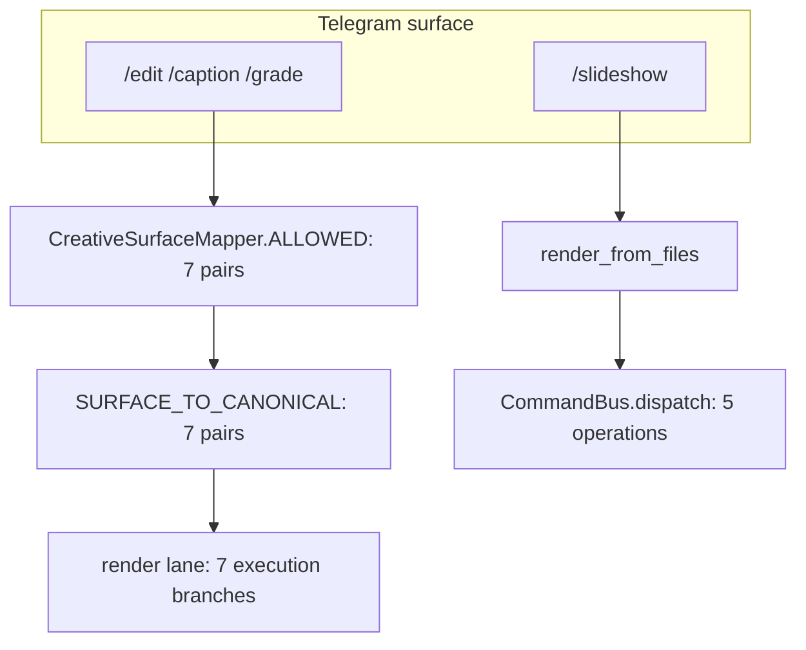

# Operation Truth: catalogue ↔ runtime ↔ surface reconciliation

> **Corrected by Gate 2.2 (2026-09-24).** This page previously reported a fixed
> `70 / 57 / 47 / 23 / 10 / 80` reconciliation with an "Executable Surface (9)"
> and described it as the product's numbers. Measurement showed that (a) the
> surface figure was not derivable from any source, and (b) `57` is true only on
> this baseline — the open PR #67/#69 report `77`. The numbers below are
> **measured per tree**, and the machine-readable form lives in
> [`../OPERATION_TRUTH.json`](../OPERATION_TRUTH.json). Full audit:
> [`audits/GATE22_OPERATION_TRUTH_AUDIT_2026-09-24.md`](audits/GATE22_OPERATION_TRUTH_AUDIT_2026-09-24.md).

## 1. Sources

Exactly three, and nothing else:

| Source | Read from |
|---|---|
| Product catalogue | `docs/NAGAR_70_OPERATIONS_TDD.md`, seven pack tables, document order (`T01..T70`) |
| Live runtime registry | `build_runtime_registry().list_operations()` |
| Live executable surface | `CreativeSurfaceMapper.ALLOWED` + `SURFACE_TO_CANONICAL` + the `/slideshow` dispatch call sites |

Matrix, reconciliation, maturity and documentation are **projections** of these.
A projection is never an input to another projection — that is the
`JSON → Markdown → JSON → assertion` loop Gate 2.2 removes.

## 2. The arithmetic

```
catalog = |C|        runtime = |R|        overlap = |C ∩ R|
missing = |C − R|    runtime_only = |R − C|    universe = |C ∪ R|
```

## 3. Measured, per tree

| Metric | PR #70 baseline (this branch) | PR #67 / PR #69 (worktree) |
|---|---:|---:|
| `catalog = \|C\|` | 70 | 70 |
| `runtime = \|R\|` | **57** | **77** |
| `overlap = \|C ∩ R\|` | **47** | **67** |
| `missing = \|C − R\|` | **23** | **3** |
| `runtime_only = \|R − C\|` | 10 | 10 |
| `universe = \|C ∪ R\|` | 80 | 87 |
| composed packs | 6 | 8 |
| `composition_issues()` | `()` | `()` |

Both trees share the same base commit `035a896d…`. The difference is PR #67/#69's
`nexus.vision.portrait` and `nexus.vision.scene` packs, which register ten
operations each and **implement twenty of this baseline's twenty-three declared
gaps**. PR #69's own TDD appendix states the same figures.

**Consequence:** `57 / 47 / 23` is a property of *this baseline*, not of the
product. Any test or document that hard-codes it breaks on the integrated tree —
see `tests/unit/test_operation_matrix_reconciliation.py`'s removal in audit §16.

## 4. Catalogue gaps on this baseline (preserved, never stubbed)

23 ids, by category:

| Category | Count | Ids |
|---|---:|---|
| `portrait` | 10 | `background_blur`, `correct_gaze`, `detect_landmarks`, `enhance_eyes`, `mask_hair`, `relight_face`, `retouch_blemish`, `smooth_skin`, `stabilize_face`, `whiten_teeth` |
| `scene` | 10 | `auto_reframe_subject`, `detect_shot_boundaries`, `find_subject_moment`, `remove_background`, `remove_logo`, `remove_object`, `replace_sky`, `segment_subject`, `track_face`, `track_object` |
| `color` | 3 | `deband_denoise`, `hdr_tonemap`, `white_balance` |

No mock, stub or fake registration closes one. Mutation probe B exists to keep it
that way.

## 5. Runtime-only operations (10)

Four Wave-1 core operations (`media.play`, `media.pause`, `system.undo`,
`timeline.mark`) plus six `slideshow.*` operations. They are dispatchable but
never named in the catalogue — a different gap, from the catalogue's side.

## 6. The executable surface: 12, derived



| Probe | Count | Source |
|---|---:|---|
| `surface_allow_list` | 7 | what the surface itself accepts |
| `worker_closed_set` | 7 | what the worker will dispatch or refuse |
| `slideshow_entrypoint` | 5 | `bus.dispatch(_command(OPERATION_*, …))` call sites in `creative/slideshow/service.py` |

The first two must agree **exactly**; a disagreement is recorded as
`surface_contract_drift`. The third is a different, additional set reached
through the `/slideshow` handler, and is confirmed by executing the real path
(`tests/unit/test_operation_truth_runtime_confirmation.py`).

**Derived surface = 7 + 5 = 12.** The previously published `9` mixed the first
set with a hard-coded literal for two slideshow operations and omitted the other
three.

## 7. Reproducing

```bash
python -m nexus_ai_agent.nagar            # 70/57/47/23/10/80, surface 12, artifact-proven 1
python -m nexus_ai_agent.nagar --check    # drift gate
```

```bash
# the cross-tree hazard
git worktree add --detach /tmp/wt69 <PR#69 head>
PYTHONPATH=/tmp/wt69/src python -c \
  "from nexus_ai_agent.creative.packs.runtime import build_runtime_registry as b; \
   print(len(b().list_operations()))"     # 77
```
