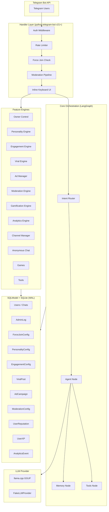
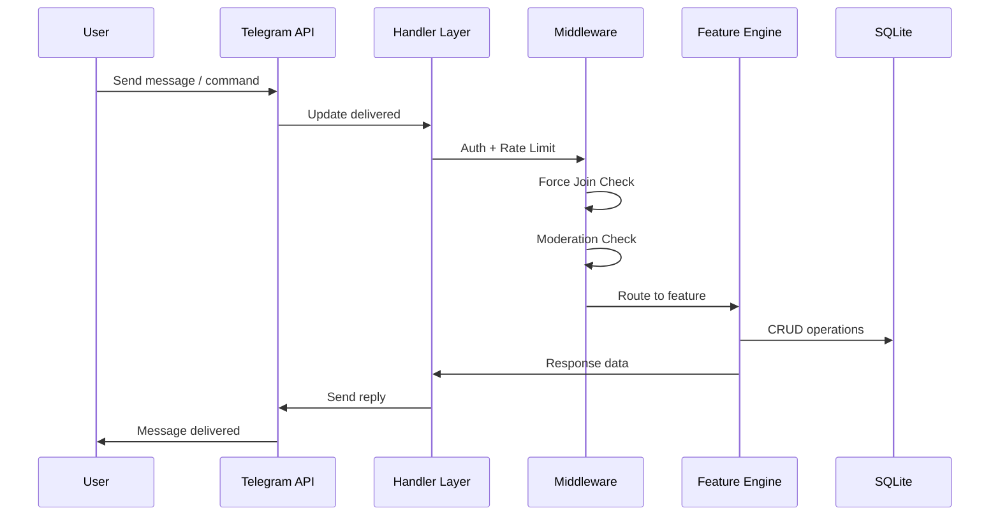
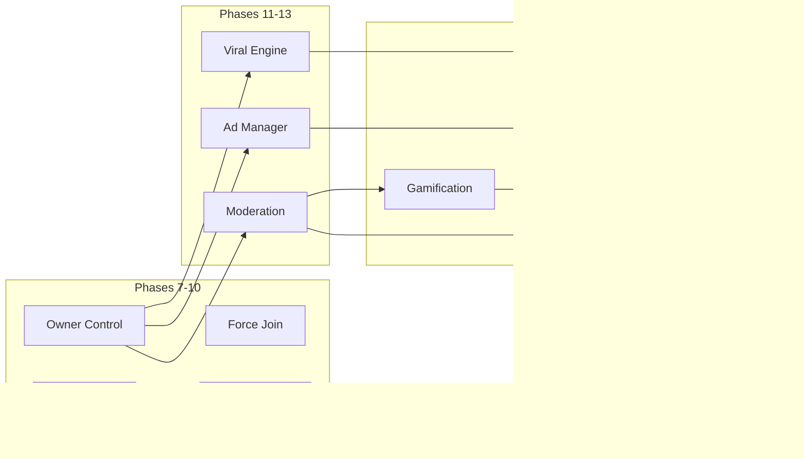
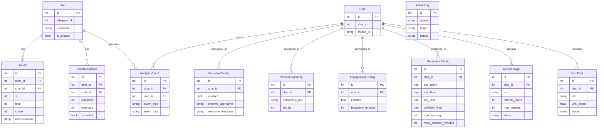

# NEXUS AI v1.3.0 — Architecture Diagram

## System Overview

```mermaid
graph TB
    subgraph Telegram["Telegram Bot API"]
        TG[Telegram Users]
    end

    subgraph Handlers["Handler Layer (python-telegram-bot v21+)"]
        AUTH[Auth Middleware]
        RATE[Rate Limiter]
        FJ[Force Join Check]
        MOD[Moderation Pipeline]
        MENU[Inline Keyboard UI]
    end

    subgraph Core["Core Orchestration (LangGraph)"]
        ROUTER[Intent Router]
        AGENT[Agent Node]
        MEMORY[Memory Node]
        TOOLS[Tools Node]
    end

    subgraph Features["Feature Engines"]
        OWN[Owner Control]
        PERS[Personality Engine]
        ENG[Engagement Engine]
        VIR[Viral Engine]
        ADS[Ad Manager]
        MD[Moderation Engine]
        GAM[Gamification Engine]
        ANA[Analytics Engine]
        CH[Channel Manager]
        ANON[Anonymous Chat]
        GAMES[Games]
        TOOL[Tools]
    end

    subgraph DB["SQLModel + SQLite (WAL)"]
        USERS[Users / Chats]
        ADMIN[AdminLog]
        FJC[ForceJoinConfig]
        PC[PersonalityConfig]
        EC[EngagementConfig]
        VP[ViralPost]
        AC[AdCampaign]
        MC[ModerationConfig]
        UR[UserReputation]
        XP[UserXP]
        AE[AnalyticsEvent]
    end

    subgraph LLM["LLM Provider"]
        LLAMA[llama.cpp GGUF]
        FAKE[FakeLLMProvider]
    end

    TG --> AUTH
    AUTH --> RATE
    RATE --> FJ
    FJ --> MOD
    MOD --> MENU

    MENU --> ROUTER
    MENU --> Features

    ROUTER --> AGENT
    AGENT --> MEMORY
    AGENT --> TOOLS
    AGENT --> LLM

    Features --> DB
    Core --> DB
```

## Data Flow

```mermaid
sequenceDiagram
    participant U as User
    participant T as Telegram API
    participant H as Handler Layer
    participant M as Middleware
    participant F as Feature Engine
    participant DB as SQLite

    U->>T: Send message / command
    T->>H: Update delivered
    H->>M: Auth + Rate Limit
    M->>M: Force Join Check
    M->>M: Moderation Check
    M->>F: Route to feature
    F->>DB: CRUD operations
    F->>H: Response data
    H->>T: Send reply
    T->>U: Message delivered
```

## Feature Dependencies

```mermaid
graph LR
    subgraph Phase7_10["Phases 7-10"]
        OC[Owner Control]
        FJ[Force Join]
        PE[Personality]
        EE[Engagement]
    end

    subgraph Phase11_13["Phases 11-13"]
        VE[Viral Engine]
        AM[Ad Manager]
        ME[Moderation]
    end

    subgraph Phase14_16["Phases 14-16"]
        GE[Gamification]
        AE[Analytics]
        UI[Advanced UI]
    end

    OC --> VE
    OC --> AM
    OC --> ME
    PE --> EE
    ME --> GE
    GE --> AE
    AE --> UI
    VE --> UI
    AM --> UI
    ME --> UI
```

## Database Schema

```mermaid
erDiagram
    User ||--o{ UserXP : has
    User ||--o{ UserReputation : has
    User ||--o{ AnalyticsEvent : generates
    Chat ||--o{ ForceJoinConfig : configured_in
    Chat ||--o{ PersonalityConfig : configured_in
    Chat ||--o{ EngagementConfig : configured_in
    Chat ||--o{ ModerationConfig : configured_in
    Chat ||--o{ AdCampaign : contains
    Chat ||--o{ ViralPost : contains
    Chat ||--o{ AnalyticsEvent : tracks

    User {
        int id PK
        int telegram_id
        string username
        bool is_allowed
    }

    Chat {
        int id PK
        int chat_id
        string thread_id
    }

    AdminLog {
        int id PK
        string action
        string target
        string details
    }

    ForceJoinConfig {
        int id PK
        int chat_id FK
        bool enabled
        string channel_username
        string welcome_message
    }

    PersonalityConfig {
        int id PK
        int chat_id FK
        string personality_key
        int set_by
    }

    EngagementConfig {
        int id PK
        int chat_id FK
        bool enabled
        int frequency_minutes
    }

    ViralPost {
        int id PK
        int chat_id FK
        string text
        float viral_score
        string status
    }

    AdCampaign {
        int id PK
        int chat_id FK
        string text
        int interval_hours
        int max_repeats
        string status
    }

    ModerationConfig {
        int id PK
        int chat_id FK
        bool anti_spam
        bool anti_flood
        bool link_filter
        bool profanity_filter
        int max_warnings
        int mute_duration_minutes
    }

    UserReputation {
        int id PK
        int user_id FK
        int chat_id FK
        int reputation
        int warnings
        bool is_muted
    }

    UserXP {
        int id PK
        int user_id FK
        int chat_id FK
        int xp
        int level
        int streak
        string achievements
    }

    AnalyticsEvent {
        int id PK
        int chat_id FK
        int user_id FK
        string event_type
        string event_data
    }
```
