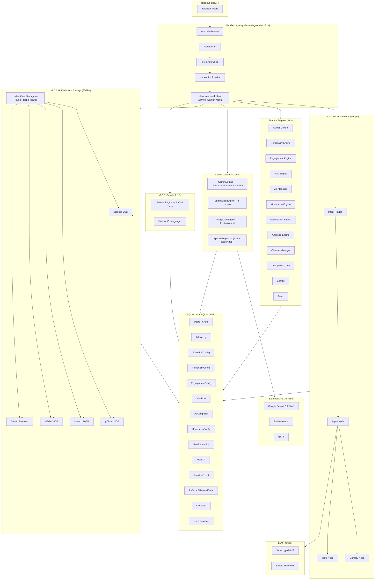
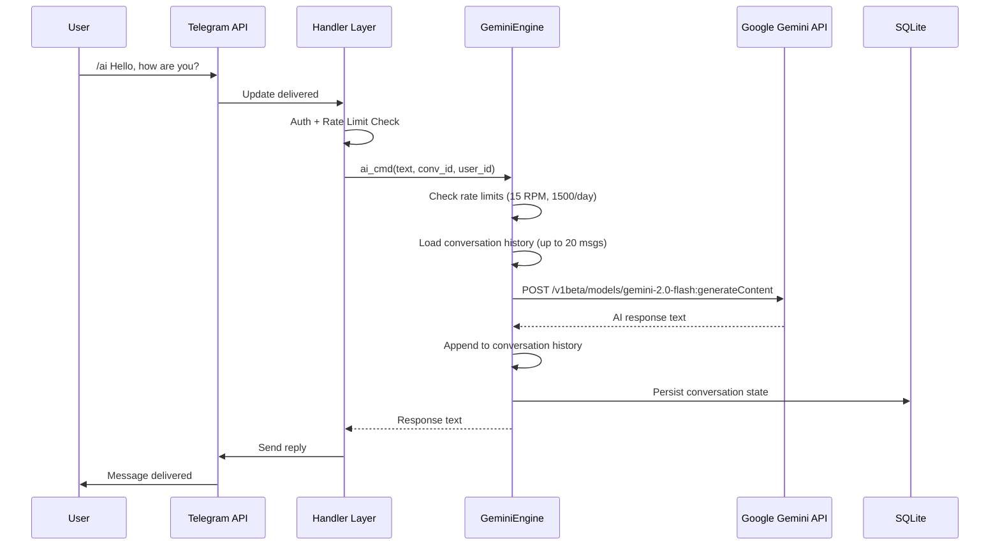
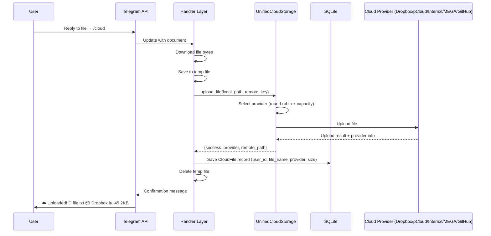
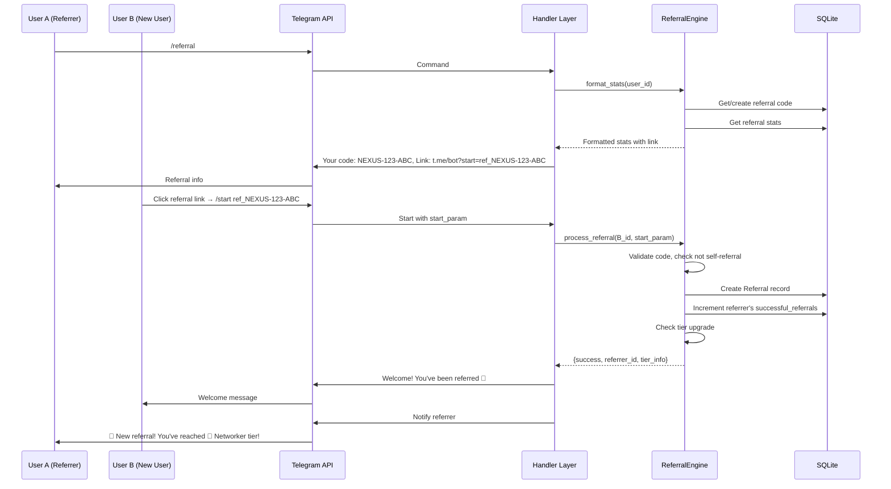
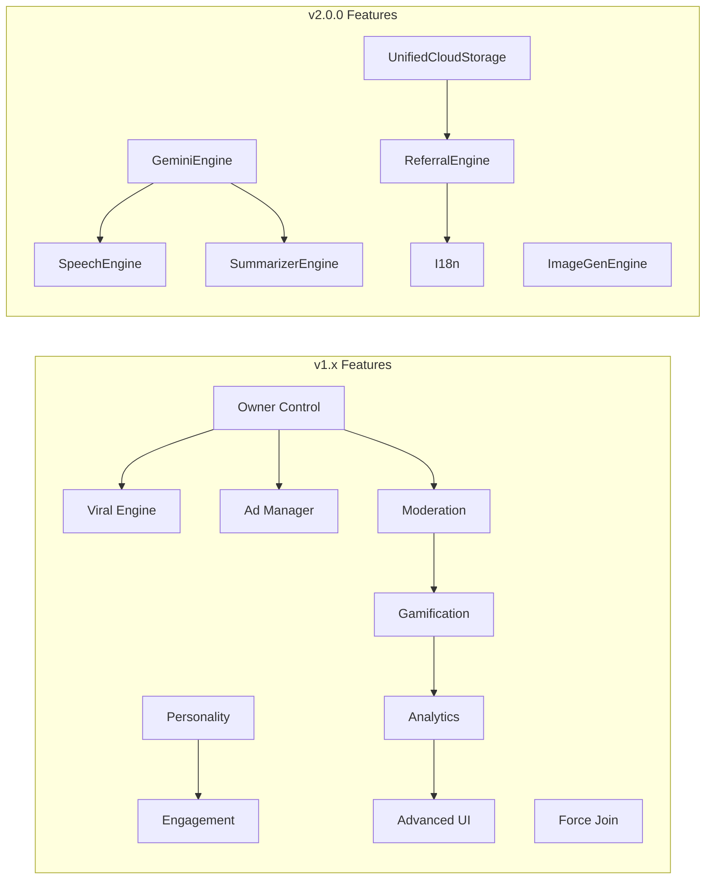

# NEXUS AI v2.0.0 — Architecture Diagram

## System Overview



## Data Flow — v2.0.0 AI Chat



## Data Flow — v2.0.0 Cloud Upload



## Data Flow — v2.0.0 Referral System



## Feature Dependencies — v2.0.0



## Database Schema — v2.0.0

```mermaid
erDiagram
    User ||--o{ UserXP : has
    User ||--o{ UserReputation : has
    User ||--o{ AnalyticsEvent : generates
    User ||--o{ ReferralCode : has
    User ||--o{ UserLanguage : prefers
    User ||--o{ CloudFile : owns
    Chat ||--o{ ForceJoinConfig : configured_in
    Chat ||--o{ PersonalityConfig : configured_in
    Chat ||--o{ EngagementConfig : configured_in
    Chat ||--o{ ModerationConfig : configured_in
    Chat ||--o{ AdCampaign : contains
    Chat ||--o{ ViralPost : contains
    Chat ||--o{ AnalyticsEvent : tracks
    ReferralCode ||--o{ Referral : generates

    User {
        int id PK
        int telegram_id
        string username
        bool is_allowed
    }

    ReferralCode {
        int id PK
        int user_id FK
        string code UK
        int total_referrals
        int successful_referrals
    }

    Referral {
        int id PK
        int referrer_id FK
        int referee_id FK_UK
        string referral_code
        string status
        bool reward_claimed
    }

    UserLanguage {
        int id PK
        int user_id FK_UK
        string language
    }

    CloudFile {
        int id PK
        int user_id FK
        string file_name
        string provider
        string remote_path
        int file_size
    }
```

## v2.0.0 API Rate Limits

| API | Free Tier | Rate Limit | Daily Limit |
|-----|-----------|------------|-------------|
| Google Gemini 2.0 Flash | Free | 15 RPM | 1,500 requests/day |
| Pollinations.ai | Free | Unlimited | Unlimited |
| gTTS | Free | Unlimited | Unlimited |
| Dropbox API | Free (2GB) | 100 requests/min | — |
| pCloud API | Free (10GB) | — | — |
| Internxt API | Free (10GB) | — | — |

## v2.0.0 Referral Reward Tiers

| Tier | Title | Referrals | Reward | XP |
|------|-------|-----------|--------|-----|
| 🥉 | Inviter | 1 | Referral Badge | 50 |
| 🥈 | Networker | 3 | 3 Days Premium | 150 |
| 🥇 | Star | 5 | 7 Days Premium | 300 |
| 💎 | Diamond | 10 | 30 Days Premium + Unlimited AI | 500 |
| 👑 | Legendary | 25 | VIP Lifetime + Special Badge | 1,000 |
| 🚀 | Viral Master | 50 | Co-Owner + All Features | 2,500 |
