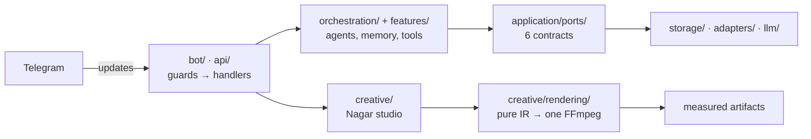

# NEXUS AI — Architecture (front door)

**Release baseline:** v3.13.0 · **Verified against:** `main` @ `7573249` · **Index:** [`docs/README.md`](README.md)

NEXUS AI Agent is a single-process, offline-first multi-agent system with two products on one runtime: a **Telegram assistant surface** and **Nagar**, a typed creative studio that compiles pure pack operations into deterministic FFmpeg renders. It is a **modular monolith**: one process, one logical data model (SQLite locally, PostgreSQL/Neon when deployed), and no broker.

```mermaid
flowchart LR
    tg["Telegram"] -->|updates| surf["bot/ · api/<br/>guards → handlers"]
    surf --> orch["orchestration/ + features/<br/>agents, memory, tools"]
    surf --> studio["creative/<br/>Nagar studio"]
    orch --> ports["application/ports/<br/>6 contracts"]
    studio --> lanes["creative/rendering/<br/>pure IR → one FFmpeg"]
    ports --> infra["storage/ · adapters/ · llm/"]
    lanes --> artifacts["measured artifacts"]
```

## Read in this order

| # | Document | Answers |
|---|---|---|
| 1 | [`architecture/OVERVIEW.md`](architecture/OVERVIEW.md) | What is this? Who cares about what? Which five quality attributes bind it, and which constraints are frozen? (C4 level 1–2) |
| 2 | [`architecture/MODULE_MAP.md`](architecture/MODULE_MAP.md) | What may import what — and which test fails when a boundary is crossed |
| 3 | [`architecture/RUNTIME_FLOWS.md`](architecture/RUNTIME_FLOWS.md) | What happens on a message, a slideshow job, a render, a migration, a webhook cold start — including the failure contract |
| 4 | [`architecture/CREATIVE_STUDIO.md`](architecture/CREATIVE_STUDIO.md) | The Nagar capability model, the seven packs, the honest coverage ledger, the render lane |
| 5 | [`architecture/DATA_AND_STORAGE.md`](architecture/DATA_AND_STORAGE.md) | Every store, who owns it, how it is migrated, and what never enters it |
| 6 | [`architecture/SECURITY.md`](architecture/SECURITY.md) | Trust boundaries, STRIDE → control → test evidence, P0 audit follow-through |
| 7 | [`architecture/OBSERVABILITY.md`](architecture/OBSERVABILITY.md) | Logs, metrics, health semantics, and the short list of things worth alerting on |
| 8 | [`architecture/TESTING.md`](architecture/TESTING.md) | Taxonomies, the four gates, determinism rules, honest gaps |
| 9 | [`architecture/PORTS.md`](architecture/PORTS.md) | The six hexagonal ports and their invariants |
| 10 | [`architecture/REFERENCES.md`](architecture/REFERENCES.md) | The external standards this documentation follows (C4, arc42, MADR, fitness functions) |

**Persian navigation summary:** [`architecture/OVERVIEW.fa.md`](architecture/OVERVIEW.fa.md).

## Adjacent records

| Document | Role |
|---|---|
| [`DECISION_LOG.md`](DECISION_LOG.md) | the authoritative, dated history of every architecture decision (wins over any summary) |
| [`architecture/adr/`](architecture/adr/README.md) | doc-layer decisions (how this documentation is produced and enforced) |
| [`NAGAR_70_OPERATIONS_TDD.md`](NAGAR_70_OPERATIONS_TDD.md) | the Phase-6 creative-studio technical design baseline (71 operation ids) |
| [`architecture/DATA_LIFECYCLE.md`](architecture/DATA_LIFECYCLE.md), [`architecture/RETENTION_DECISION.md`](architecture/RETENTION_DECISION.md) | data-lifecycle contract and retention policy |
| [`architecture/LLM_PROVIDERS.md`](architecture/LLM_PROVIDERS.md) | provider chain, cooldowns, strict-privacy behaviour |
| [`ROADMAP_STATUS.md`](../ROADMAP_STATUS.md) · [`REQUIREMENTS_LEDGER.md`](../REQUIREMENTS_LEDGER.md) · [`AGENTS.md`](../AGENTS.md) | roadmap state, requirement ledger, multi-agent protocol |
| [`../README.md`](../README.md) | product overview, command reference, quick start |
| [`history/architecture-v2.0.0.md`](history/architecture-v2.0.0.md) | archived v2.0.0 diagram (traceability only — not a source of truth) |

## Conventions

- **Living views** (`docs/architecture/*.md`) are updated in place; a stale sentence is a bug fixed in the same PR that invalidated it.
- **Dated records** (`docs/audits/`, `docs/history/`) are immutable history.
- Every boundary rule names the **test** that enforces it; every number in these pages can be regenerated with the commands in [`architecture/TESTING.md`](architecture/TESTING.md) §6.
- English is canonical; [`architecture/OVERVIEW.fa.md`](architecture/OVERVIEW.fa.md) is a navigation summary that defers to it on conflict.
- `tests/unit/test_docs_integrity.py` fails when a document is unindexed, a link breaks, a diagram fence is unbalanced, or a placeholder survives.
