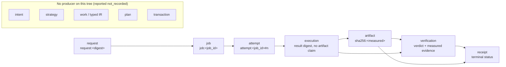

# The causal evidence ledger: durable history for creative execution

This page describes `nexus_ai_agent.causal` — the append-only, hash-chained
record of what the system observed itself do, and the Artifact Passport that
projects it. The ledger answers one question deterministically:

> **Exactly why and how did this artifact come into existence?**

It answers it by *reconciling three authorities* rather than trusting any one
record, and it refuses to answer when the evidence is not there.

## 1. The problem it closes

Before this layer, the creative chain's causal facts were durable but
scattered: the job row carried status, attempt (fencing token), payload and the
verification block; the artifact's identity was its bytes on disk; the
verification block carried the logical/spec/physical identities. Nothing bound
those facts into one ordered, tamper-evident history, and nothing could
reconstruct "which execution produced these bytes, under which fence, with
which measurement" for an arbitrary artifact. `jobs.lifecycle` and
`docs/architecture/JOB_LIFECYCLE.md` define the lifecycle; the causal layer
records the *history of a specific artifact* across it.

## 2. Sources of truth (one fact, one owner)

| Fact | Source of truth | The ledger's role |
|---|---|---|
| Job state, fencing token, idempotency key, result payload | `nexus_job_queue` row (`adapters/in_process_job_queue`) | Records what was committed, then cross-checks against the row |
| Artifact content | The bytes on disk (re-measured by `jobs.verification` and again by the passport) | Records the *measured* digest; re-measures before certifying |
| Causal order and integrity of the history | `nexus_ai_agent.causal` (`causal_journal` table) | Owns it exclusively; append-only; hash-chained |
| Authorization decision | *Nothing durable yet on this tree* | Reports `authority` as not recorded; never invents a grant |

The ledger is a **witness, not an authority**. It cannot change a job row, it
contains no `UPDATE` and no `DELETE` statement, and its SQL touches exactly one
table (`tests/architecture/test_causal_boundary.py`).

## 3. The record

Each record (`causal.models.CausalRecord`) is frozen and carries: `seq`,
`stage`, the `subject` node it states facts about, its `parents` (causal
edges), the asserting actor, the observed authority (if any), a whitelisted
facts object, the facts digest, the logical `record_key`, `recorded_at`,
`prev_hash` and `record_hash`.

Three laws do the work:

1. **Deterministic identity.** Node identities are derived from durable facts:
   `request:<digest>`, `job:<job_id>`, `attempt:<job_id>#<n>`,
   `execution:<job_id>#<n>`, `verification:<job_id>#<n>`,
   `receipt:<job_id>#<n>`, and — content-addressed — the artifact node **is**
   its measured `sha256:` digest.
2. **Idempotent append.** A record's logical identity (`record_key`) excludes
   volatile fields, so replaying the same committed fact (a retried
   observation after a lost acknowledgement) collapses onto the existing
   record instead of inventing a second one.
3. **Bounded, private facts.** Facts are whitelisted per stage, JSON-exact
   (no `NaN`/`Infinity`), one nesting level deep and size-capped. Unknown keys
   — a user id, a token, a blob — are refused at the boundary, never silently
   stored.

## 4. The graph model



The stage vocabulary is closed (`causal.models.Stage`) and already contains
the proposal/compiler stages, so whichever typed-intent contract lands can
record `intent → strategy → work → plan → transaction` without a schema
change. What the passport must **not** do is fill them in: on this tree they
have no producer, and a passport reports them as `not_recorded`.

The artifact node is created only from the verifier's *independent
measurement*, never from a handler's claim: an execution record deliberately
carries no artifact digest, size or path.

## 5. The passport: a projection, not a certificate mill

`causal.passport.PassportBuilder` builds an `ArtifactPassport` from the
journal, the queue row and freshly measured bytes:

* **no evidence → no passport.** Nothing in the journal mentions the subject
  ⇒ `PassportRefused("evidence_missing")`.
* **`COMPLETE`** means the three authorities agree: the chain verifies, the
  row's terminal attempt matches the recorded attempt, the row's digest equals
  the artifact node, the required stages are recorded, and the bytes on disk
  still hash to the artifact identity.
* **`PARTIAL` / `IN_FLIGHT` / `DIVERGED` / `UNPROVEN`** carry the reasons as
  typed `Divergence` entries — `journal_incomplete`, `attempt_unsettled`,
  `authority_disagreement`, `artifact_bytes_diverged`, `artifact_unreadable`,
  `artifact_from_failed_job`, `duplicate_request_with_different_payload`
  (informational: first payload won, no second effect), `superseded_attempt`.
* The passport carries its own content digest (`passport_id`). It is
  rebuildable at any time and is never the source of truth.

`causal.verify.verify_passport` is the independent judge: it recomputes the
passport's identity, refuses anything that is not `COMPLETE`, re-measures the
artifact's bytes with its own implementation, and reports
`passport_edited` / `passport_incomplete` / `chain_link_broken` /
`artifact_unreadable` / `artifact_digest_mismatch`. The producer of an
artifact is never the judge of its own output.

## 6. Failure behaviour (each row is a real test)

| Failure | What the ledger must show | Test |
|---|---|---|
| Process crash after execution, before the terminal commit | No artifact, no receipt; the settled attempt is a later one; still exactly one artifact | `tests/integration/test_causal_fault_injection.py::test_crash_after_execution_before_commit_recovers_without_second_artifact` |
| Lost enqueue acknowledgement | One durable job, one execution, one artifact; the retry collapses | `…::test_lost_enqueue_acknowledgement_produces_exactly_one_execution` |
| Stale execution (row taken over) | The stale execution is recorded, but only the owning attempt certifies evidence | `…::test_stale_execution_cannot_settle_the_row_or_record_an_artifact` |
| Corrupted input | A failure receipt and **no** artifact node | `…::test_corrupted_input_fails_closed_without_an_artifact_node` |
| Tampered history | Chain verification fails; the passport refuses; the artifact is untouched | `…::test_tampered_journal_refuses_and_leaves_the_artifact_intact` |
| In-place edit / interior deletion / truncation of the journal | Detected with the first bad sequence number; appends refuse to extend a broken chain | `tests/unit/test_causal_journal.py` |
| Duplicate request with a different payload | Recorded and explained; the first payload keeps the key | `tests/integration/test_causal_chain_e2e.py::test_conflicting_replay_is_explained_not_hidden` |
| Bytes altered after certification | `DIVERGED` on rebuild and `artifact_digest_mismatch` on verification of the stored passport | `…::test_artifact_path_lookup_and_tamper_detection` |
| Restart / reopen | The chain re-verifies and the passport rebuilds identically | `tests/unit/test_causal_journal.py::test_reopening_the_file_preserves_the_chain` |

The queue side of the integration is strictly fail-safe: an observer that
raises is logged with "evidence may be incomplete" and cannot delay, undo or
re-open a committed transition (`_observe` in
`adapters/in_process_job_queue.py`). Such a gap is *detectable*: the passport
cross-checks the row against the journal and reports `journal_incomplete`.

## 7. Honest limitations

* **No external anchor or secret.** The chain detects in-place edits, interior
  deletions, reordering and (with an anchor) truncation. An attacker able to
  rewrite the *entire* journal consistently can re-forge it — but cannot
  produce a verifying passport, because the artifact identity must also match
  the queue row and the bytes on disk. Anchoring a journal head in an external
  store is future work, and is named here rather than implied.
* **Authority is not recorded yet.** On this tree the authorization decision
  is enforced by the surface and the capability registry but is not persisted
  per job; every record therefore carries `authority = null` and the passport
  reports the authority as absent. Recording it truthfully requires the
  command/authorization contract to persist its decision first.
* **The proposal stages have no producer.** `intent`, `strategy`, `work`,
  `plan` and `transaction` are vocabulary and extension points, not
  implemented behaviour.

## 8. Enforcement

| Boundary | Test |
|---|---|
| The causal package cannot execute or reach the render lane, bus, compiler, LLM, storage or adapters | `tests/architecture/test_causal_boundary.py` |
| The journal is append-only and owns exactly one table | same file |
| The observer port is optional, post-commit and fail-safe | same file + `tests/integration/test_in_process_job_queue.py` |
| Passport laws, reconciliation and refusal | `tests/unit/test_causal_passport.py` |
| Journal laws (chain, idempotency, corruption, redaction) | `tests/unit/test_causal_journal.py` |
| The chain on real bytes (real FFmpeg, real queue, real verifier) | `tests/integration/test_causal_chain_e2e.py` |

## 9. Using it

```python
from nexus_ai_agent.causal import CausalJournal, CausalObserver, PassportBuilder, verify_passport

journal = CausalJournal("data/causal.sqlite")
queue = InProcessJobQueue(db_path, causal_observer=CausalObserver(journal))

passport = PassportBuilder(
    journal,
    job_reader,  # durable row facts: job_facts_from_chain_row(get_result_chain(...))
    allowed_roots=[creative_temp_dir],
).for_artifact(measured_sha256)

assert verify_passport(passport).ok
```
