# Nagar Command and Capability Contract

**Scope:** Gate 2 (board task-179), the canonical contract of the existing
`creative/studio/` command bus and capability registry — not a new renderer, a
new executor, or a UI. **Baseline:** `main` @
`035a896dd2ed1293de6accf2ef4309da2fd64c89` (2026-09-24, after PR#65).
Behaviour decision: [D-0013](../DECISION_LOG.md); governance record:
[ADR 0005](adr/0005-canonical-command-capability-contract.md).

## 1. Canonical decision

One envelope, one registry, one bus. The Gate 2 agent reports disagreed on the
contract identity; remote-verifiable evidence resolved the conflict in favour
of evolving the merged `TypedCommand` in place (§10).

### 1.1 Command identity

| Field | Meaning | Authority |
|---|---|---|
| `command_id` | transport identity of one delivery attempt; may rotate on redelivery | client-generated, unique per attempt |
| `operation` | operation id (`domain.verb`, for example `timeline.mark`) | must exist in the `CapabilityRegistry` allow-list |
| `capability_id` | capability owning the operation (`domain.capability`) | derived from the registry via `describe()`; a client snapshot is advisory only |
| `idempotency_key` | logical identity of the intended effect (optional) | client-generated; scoped by `(project_id, operation, key)` |

### 1.2 Versioning

| Version | Value | Rule |
|---|---|---|
| external protocol identifier | `nagar.command.v1` | fixed; any other value (including a `v2` protocol id) is refused at parse |
| envelope `schema_version` | `1` (legacy, default) or `2` (canonical) | unknown values refused; `2` requires explicit `actor`, `target.project_id`, `provenance` |
| per-operation `operation_schema_version` | integer `>= 1`, default `1` | must equal the registered `OperationSpec.schema_version`; mismatch refused |
| capability `version` | `MAJOR.MINOR.PATCH` per capability | snapshot major must equal installed major and must not be newer |

Backward compatibility is additive: schema 1 commands (the shape every
in-process runtime call site emits today) parse and dispatch unchanged; schema
2 adds required claims for the claimed path. No database migration, no
protocol rename, no fallback conversion that could silently reinterpret a
command. The six shipped pack manifests keep pinning `nagar.command.v1`.

## 2. Dispatch pipeline

`CommandBus.dispatch` runs every input shape (JSON text, mapping, typed
command) through the same nine stages (plus the lifecycle sub-stage 4b)
inside one lock; each stage fails closed and later stages never run after a
refusal:

```mermaid
flowchart LR
    parse["1 parse"] --> schema["2 envelope + operation schema"]
    schema --> authz["3 actor / project grant"]
    authz --> cap["4 capability + version + permissions"]
    cap --> life["4b pack lifecycle gate (required_packs)"]
    life --> policy["5 execution policy + A/B/C/D"]
    policy --> refs["6 input refs + pinned time refs"]
    refs --> idem["7 idempotency reserve / replay / conflict"]
    idem --> pre["8 revision preconditions"]
    pre --> apply["9 pure handler + atomic commit"]
```



1. **Parse.** Strict JSON (duplicate keys, `NaN`/`Infinity`, non-objects
   refused); typed objects are revalidated; the initial `Project` snapshot is
   revalidated so a stale or fabricated `state_hash` can never become a
   precondition.
2. **Schema.** Protocol literal, envelope schema literal, registered
   operation (`UnknownOperationError`), operation schema version match, typed
   input validation (every input model forbids extra fields; input must be
   finite JSON within 512 KiB).
3. **Actor / project.** `target.project_id` is a claim, verified against the
   bus project. The injected `ProjectAuthorizer` binds actor and project
   independently; a missing, mismatched, or foreign grant is denied. An actor
   claim without an authorizer is denied. A claim-less schema-1 command
   without an authorizer dispatches under implicit local trust (deprecated
   compatibility path, §4).
4. **Capability.** `check_capability` verifies existence, availability, and
   snapshot compatibility against the authoritative registry; the grant must
   cover the operation's effective permissions (`project:read` baseline for
   level A, `project:write` otherwise, plus declared extras).
4b. **Capability lifecycle (pack gate, task-183).** Every pack the *registry*
   declares for the operation (`describe(...).required_packs`) is resolved in
   `creative/studio/lifecycle.py`: `AVAILABLE` passes; `EXPERIMENTAL` passes
   only with the bus-level `allow_experimental=True` opt-in; unknown ids,
   `STUB` and `RETIRED` always refuse with `PackRequirementError`. The gate
   sits *after* the actor grant (lifecycle can never grant what authorization
   denied, and an intruder cannot probe pack state) and *before* policy,
   reference pinning, the idempotency reservation and the handler (a refused
   pack does zero work, consumes no key, and leaves state and history
   untouched). `allow_experimental` is composition-root state, never an
   envelope field: a command cannot widen its own lifecycle. The one
   production call site that sets it (the render worker) derives it from the
   canonical operation via `render_jobs.EXPERIMENTAL_OPT_IN_OPERATIONS`; the
   queue row (`CreativeRenderPayload`, `extra="forbid"`) cannot carry it, so
   the chain is *external request → surface mapping → server job policy →
   bus composition → lifecycle gate*, never *request → boolean*. Lifecycle
   (maturity) stays distinct from `packs/availability.py` (runnability at
   render/preflight time); the bus owns only the former.
5. **Policy.** Requested execution mode must be advertised (`local` only
   today); the A/B/C/D ladder still gates (C needs `confirmed`, D always
   denied). The envelope cannot request network access or a shell.
6. **References.** Every declared `input_refs` entry is validated against the
   authorized project (asset/clip/timeline membership, project scope,
   optional kind/digest assertions); semantic time expressions pin to an exact
   `timecode_us` with `captured_at_command=True`. Paths, URLs, traversal, and
   external schemes are not references.
7. **Idempotency.** Keyed requests reserve `(project_id, operation, key)`
   before any handler runs. Same key + same logical payload returns a copy of
   the original `CommandResult`; same key + different payload raises a
   deterministic `IdempotencyConflictError` (§6).
8. **Preconditions.** `state_revision` / `state_hash` are checked for new
   work only; stale commands are rejected untouched, and any failure releases
   the key so a corrected retry can proceed.
9. **Apply.** The registered pure handler runs against an isolated copy; the
   new project, bumped revision, recomputed hash, `EditTransaction`, and the
   reservation result commit together. A handler that mutates-then-fails or
   renames the project cannot corrupt central state.

## 3. Capability contract

`CapabilityRegistry.describe(operation)` is the authoritative,
JSON-serializable view: capability id, semantic version, operation set, input
JSON schema and its version, availability, advertised execution modes,
effective permissions, required packs, and provider
(`required_packs[0]`, else `nagar.core`). Registration is fail-closed:
duplicate operations, cross-domain ids, non-`forbid` input models, unknown
execution modes, invalid semver, and conflicting version/availability for one
capability are all refused. A client `capability_snapshot` is checked on
every attempt (unknown id, operation mismatch, forged provider, incompatible
version) and can never declare an operation, override availability, or grant
access. The live pack runtime registry reconciles every operation against
this contract in `test_live_runtime_registry_reconciles_every_operation` —
derived from the builders, never from a hardcoded list.

## 4. Authorization semantics

The envelope actor is a claim, never proof. Trust enters only through the
`ProjectAuthorizer` port, injected by the composition root that authenticated
the caller. The pure studio layer knows no database or web framework.
Claim-less schema-1 dispatch without an authorizer is the deprecated local
path that keeps the three in-process runtime call sites
(`creative/slideshow/service.py`, `creative/slideshow/upscale.py`,
`creative/render_jobs.py`) working unchanged; binding explicit service grants
there is the runtime owner's follow-up (board task-181), after which the
implicit path can be retired. No anonymous or bypass principal exists: with
an authorizer configured, a missing actor claim is denied.

## 5. Error taxonomy

| Error | Stage | Meaning |
|---|---|---|
| `CommandValidationError` | 1–2 | malformed envelope, unknown version, bad input |
| `UnknownOperationError` | 2 | operation not in the registry |
| `AuthorizationError` | 3–4 | untrusted actor/project/grant or missing permissions |
| `UnknownCapabilityError` / `CapabilityError` / `CapabilityVersionError` | 4 | unknown, unavailable, mismatched, or incompatible capability |
| `ExecutionPolicyError` | 5 | unadvertised mode or A/B/C/D denial (a `PermissionDeniedError`) |
| `InputReferenceError` / `ReferenceResolutionError` | 6 | bad project ref or unresolvable time expression |
| `IdempotencyConflictError` | 7 | same key, different logical payload |
| `PreconditionError` | 8 | stale revision or hash |
| `CommandExecutionError` | 9 | handler failure, nested dispatch, identity change |

## 6. Idempotency

Formulas (all proven by the contract suite):

- same project + same operation + same key + same payload = same logical
  result (same `transaction_id`, no second handler run, no second
  transaction) — even after the project has advanced;
- same key + different payload (input, confirmation, policy, actor, refs,
  preconditions) = deterministic `IdempotencyConflictError`, state untouched;
- the key scope includes project and operation: reuse across operations or
  projects is independent, never a false replay;
- `command_id`, `trace_id`, and the advisory `capability_snapshot` may rotate
  on redelivery without changing the logical payload — but the snapshot is
  still verified on every attempt, so a caller that lost authorization or
  capability is revoked instead of replayed.

The fingerprint is canonical JSON (sorted keys, no whitespace, `allow_nan`
refused) over the envelope minus the three transport fields, hashed with
SHA-256. Reservation follows the Stripe/IETF shape (absent → in-flight →
complete with fingerprint comparison); failures release the key. The store is
per-bus in-memory: cross-instance, cross-process, and post-restart replay of
a bus reservation is NOT VERIFIED and not claimed. The durable SQLite job
queue above the bus returns the original job id for a reused key on this
baseline *without* comparing payloads — same-key-different-payload is not a
deterministic conflict there yet (board task-182; open PR#68 implements the
fix and remains the salvageable proposal for the lifecycle lane).

## 7. Revision

`base_revision` / `base_hash` in contract language are the envelope
`preconditions.state_revision` / `preconditions.state_hash`, checked against
the live `Project.state_revision` / `state_hash`. `state_hash` is derived
from content on every construction (revision excluded), so revision+hash
pairs survive undo cycles: undo restores the exact previous hash and new
commands can precondition on it. An old command presented to a newer state
fails closed; replay is the only path that returns an older result, and only
for the identical logical payload under its own key.

## 8. Compatibility strategy

Additive fields with defaults, strict literals for versions, and one
documented legacy path (claim-less schema 1 under implicit local trust).
Sunset rule: the implicit path may be retired only after the runtime owner
lands explicit grants at the three call sites (task-181) plus an
architecture guard requiring `authorizer=` there; the retirement PR must keep
the full suite green without touching the contract layer. No second bus, no
second resolver, no parallel envelope package.

## 9. Security implications

Reordering replay after authorization closes key-probing and cross-actor
replay: previously any matching key returned cached work before identity,
schema, references, or payload were compared. Revalidation of typed objects
and of the initial snapshot closes fabricated-hash preconditions. Handler
isolation (deep copy in, identity check out) closes mutating-handler
corruption. Input bounds (512 KiB finite JSON, identifier shapes, 512 refs)
bound the pure validation path. Residuals: the implicit local path trusts
the in-process caller by design (in-process callers already own the
process); network-facing adapters MUST inject an authorizer — the seam
exists, the enforcement at each future adapter is that adapter's contract.

## 10. Reconciliation record

Conflict: Agent 1 (`schema_version = 2`, external id `nagar.command.v1`,
wired bus; open PR#68) vs Agent 2 (`Command Envelope v2`, canonical
`nagar.command.v2`, `docs/contracts/`, ADR 0005–0008; branch
`arena/01a0d3a8`, no PR). Evidence hierarchy (live repo → merged code → open
PR → tests → docs → ADR → agent report → external) decided:

- Live `main` pins `nagar.command.v1` in `studio/models.py`,
  `packs/manifest.py`, six pack manifests, `DECISION_LOG.md`, and the TDD;
  the wave-1 suite already rejects `nagar.command.v2` as a protocol value.
- PR#68 evolves the merged modules, wires the bus, and keeps handlers; the
  `01a0d3a8` branch adds a parallel `creative/contracts/` package with
  duplicated models and error classes, zero bus integration, a hardcoded
  operation snapshot, a `default_factory` that cannot construct, and a
  hardcoded weakening of `test_docs_integrity.py` instead of indexing its
  system-behaviour records as the ADR rules require.
- External evidence (Stripe/IETF idempotency shape, CQRS envelope practice,
  additive BACKWARD-compatible schema evolution) supports evolving one
  envelope with scoped keys, fingerprint conflicts, and optional-claim
  compatibility — not a parallel envelope or a protocol rename.

Rejected alternatives: (B) Agent 2's parallel v2 envelope; (C) a minimal
additive change with unenforced authorization; (D) a full `v2` protocol
cutover across manifests and logs. Full scoring is in [ADR 0005](adr/0005-canonical-command-capability-contract.md#decision-outcome).
Salvaged from Agent 2 into this contract: the operation-matrix *question*
(answered executably from live builders), advisory capability snapshots,
fail-closed locality (`network_access = False`), and dry-run surface
(`preview` mode reserved, not yet executable). This gate supersedes PR#68's
contract scope (same studio files; expected textual conflict resolved by
merge order); PR#68's queue hardening and runtime call-site migrations stay
valid follow-ups for their lanes.

## 11. Open gaps

| Gap | Status |
|---|---|
| Bus reservation across instances / processes / restart | NOT VERIFIED by design (in-memory); no claim |
| Durable queue payload-conflict | GAP, lifecycle lane (task-182) |
| Explicit service grants at the three runtime call sites | RUNTIME GAP, owner Agent 1 (task-181) |
| Integration with PR#67's `required_packs`/lifecycle bus gate | INTEGRATED at stage 4b (task-183, stacked on PR#72; PR#67's lifecycle suite runs unchanged on this tree); `MERGED` only after PR#72 lands and CI re-runs. Merging PR#67 afterwards is a *semantic* resolution: keep stage 4b and drop PR#67's stage-3.5 call and its `CreativeRenderPayload.allow_experimental` / surface flag (the architecture guards fail otherwise), and add `color.apply_lut` to `EXPERIMENTAL_OPT_IN_OPERATIONS` |
| Runtime opt-in propagation beyond the render-job queue (studio/slideshow service call sites) | runtime-owner follow-up; slideshow/caption/edit packs are `AVAILABLE`, so no opt-in is needed today |
| `preview` execution mode semantics | reserved surface, no implementation |
| Authenticated multi-user project store / network API authorizer | not in this gate |

## 12. Enforcers and verification

Enforcers: `tests/unit/test_command_capability_contract.py` (behavioural
contract incl. order probes), `tests/unit/test_gate2_lifecycle_seam.py`
(stage-4b order proofs A–H), `tests/unit/test_gate2_lifecycle_mutations.py`
(mutations M1–M5 against the seam),
`tests/architecture/test_lifecycle_gate_boundary.py` (one gate call site, one
bus construction set, opt-in derived only from server policy),
`tests/unit/test_capability_lifecycle.py` (PR#67's lifecycle suite, unchanged),
`tests/architecture/test_test_suite_hygiene.py` (no cross-test package imports), `tests/architecture/test_command_capability_boundary.py`
(R13 in [MODULE_MAP.md](MODULE_MAP.md) §3), `tests/architecture/test_nagar_studio_isolation.py`
(R6), `tests/unit/test_nagar_wave1_green_cockpit.py`,
`tests/unit/test_docs_integrity.py`.

```bash
ruff check . && ruff format --check .
mypy src
pytest -q tests/unit/test_command_capability_contract.py \
  tests/architecture/test_command_capability_boundary.py \
  tests/unit/test_nagar_wave1_green_cockpit.py
pytest -q -m "not slow"
```
