# Nagar Command and Capability Contract

**Scope:** Gate 2 (board task-179), the canonical contract of the existing
`creative/studio/` command bus and capability registry — not a new renderer, a
new executor, or a UI. **Baseline:** `main` @
`035a896dd2ed1293de6accf2ef4309da2fd64c89` (2026-09-24, after PR#65).
Behaviour decision: [D-0013](../DECISION_LOG.md); governance record:
[ADR 0005](adr/0005-canonical-command-capability-contract.md).

## 1. Canonical decision

One envelope, one registry, one bus. The Gate 2 agent reports disagreed on the
contract identity; remote-verifiable evidence resolved the conflict in favour
of evolving the merged `TypedCommand` in place (§10).

### 1.1 Command identity

| Field | Meaning | Authority |
|---|---|---|
| `command_id` | transport identity of one delivery attempt; may rotate on redelivery | client-generated, unique per attempt |
| `operation` | operation id (`domain.verb`, for example `timeline.mark`) | must exist in the `CapabilityRegistry` allow-list |
| `capability_id` | capability owning the operation (`domain.capability`) | derived from the registry via `describe()`; a client snapshot is advisory only |
| `idempotency_key` | logical identity of the intended effect (optional) | client-generated; scoped by `(project_id, operation, key)` |

### 1.2 Versioning

| Version | Value | Rule |
|---|---|---|
| external protocol identifier | `nagar.command.v1` | fixed; any other value (including a `v2` protocol id) is refused at parse |
| envelope `schema_version` | `1` (legacy, default) or `2` (canonical) | unknown values refused; `2` requires explicit `actor`, `target.project_id`, `provenance` |
| per-operation `operation_schema_version` | integer `>= 1`, default `1` | must equal the registered `OperationSpec.schema_version`; mismatch refused |
| capability `version` | `MAJOR.MINOR.PATCH` per capability | snapshot major must equal installed major and must not be newer |

Backward compatibility is additive: schema 1 commands (the shape every
in-process runtime call site emits today) parse and dispatch unchanged; schema
2 adds required claims for the claimed path. No database migration, no
protocol rename, no fallback conversion that could silently reinterpret a
command. The six shipped pack manifests keep pinning `nagar.command.v1`.

## 2. Dispatch pipeline

`CommandBus.dispatch` runs every input shape (JSON text, mapping, typed
command) through the same nine stages (plus the lifecycle sub-stage 4b)
inside one lock; each stage fails closed and later stages never run after a
refusal:

```mermaid
flowchart LR
    parse["1 parse"] --> schema["2 envelope + operation schema"]
    schema --> authz["3 actor / project grant"]
    authz --> cap["4 capability + version + permissions"]
    cap --> life["4b pack lifecycle gate (required_packs)"]
    life --> policy["5 execution policy + A/B/C/D"]
    policy --> refs["6 input refs + pinned time refs"]
    refs --> idem["7 idempotency reserve / replay / conflict"]
    idem --> pre["8 revision preconditions"]
    pre --> apply["9 pure handler + atomic commit"]
```



1. **Parse.** Strict JSON (duplicate keys, `NaN`/`Infinity`, non-objects
   refused); typed objects are revalidated; the initial `Project` snapshot is
   revalidated so a stale or fabricated `state_hash` can never become a
   precondition.
2. **Schema.** Protocol literal, envelope schema literal, registered
   operation (`UnknownOperationError`), operation schema version match, typed
   input validation (every input model forbids extra fields; input must be
   finite JSON within 512 KiB).
3. **Actor / project.** `target.project_id` is a claim, verified against the
   bus project. The injected `ProjectAuthorizer` binds actor and project
   independently; a missing, mismatched, or foreign grant is denied. An actor
   claim without an authorizer is denied. A claim-less schema-1 command
   without an authorizer dispatches under implicit local trust (deprecated
   compatibility path, §4).
4. **Capability.** `check_capability` verifies existence, availability, and
   snapshot compatibility against the authoritative registry; the grant must
   cover the operation's effective permissions (`project:read` baseline for
   level A, `project:write` otherwise, plus declared extras).
4b. **Capability lifecycle (pack gate, task-183).** Every pack the *registry*
   declares for the operation (`describe(...).required_packs`) is resolved in
   `creative/studio/lifecycle.py`: `AVAILABLE` passes; `EXPERIMENTAL` passes
   only with the bus-level `allow_experimental=True` opt-in; unknown ids,
   `STUB` and `RETIRED` always refuse with `PackRequirementError`. The gate
   sits *after* the actor grant (lifecycle can never grant what authorization
   denied, and an intruder cannot probe pack state) and *before* policy,
   reference pinning, the idempotency reservation and the handler (a refused
   pack does zero work, consumes no key, and leaves state and history
   untouched). `allow_experimental` is composition-root state, never an
   envelope field: a command cannot widen its own lifecycle. The one
   production call site that sets it (the render worker) derives it from the
   canonical operation via `render_jobs.EXPERIMENTAL_OPT_IN_OPERATIONS`; the
   queue row (`CreativeRenderPayload`, `extra="forbid"`) cannot carry it, so
   the chain is *external request → surface mapping → server job policy →
   bus composition → lifecycle gate*, never *request → boolean*. Lifecycle
   (maturity) stays distinct from `packs/availability.py` (runnability at
   render/preflight time); the bus owns only the former.
5. **Policy.** Requested execution mode must be advertised by the spec;
   advertising `preview` is only legal with an explicit registration-time
   `preview_semantics` declaration (§13). The A/B/C/D ladder still gates
   (C needs `confirmed`, D always denied). The envelope cannot request
   network access or a shell.
6. **References.** Every declared `input_refs` entry is validated against the
   authorized project (asset/clip/timeline membership, project scope,
   optional kind/digest assertions); semantic time expressions pin to an exact
   `timecode_us` with `captured_at_command=True`. Paths, URLs, traversal, and
   external schemes are not references.
7. **Idempotency.** Keyed requests reserve `(project_id, operation, key)`
   before any handler runs. Same key + same logical payload returns a copy of
   the original `CommandResult`; same key + different payload raises a
   deterministic `IdempotencyConflictError` (§6).
8. **Preconditions.** `state_revision` / `state_hash` are checked for new
   work only; stale commands are rejected untouched, and any failure releases
   the key so a corrected retry can proceed.
9. **Apply.** The registered pure handler runs against an isolated copy; the
   new project, bumped revision, recomputed hash, `EditTransaction`, and the
   reservation result commit together. A handler that mutates-then-fails or
   renames the project cannot corrupt central state. The committed
   `CommandResult` is stamped with `diagnostics.execution_mode` and
   `diagnostics.authoritative` (§13): every consumer can tell which mode
   produced the result and whether it is master evidence.

## 3. Capability contract

`CapabilityRegistry.describe(operation)` is the authoritative,
JSON-serializable view: capability id, semantic version, operation set, input
JSON schema and its version, availability, advertised execution modes,
effective permissions, required packs, and provider
(`required_packs[0]`, else `nagar.core`). Registration is fail-closed:
duplicate operations, cross-domain ids, non-`forbid` input models, unknown
execution modes, invalid semver, and conflicting version/availability for one
capability are all refused. A client `capability_snapshot` is checked on
every attempt (unknown id, operation mismatch, forged provider, incompatible
version) and can never declare an operation, override availability, or grant
access. The live pack runtime registry reconciles every operation against
this contract in `test_live_runtime_registry_reconciles_every_operation` —
derived from the builders, never from a hardcoded list.

## 4. Authorization semantics

The envelope actor is a claim, never proof. Trust enters only through the
`ProjectAuthorizer` port, injected by the composition root that authenticated
the caller. The pure studio layer knows no database or web framework.
Claim-less schema-1 dispatch without an authorizer is the deprecated local
path that keeps the three in-process runtime call sites
(`creative/slideshow/service.py`, `creative/slideshow/upscale.py`,
`creative/render_jobs.py`) working unchanged; binding explicit service grants
there is the runtime owner's follow-up (board task-181), after which the
implicit path can be retired. No anonymous or bypass principal exists: with
an authorizer configured, a missing actor claim is denied.

## 5. Error taxonomy

| Error | Stage | Meaning |
|---|---|---|
| `CommandValidationError` | 1–2 | malformed envelope, unknown version, bad input |
| `UnknownOperationError` | 2 | operation not in the registry |
| `AuthorizationError` | 3–4 | untrusted actor/project/grant or missing permissions |
| `UnknownCapabilityError` / `CapabilityError` / `CapabilityVersionError` | 4 | unknown, unavailable, mismatched, or incompatible capability |
| `ExecutionPolicyError` | 5 | unadvertised mode or A/B/C/D denial (a `PermissionDeniedError`) |
| `InputReferenceError` / `ReferenceResolutionError` | 6 | bad project ref or unresolvable time expression |
| `IdempotencyConflictError` | 7 | same key, different logical payload |
| `PreconditionError` | 8 | stale revision or hash |
| `CommandExecutionError` | 9 | handler failure, nested dispatch, identity change |

## 6. Idempotency

Formulas (all proven by the contract suite):

- same project + same operation + same key + same payload = same logical
  result (same `transaction_id`, no second handler run, no second
  transaction) — even after the project has advanced;
- same key + different payload (input, confirmation, policy, actor, refs,
  preconditions) = deterministic `IdempotencyConflictError`, state untouched;
- the key scope includes project and operation: reuse across operations or
  projects is independent, never a false replay;
- `command_id`, `trace_id`, and the advisory `capability_snapshot` may rotate
  on redelivery without changing the logical payload — but the snapshot is
  still verified on every attempt, so a caller that lost authorization or
  capability is revoked instead of replayed.

The fingerprint is canonical JSON (sorted keys, no whitespace, `allow_nan`
refused) over the envelope minus the three transport fields, hashed with
SHA-256. Reservation follows the Stripe/IETF shape (absent → in-flight →
complete with fingerprint comparison); failures release the key. The store is
per-bus in-memory: cross-instance, cross-process, and post-restart replay of
a bus reservation is NOT VERIFIED and not claimed. The durable SQLite job
queue above the bus returns the original job id for a reused key on this
baseline *without* comparing payloads — same-key-different-payload is not a
deterministic conflict there yet (board task-182; open PR#68 implements the
fix and remains the salvageable proposal for the lifecycle lane).

## 7. Revision

`base_revision` / `base_hash` in contract language are the envelope
`preconditions.state_revision` / `preconditions.state_hash`, checked against
the live `Project.state_revision` / `state_hash`. `state_hash` is derived
from content on every construction (revision excluded), so revision+hash
pairs survive undo cycles: undo restores the exact previous hash and new
commands can precondition on it. An old command presented to a newer state
fails closed; replay is the only path that returns an older result, and only
for the identical logical payload under its own key.

## 8. Compatibility strategy

Additive fields with defaults, strict literals for versions, and one
documented legacy path (claim-less schema 1 under implicit local trust).
Sunset rule: the implicit path may be retired only after the runtime owner
lands explicit grants at the three call sites (task-181) plus an
architecture guard requiring `authorizer=` there; the retirement PR must keep
the full suite green without touching the contract layer. No second bus, no
second resolver, no parallel envelope package.

## 9. Security implications

Reordering replay after authorization closes key-probing and cross-actor
replay: previously any matching key returned cached work before identity,
schema, references, or payload were compared. Revalidation of typed objects
and of the initial snapshot closes fabricated-hash preconditions. Handler
isolation (deep copy in, identity check out) closes mutating-handler
corruption. Input bounds (512 KiB finite JSON, identifier shapes, 512 refs)
bound the pure validation path. Residuals: the implicit local path trusts
the in-process caller by design (in-process callers already own the
process); network-facing adapters MUST inject an authorizer — the seam
exists, the enforcement at each future adapter is that adapter's contract.

## 10. Reconciliation record

Conflict: Agent 1 (`schema_version = 2`, external id `nagar.command.v1`,
wired bus; open PR#68) vs Agent 2 (`Command Envelope v2`, canonical
`nagar.command.v2`, `docs/contracts/`, ADR 0005–0008; branch
`arena/01a0d3a8`, no PR). Evidence hierarchy (live repo → merged code → open
PR → tests → docs → ADR → agent report → external) decided:

- Live `main` pins `nagar.command.v1` in `studio/models.py`,
  `packs/manifest.py`, six pack manifests, `DECISION_LOG.md`, and the TDD;
  the wave-1 suite already rejects `nagar.command.v2` as a protocol value.
- PR#68 evolves the merged modules, wires the bus, and keeps handlers; the
  `01a0d3a8` branch adds a parallel `creative/contracts/` package with
  duplicated models and error classes, zero bus integration, a hardcoded
  operation snapshot, a `default_factory` that cannot construct, and a
  hardcoded weakening of `test_docs_integrity.py` instead of indexing its
  system-behaviour records as the ADR rules require.
- External evidence (Stripe/IETF idempotency shape, CQRS envelope practice,
  additive BACKWARD-compatible schema evolution) supports evolving one
  envelope with scoped keys, fingerprint conflicts, and optional-claim
  compatibility — not a parallel envelope or a protocol rename.

Rejected alternatives: (B) Agent 2's parallel v2 envelope; (C) a minimal
additive change with unenforced authorization; (D) a full `v2` protocol
cutover across manifests and logs. Full scoring is in [ADR 0005](adr/0005-canonical-command-capability-contract.md#decision-outcome).
Salvaged from Agent 2 into this contract: the operation-matrix *question*
(answered executably from live builders), advisory capability snapshots,
fail-closed locality (`network_access = False`), and the dry-run surface
question — since task-186 the `preview` execution mode has defined,
fail-closed semantics (§13). This gate supersedes PR#68's contract scope
(same studio files; expected textual conflict resolved by merge order);
PR#68's queue hardening and runtime call-site migrations stay valid
follow-ups for their lanes.

## 11. Open gaps

| Gap | Status |
|---|---|
| Bus reservation across instances / processes / restart | NOT VERIFIED by design (in-memory); no claim |
| Durable queue payload-conflict | GAP, lifecycle lane (task-182) |
| Explicit service grants at the three runtime call sites | RUNTIME GAP, owner Agent 1 (task-181) |
| Integration with PR#67's `required_packs`/lifecycle bus gate | INTEGRATED at stage 4b (task-183, stacked on PR#72; PR#67's lifecycle suite runs unchanged on this tree); `MERGED` only after PR#72 lands and CI re-runs. Merging PR#67 afterwards is a *semantic* resolution: keep stage 4b and drop PR#67's stage-3.5 call and its `CreativeRenderPayload.allow_experimental` / surface flag (the architecture guards fail otherwise), and add `color.apply_lut` to `EXPERIMENTAL_OPT_IN_OPERATIONS` |
| Runtime opt-in propagation beyond the render-job queue (studio/slideshow service call sites) | runtime-owner follow-up; slideshow/caption/edit packs are `AVAILABLE`, so no opt-in is needed today |
| `preview` execution mode semantics | IMPLEMENTED at the contract level (task-186, §13): registration-time declaration, fail-closed refusal, dispatch stamping, master-evidence gate. Media realization preview twins (per-operation renderers) remain the render lane's job |
| Capability discovery surface for the Assistant | IMPLEMENTED (task-186, §14): `build_capability_surface`, protocol `nagar.discovery.v1`, Law-4 projection, typed error contract |
| Core API HTTP adapter (`/studio/v1/*`) | SPECIFIED (§15.4); adapter implementation deferred to the composition root — it must inject a `ProjectAuthorizer` and carry its own authentication design |
| `DECISION_LOG` D-0021/D-0022 entries for task-186 | DEFERRED behind the task-181 lease on `docs/DECISION_LOG.md`; the decisions are published here (§13/§14) and queued for transcription (board task-187) |
| Authenticated multi-user project store / network API authorizer | not in this gate |

## 12. Enforcers and verification

Enforcers: `tests/unit/test_command_capability_contract.py` (behavioural
contract incl. order probes), `tests/unit/test_gate2_lifecycle_seam.py`
(stage-4b order proofs A–H), `tests/unit/test_gate2_lifecycle_mutations.py`
(mutations M1–M5 against the seam),
`tests/architecture/test_lifecycle_gate_boundary.py` (one gate call site, one
bus construction set, opt-in derived only from server policy),
`tests/unit/test_capability_lifecycle.py` (PR#67's lifecycle suite, unchanged),
`tests/architecture/test_test_suite_hygiene.py` (no cross-test package imports), `tests/architecture/test_command_capability_boundary.py`
(R13 in [MODULE_MAP.md](MODULE_MAP.md) §3), `tests/architecture/test_nagar_studio_isolation.py`
(R6), `tests/unit/test_nagar_wave1_green_cockpit.py`,
`tests/unit/test_docs_integrity.py`. Task-186 enforcers:
`tests/unit/test_studio_discovery.py` (Law-4 projection, determinism, error
contract, R14), `tests/unit/test_studio_preview_master_boundary.py`
(preview/master registration + stamps, R15),
`tests/unit/test_studio_integration_contracts.py` (the executable Agent 2 /
Agent 3 integration contract, nine-category matrix).

```bash
ruff check . && ruff format --check .
mypy src
pytest -q tests/unit/test_command_capability_contract.py \
  tests/architecture/test_command_capability_boundary.py \
  tests/unit/test_nagar_wave1_green_cockpit.py
pytest -q -m "not slow"
```

## 13. Preview/master execution boundary (task-186)

The TDD splits realization into two engines: a **preview** path (fast,
possibly lower-fidelity) and a **master** path (the authoritative export).
The risk it names: an agent cannot be allowed to assume that what it
previewed is what will be exported. The boundary is therefore a *contract
property of every execution*, not a renderer feature:

### 13.1 Semantics

| Concept | Rule |
|---|---|
| execution mode | the envelope `execution_policy.mode` — `local` (master-authoritative) or `preview`; any unadvertised mode is refused at dispatch stage 5 |
| `preview_semantics` | a registration-time declaration on the `OperationSpec`, required the moment an operation advertises `preview`: `state_equivalent` or `non_authoritative_realization` |
| `state_equivalent` | the preview execution **is** the same pure state edit; its result is authoritative as *state truth* (identical reducer, identical state hash) |
| `non_authoritative_realization` | the preview execution is a realization whose outputs are **not** master evidence; a master requires its own `local` execution |
| result stamp | every `CommandResult` carries `diagnostics.execution_mode` and `diagnostics.authoritative`; consumers must not infer authority from anything else |
| master evidence | `is_master_evidence(result)` — true only when the stamp is `authoritative is True`; an unstamped result is never evidence (fail-closed). Stamps are minted only by the bus at commit; a hand-built result claiming authority is an in-process forgery under the §9 trust model, and artifact lanes must re-measure independently (task-178 chain), never trust a presented result |
| promotion | none exists. A preview result can never be upgraded, renamed or re-labelled into master evidence; the master must be re-executed under `local` |

### 13.2 Fail-closed registration

`CapabilityRegistry.register_operation` refuses both directions of an
ambiguous contract:

* advertising `preview` in `execution_modes` without `preview_semantics`
  raises `ValueError` — a preview advertisement is a semantic claim and must
  be declared;
* declaring `preview_semantics` without advertising `preview` raises
  `ValueError` — dead contract data is a lie by omission.

The shipped Wave-1 catalog and the six pack registrars register unchanged:
they advertise `local` only, so preview requests against them are still
denied at stage 5 (the pinned Gate-2 behaviour). When a pack later ships a
real preview twin, it advertises `preview` with explicit semantics — the
registry refuses anything less.

### 13.3 Enforcement

* `OperationSpec.authoritative_for(mode)` is the single authority consulted
  by the bus when stamping a result; unadvertised modes fail closed.
* `discovery.is_master_evidence(result)` is the single authority consumers
  use before treating a result as master evidence.
* Enforcement suite: `tests/unit/test_studio_preview_master_boundary.py`
  (registration refusal both directions, stamp matrix, no forged stamp on
  failed execution, pinned baseline regression) and the Agent 3 stamp flow
  in `tests/unit/test_studio_integration_contracts.py`.

## 14. Capability discovery contract — `nagar.discovery.v1` (task-186)

The bus is the *write* authority; discovery is the *read* authority.
`build_capability_surface(registry, *, include_experimental=False)` projects
any `CapabilityRegistry` into a typed `CapabilitySurface` — the only
capability view an Assistant is allowed to plan against.

### 14.1 Law-4 projection (runtime truth only)

An Assistant must never see a capability the runtime cannot guarantee:

* operations whose capability is marked unavailable are hidden;
* operations whose required packs include an unknown id, a `STUB`, or a
  `RETIRED` pack are hidden (lifecycle maturity axis, fail-closed);
* operations on `EXPERIMENTAL` packs are hidden unless
  `include_experimental=True` — the same composition-root flag the bus uses
  (`CommandBus(allow_experimental=...)`). The flag is server state; a client
  cannot opt itself in through the envelope;
* every hidden operation is recorded in `excluded` with a typed reason code
  (`capability_unavailable`, `pack_unknown`, `pack_stub`, `pack_retired`,
  `pack_experimental_not_opted_in`) and **no permission data**.

Advertised operations carry everything needed to plan a command: operation
id, capability id + semver, description, permission level and effective
permissions, advertised execution modes + preview semantics, operation
schema version + the operation input JSON schema, required packs with their
resolved lifecycle states, pack provider, and the determinism flag.

### 14.2 Determinism and versioning

The surface is a pure function of (registry, flag): sorted iteration, no
clock, no randomness. `surface_canonical_json` / `surface_identity` give a
byte-stable serialization and content hash — identical registries produce
identical identities. The protocol literal is `nagar.discovery.v1`;
evolution is additive only (new optional fields; existing keys never
renamed). Discovery output can never authorize anything — dispatch re-runs
every gate against the live registry on every attempt.

### 14.3 Typed error contract

`ERROR_CONTRACT` / `error_code_of` map every `NagarError` of the dispatch
pipeline to a stable string code, most-derived class first:
`unknown_operation`, `idempotency_conflict`, `command_validation`,
`authorization`, `execution_policy`, `permission_denied`,
`unknown_capability`, `capability_version`, `capability_unavailable`,
`input_reference`, `reference_resolution`, `precondition`, `undo_stack_empty`,
`execution_failed`, `pack_requirement`, `nagar_error`. Published codes are
never renamed; new codes are additive.

## 15. Integration contracts — Agent 2 and Agent 3 (task-186)

The executable form of these contracts is
`tests/unit/test_studio_integration_contracts.py`; it runs through the
public studio API only and is the reference both agents code against.
Envelope identity, versioning and dispatch semantics stay governed by §1–§10
(ADR 0005); this section adds nothing parallel — it pins how downstream
agents consume the canonical core.

### 15.1 Agent 2 — Assistant / driver consumer

Intent chain: **discovery → plan → dispatch → result → undo**.

1. **Discover** — call `build_capability_surface` on the runtime registry;
   plan strictly from the advertised rows (§14). Hidden operations do not
   exist for planning; attempting them dispatches into
   `unknown_operation` / `pack_requirement` anyway.
2. **Plan** — build a schema-2 `TypedCommand` (`actor`, `target.project_id`,
   `provenance` claims required); the advisory `capability_snapshot` must be
   copied from the surface row (capability id, version, operation schema
   version, provider) — forged snapshots are refused at stage 4.
3. **Dispatch** — through `CommandBus.dispatch` only (no handler bypass,
   R13); branch on `error_code_of` for recoverable failures.
4. **Consume** — read `CommandResult` stamps (§13): use
   `is_master_evidence` before treating any result as master evidence.
5. **Undo** — `system.undo` through the same path; the restored
   `state_hash` equals the pre-transaction hash exactly.

Agent 2 must never: construct grants from its own claims, widen lifecycle
flags, treat `excluded` rows as retry targets, or cache a surface across a
registry change without re-fetching (surface identity makes staleness
detectable).

### 15.2 Agent 3 — runtime / execution consumer

1. **Register** — operations enter only through
   `CapabilityRegistry.register_operation`: `extra="forbid"` input model,
   valid semver capability version, advertised modes with declared preview
   semantics (§13.2), required packs named explicitly.
2. **Compose** — pack composition is explicit data
   (`creative/packs/runtime.COMPOSITION`); lifecycle states live in
   `creative/studio/lifecycle.PACK_LIFECYCLE` and change only with the
   tests that prove the new behaviour.
3. **Execute** — handlers stay pure `(Project, OperationContext) ->
   OperationOutcome`; the bus owns atomicity, stamps and history.
4. **Publish** — artifact-producing lanes keep the task-178/180 chain:
   staging → verification → atomic publication, with the result stamp
   carried into the job result so `non_authoritative_realization` outputs
   can never be published as masters.

### 15.3 Tool invocation rule

The studio accepts exactly one invocation shape: a typed command against a
registered operation (R13). Any *new* tool surface must be expressed as a
capability operation with a schema — `tools/`-style dict-in/dict-out
invocation is a frozen legacy surface for the pre-Nagar agent graph and
must not grow: new entries there are an architecture violation.

### 15.4 Core API endpoint contract (adapter deferred)

The core is consumable in-process today; the HTTP adapter is a
composition-root deliverable with its own authentication design. Its
contract is fixed here so the adapter cannot invent a surface:

| Endpoint | Method | Purpose | Contract |
|---|---|---|---|
| `/studio/v1/capabilities` | GET | discovery surface | `?include_experimental` only via server policy; response = `CapabilitySurface` JSON (§14) |
| `/studio/v1/commands` | POST | dispatch one typed command | request body = `TypedCommand` JSON (schema 2, claims required); response = `CommandResult` JSON or a typed error `{code, message}` from §14.3 |
| `/studio/v1/commands/{idempotency_key}` | POST | keyed redelivery | replay/conflict semantics of §6, unchanged |
| `/studio/v1/jobs/{job_id}` | GET | durable job state | `JobResult` JSON from `jobs.lifecycle` (task-178 chain) |

Adapter obligations (fail-closed): an authenticated `ProjectAuthorizer`
injected at construction (no grant may be derived from request JSON); the
implicit local-trust path is never exposed on a network surface; the A/B/C/D
ladder, pack gate and mode policy are inherited from the bus, not
re-implemented. Until the adapter lands, in-process composition (as in the
integration tests) is the only supported path.

### 15.5 Governance and location decision (docs layer)

This section is the canonical location for the Agent 2 / Agent 3
integration contracts. Decision (task-186, docs layer): the contracts live
as **living sections of this document** plus the executable suite
`tests/unit/test_studio_integration_contracts.py` — not in a parallel
`docs/contracts/` directory and not in a parallel envelope package (ADR 0005
rejected both shapes; this decision adds nothing parallel either). A
docs-layer ADR for the location was prepared but is **not** filed while
`docs/README.md` is under the task-181 exclusive lease (a new ADR file
requires a docs index line, which that lease blocks) — the same precedent
task-181 applied when it declined to create an ADR file. If a future session
proposes a `docs/contracts/` directory again, it must land the index line in
the same PR and stay additive to §13–§15. The behavioural decisions of
task-186 (D-0021 preview/master boundary, D-0022 discovery surface) are
published in §13/§14 and queued for `DECISION_LOG.md` transcription as board
`task-187-decision-log-transcription`, claimable once that lease frees.
