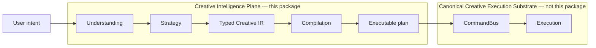
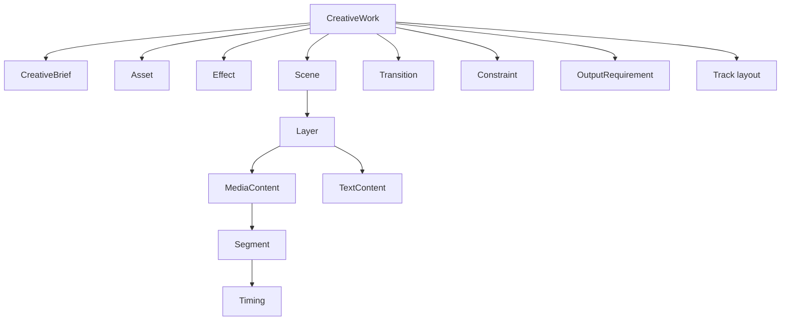
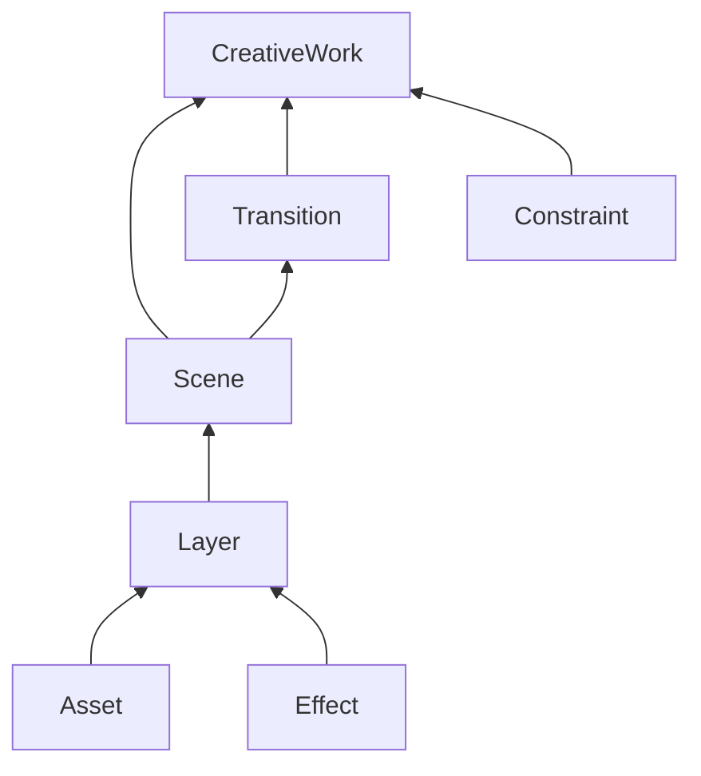

# Creative Intelligence Plane

**Status:** living view · **Owner zone:** `creative-intelligence-plane` · **First slice:** task-224 (Typed Creative IR) · **Enforcing tests:** [`test_creative_intelligence_boundary.py`](../../tests/architecture/test_creative_intelligence_boundary.py), [`test_creative_ir.py`](../../tests/unit/test_creative_ir.py), [`test_creative_ir_determinism.py`](../../tests/unit/test_creative_ir_determinism.py)

The Creative Intelligence Plane is the part of NEXUS that turns *what a person
meant* into *what should be built*. It sits upstream of execution and stops
there.

The plane **proposes**; it never executes. It contains no `subprocess`, no file
or network I/O, no database access, no event loop, and no reference to the
CommandBus or to transactions. That is enforced structurally, not by
convention — see [§6](#6-boundaries-and-their-enforcers).

## 1. Why this layer exists

Before task-224 the repository had no representation of a creative piece at the
level of *meaning*. Verified against `main` at `e5b326b`:

| Question | Answer on `main` @ `e5b326b` | Evidence |
|---|---|---|
| Is there a `Strategy` abstraction in `creative/`? | No. The only hit for `strategy` in `src/` is provider routing in `llm/litellm_provider.py`. | `grep -rni strategy src/nexus_ai_agent` |
| Is there a `Recipe` type? | No occurrences of `recipe` anywhere in `src/`. | `grep -rni recipe src/nexus_ai_agent` |
| Is there a semantic diff between two creative states? | No. | `grep -rniE "creative.diff\|semantic.diff" src/` returns nothing |
| Is there an authoring-level creative IR? | No. `creative/rendering/ir.py` is shaped like an FFmpeg lane (`LaneOp` → filtergraph); `creative/studio/models.py` `Project`/`Timeline` is *execution state* the bus mutates. Neither expresses "a hook, a subject, a call to action, fast paced, premium". | reading both modules |
| What sits between a user request and a capability operation? | On the unmerged spine lineage (PR #126) a keyword table maps five phrases onto five registry operations. Nothing models the piece itself. | `gh pr diff 126` |

So the gap was not a missing feature but a missing *type*: there was nothing for
a strategy to produce, nothing for a compiler to consume, nothing for a revision
to edit, and nothing for a diff to compare. This layer supplies that type.

## 2. The Typed Creative IR

[`src/nexus_ai_agent/creative/intelligence/ir.py`](../../src/nexus_ai_agent/creative/intelligence/ir.py)
defines `CreativeWork` — the plane's one exchange type.

Every concept earns its place against a capability operation the repository
already exposes (52 operations across the six pack manifests):

| IR concept | Consumed today by |
|---|---|
| `Asset` | `slideshow.scan_assets`, `AssetRecord` |
| `Scene` | `slideshow.compose`, `ShotPlan` |
| `Segment` / `Timing` | `TimeRangeUS`, `timeline.trim` |
| `Transition` | `motion.add_transition` |
| `Effect` | `motion.add_glow`, `color.apply_lut`, `color.adjust_exposure` |
| `AudioIntent` | the ten `audio.*` operations |
| `TextSpec` | `motion.add_title`, the ten `caption.*` operations |
| `OutputRequirement` | `delivery.render_master_4k`, `delivery.make_proxy_480p` |

Two have no precedent in the repository and are the reason the slice exists:

* **`SemanticRole`** — *why* an element is present (`subject`, `hook`, `cta`,
  `music`, `voiceover`). Without it, "make it more emotional but keep the
  rhythm" has no addressable target and a revision can only rebuild blindly.
* **`Constraint`** — a requirement that survives compilation and can be
  *checked*. All five kinds are decidable against the IR itself, so a
  constraint is a predicate rather than a comment.

### 2.1 What the IR deliberately does not model

**Tracks are layout, not authoring.** `Track` exists but only as compiler output:
an authored document carries `layout=()` and its layers carry a role plus a
timing; the normaliser decides track allocation, after which the layout must be
complete, single-assigned and non-overlapping. Track allocation is an opinion of
whatever renders the piece; letting a strategy author tracks would freeze every
future backend to one NLE's structure.

**No filtergraph, no argv, no codec.** `Effect.operation` names a capability
operation. Turning that into an FFmpeg filter belongs to
[`creative/rendering/`](../../src/nexus_ai_agent/creative/rendering/), downstream
of the compiler.

**No floats.** Time is integer microseconds, normalised quantities are integer
per-mille (0..1000), and signed continuous parameters are integer milli-units
(`+1.5` EV is `1500`). This is a determinism requirement, not a style choice —
see [§4](#4-determinism-and-identity).

## 3. Two gates with different contracts

A document passes through two checks, and they are not interchangeable:

| Gate | Answers | Runs on | Fails with |
|---|---|---|---|
| `assert_valid()` | Is this document *well-formed*? | Authored (unsealed) documents, before identity exists | `IRValidationError` carrying **every** problem found |
| `seal()` | Assign the true content address | Well-formed documents | `DanglingReferenceError`, because sealing resolves references |
| `verify_identity()` | Does this document match its own content? | Sealed documents | `IdentityError` naming each drifted id |
| `check_constraints()` / `assert_constraints()` | Is this what was *asked for*? | Sealed documents | `ConstraintViolationError` (hard violations only) |

`assert_valid()` reports all problems at once rather than raising on the first,
because a strategy layer that produced a broken document needs one actionable
list, not one rebuild per discovery.

It is named `assert_valid` and not `validate` because pydantic's
`BaseModel.validate` is a *classmethod* with a different signature; shadowing it
on a model would break Liskov substitution for anyone reaching for the pydantic
API. [`test_creative_ir.py`](../../tests/unit/test_creative_ir.py) pins this.

### 3.1 Constraints are predicates

| Kind | Meaning | Decidable against the IR |
|---|---|---|
| `TimingConstraint` | the work, or one scene, must fall in a duration band | yes |
| `OrderConstraint` | one scene must precede another | yes |
| `ExclusionConstraint` | an operation or asset kind must not appear | yes |
| `EmphasisConstraint` | a role must claim at least a share of attention | yes |
| `QualityConstraint` | a floor on resolution, frame rate or duration | yes |

`priority` separates a requirement that blocks the job (`HARD`) from a
preference the compiler may trade away and must report (`SOFT`).

## 4. Determinism and identity

Every identity in the IR is the SHA-256 of the element's own semantic payload
joined with the identities it refers to. The document is a **Merkle tree**.

Four properties follow, and each one is a capability a later slice cannot get
any other way:

1. **Deterministic compilation.** Building the same document twice yields
   byte-identical identities. There is no `uuid4` in the identity path — an
   AST-level test asserts it.
2. **Cheap semantic diff.** A change confined to one scene changes exactly that
   subtree and the root. Every other identity is bit-identical, so "what changed
   between v1 and v2" is a tree walk rather than a text diff.
3. **Cheap semantic revision.** A revision that rewrites one scene re-hashes one
   subtree. Untouched elements keep their identities, which is what makes a
   revision an *edit* rather than a rebuild.
4. **Self-verification.** `verify_identity()` re-derives every id, so a
   hand-edited or stale document is caught before it reaches a compiler.

`seal()` is a pure function of content: it ignores whatever provisional ids a
builder used, and `seal(seal(w)) == seal(w)`.

## 5. Provenance is data

Every element carries an `Origin` — `source` (`user`, `reference`, `strategy`,
`recipe`, `system`), a `detail` string, and an optional `reference_id`.
Explainability is therefore a structural property of the document: any scene can
answer *why are you here*, and a later slice can show a user that a given beat
exists because they asked for a dramatic reveal rather than because a model
invented one.

`CreativeBrief` carries the raw phrases a user actually said
(`semantic_intents`) alongside the ones nothing resolved
(`unresolved_intents`), and the model rejects an unresolved phrase that was
never declared. An instruction that could not be honoured is a **declared gap**,
never a silent disappearance.

## 6. Boundaries and their enforcers

Every rule below is a build failure, not a comment. Enforced by
[`tests/architecture/test_creative_intelligence_boundary.py`](../../tests/architecture/test_creative_intelligence_boundary.py).

| Rule | Why | Enforcing test |
|---|---|---|
| No `subprocess`, `os`, `socket`, `httpx`, `sqlite3`, `asyncio`, `tempfile`, `urllib` | The plane must be unable to become a second execution authority | `test_no_module_imports_an_execution_or_heavy_dependency` |
| No `open()`, `read_text()`, `write_text()`, `mkdir()` | No file I/O anywhere in the plane | `test_no_file_performs_io` |
| No import of `creative.studio`, `creative.spine`, `creative.rendering`, `creative.packs`, `creative.slideshow`, `storage`, `llm`, `jobs`, `adapters`, `bot`, `api`, `features`, `application` | Coupling would make the IR a view onto state the plane does not own, and would put this package inside another agent's zone | `test_the_plane_never_reaches_into_another_ownership_zone` |
| Only stdlib + `pydantic` + the plane itself | Understanding and compilation are pure transformations; anything needing a provider sits behind a port | `test_the_dependency_surface_is_closed` |
| No `CommandBus`, `PlanTransaction`, `EditTransaction`, `TypedCommand`, `execute`, `dispatch`, `undo` symbol | The plane names no execution machinery, even in a symbol | `test_the_plane_never_names_the_execution_authority` |
| `MICROSECONDS_PER_SECOND` equals the studio constant | The plane redeclares it (the import is forbidden), so a ratchet keeps the promise | `test_the_time_base_matches_the_execution_substrate` |
| `__all__` equals the exported surface | The plane's contract with its consumers stays legible | `test_the_public_surface_matches_the_declared_surface` |
| No `CompiledPlan` / `CreativeCompiler` symbol yet | Honest scope: this slice is the IR, and the compiler slice must update this test deliberately | `test_the_plane_produces_no_plan_or_command_type_yet` |

### 6.1 Relationship to the other substrates

* **Canonical Creative Execution Substrate** (`creative/studio/bus.py`,
  transactions, undo, idempotency): the plane produces plans *for* it and
  imports nothing from it. Authority to execute stays there.
* **Creative execution spine** (`creative/spine/`, PR #126 / #127 lineage): a
  separate, claimed zone. The plane does not import it and does not duplicate
  it. Where the spine maps an intent onto registry operations, the plane models
  the piece those operations are meant to produce; the two are complementary and
  the integration is a later, explicit decision.
* **Persistent Recovery Substrate** (storage, DB init, backup): the IR is
  serialisable to canonical JSON, which is all the plane contributes. It never
  opens a store.

## 7. Honest status

| Capability | Status |
|---|---|
| Typed Creative IR, validation, identity, canonical serialization | **Implemented and tested** (101 tests) |
| Semantic layer (phrases → constraints) | Not built. `CreativeBrief.semantic_intents` is the declared input for it. |
| Deterministic compiler (IR → plan) | Not built. Deliberately: the gate in §6 makes its absence visible. |
| Semantic revision | Not built. The Merkle property it needs is implemented and tested. |
| Creative diff | Not built. Same dependency, same readiness. |
| Reference → Creative Recipe | Not built. `Origin.source="recipe"` is reserved for it. |
| Reachable from a user command | **No.** Nothing outside the plane constructs a `CreativeWork` yet. This slice is a foundation, not a feature. |

## 8. Decision record

See `D-0025` in [`DECISION_LOG.md`](../DECISION_LOG.md) for the accepted
decision, the rejected alternatives (a scene-graph over the studio `Project`,
reusing `rendering/ir.py` as the authoring surface, UUID identities, float
quantities) and the evidence.
