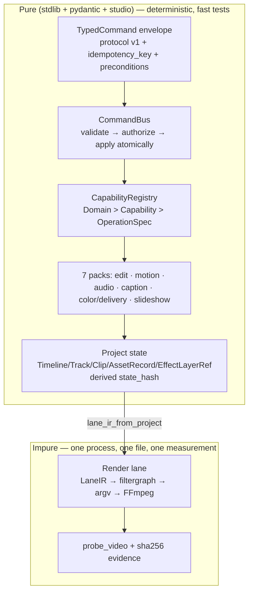

# Nagar Creative Studio

**Status:** Living document (wave state + coverage matrix regenerated each release)
**Scope:** the capability model, the pack substrate, the command bus, the render lane, and the honest coverage ledger
**Verified against:** `main` @ `7573249` — numbers below were produced by executing the builders and the CLI, not by reading names

Nagar is the studio inside NEXUS: a typed, permissioned, *pure-by-default* media pipeline whose only impure step is a single FFmpeg process at the very end.

---

## 1. The shape in one picture



The split is the load-bearing decision: **evidence is gathered above the bus** (probing, analysis, image generation), **handlers inside the bus stay pure**, and **execution happens exactly once, in the lane**. See [`../DECISION_LOG.md`](../DECISION_LOG.md) Wave 2/2c entries.

## 2. Capability model

| Concept | Type | Meaning |
|---|---|---|
| Domain | `Domain` | first id segment: `media`, `timeline`, `motion`, `audio`, `caption`, `color`, `delivery`, `slideshow`, `system` |
| Capability | `Capability` | a named grouping inside a domain (for example `timeline.edit`) |
| Operation | `OperationSpec` | `operation_id`, typed `input_model` (pydantic, `extra="forbid"`), handler, `permission_level`, `undoable` |
| Envelope | `TypedCommand` | `operation`, `input`, `target`, `preconditions`, `idempotency_key`, `confirmed`, `protocol_version` |

**Permission ladder** (`PermissionLevel`):

| Level | Name | Behaviour | Example |
|---|---|---|---|
| A | Immediate | non-destructive, always allowed | `media.play`, `timeline.mark` |
| B | Reversible | applied as an atomic `EditTransaction`, undoable | `timeline.trim`, `motion.add_transition` |
| C | Confirmation | requires `confirmed: true` in the envelope | heavyweight/identity-changing ops (none registered yet) |
| D | Denied | refused by policy: shell, raw upload, code execution, anything unregistered | — |

**Dispatch pipeline** (`creative/studio/bus.py::_dispatch_locked`) — strict order, each step failing closed:
1. envelope validation (protocol v1) → 2. idempotency replay → 3. registry lookup (`UnknownOperationError`) → 4. permission gate (`PermissionDeniedError`) → 5. typed input validation → 6. precondition check (`state_revision` / `state_hash`) → 7. atomic apply + `EditTransaction` push → 8. deep-copied `project` snapshot for safe reads.

`Project.state_hash` is **derived** from a canonical JSON serialization on every construction (revision excluded, so revision+hash preconditions survive undo cycles). A stored hash therefore cannot drift from the state it describes.

## 3. The pack substrate (data, never code-on-arrival)

A pack is a directory with a `pack.manifest.json` validated against `nexus.capability-pack.v1` plus pure handler modules:

| Field group | Examples |
|---|---|
| identity | `manifest_schema`, `package_id`, `version`, `display_name` |
| capability surface | `capabilities: ["slideshow.compose", …]` |
| execution | `runtime.native` (`adapter_id`, `sandbox: in_process`, `network_required`), `runtime.browser` (`none`) |
| power | `permissions` (allow-list strings only), `network_policy`, `hardware_requirements`, `resource_budget` |
| supply chain | `artifacts` (with hashes), `security` (signature state), `external_binaries` |

**Rules that are enforced, not requested**
- No executable key at any depth of any manifest (`test_pack_manifest_is_data_only.py`).
- A pack's declared capabilities must equal the operations its registration function adds, and it must activate against its own manifest (`test_slideshow_adapter_boundary.py`).
- An **external** pack that declares an operation the runtime does not know is rejected at registration; a **builtin** pack may register with *pending* capabilities but cannot be activated until they resolve (`creative/packs/registry.py`).
- Verification reports every finding; signature state is reported honestly (`placeholder`, `format_only_unverified`) — no pack claims a verified signature today.

## 4. Pack inventory and the activation gap (verified 2026-09-21)

`nexus packs list` output at `7573249` (executed, not paraphrased):

| Pack | Version | Capabilities | Pending | Signature | Binaries |
|---|---|---:|---:|---|---|
| `nexus.slideshow.compose` | 0.2.0 | 6 | 0 | placeholder | ffmpeg |
| `nexus.language.caption` | 1.0.0 | 10 | 0 | placeholder | — |
| `nexus.edit.timeline` | 1.0.0 | 8 | **8** | format_only_unverified | — |
| `nexus.motion.graphics` | 1.0.0 | 7 | **7** | format_only_unverified | — |
| `nexus.audio.studio` | 1.0.0 | 8 | **8** | format_only_unverified | — |
| `nexus.color.delivery` | 1.0.0 | 7 | **7** | format_only_unverified | — |

```text
$ nexus packs activate nexus.audio.studio
✗ nexus.audio.studio: cannot activate — the runtime does not know audio.detect_beats,
  audio.normalize_loudness, audio.duck_music, audio.beat_sync_cut, audio.remove_noise,
  audio.deess, audio.eq_voice, audio.time_stretch
```

**Why:** the CLI composition root (`cli.py::_packs_registry`) composes only the slideshow and caption registries, so the runtime sees **21** of the **51** implemented operation ids. The handlers for edit/motion/audio/delivery exist and pass their own tests; they are not yet *reachable* through the CLI registry. This is board task **task-126**, sequenced after PR#33 because that PR rewrites `cli.py`. Until it lands, treat the four pending packs as **implemented but not activatable** — the honest status.

## 5. Coverage ledger vs. the TDD catalogue

Measured by diffing the operation ids in [`../NAGAR_70_OPERATIONS_TDD.md`](../NAGAR_70_OPERATIONS_TDD.md) against the union of all registry builders:

| Metric | Value |
|---|---:|
| Operation ids catalogued by the TDD | 71 |
| Implemented and registered by a builder | 51 unique (77 registrations across 7 registries, with inherited Wave-1 ops shared) |
| TDD ids implemented | 42 |
| TDD ids remaining | **29** |

Remaining, by family:

| Family | Remaining ids |
|---|---|
| `portrait.*` (9) | `detect_landmarks`, `smooth_skin`, `whiten_teeth`, `retouch_blemish`, `enhance_eyes`, `relight_face`, `background_blur`, `mask_hair`, `correct_gaze`, `stabilize_face` |
| `scene.*` (9) | `detect_shot_boundaries`, `auto_reframe_subject`, `remove_object`, `remove_background`, `replace_sky`, `segment_subject`, `track_object`, `track_face`, `find_subject_moment`, `remove_logo` |
| `motion.*` (3) | `add_particles`, `apply_mask`, `warp` |
| `color.*` (3) | `white_balance`, `deband_denoise`, `hdr_tonemap` |
| `audio.*` (2) | `align_music`, `remove_vocal` |
| `timeline.*` (1) | `sync_multicam` |

(Counts in the "Remaining" table are per-id; the TDD list also contains the six `nexus.*` pack ids and non-operation tokens, which are excluded here.)

## 6. The render lane

| Property | Implementation |
|---|---|
| Typed ops | 8 (`TrimOp`, `SpeedOp`, `ReverseOp`, `FreezeOp`, `XfadeOp`, `TitleOp`, `LoudnormOp`, `DuckOp`) in `creative/rendering/ir.py` |
| Duration algebra | integer microseconds — trim/speed/reverse/freeze/xfade have explicit formulas; no float drift |
| Purity | `compile_lane`, `compile_measure` are pure and golden-tested; `lane_ir_from_project` bridges packs' `Project` IR to lane IR |
| Process policy | one process per call, no shell, one timeout, binary allow-list (`override → NEXUS_FFMPEG_BIN → PATH → imageio-ffmpeg`) |
| Publication | `.<name>.part.<ext>` → atomic rename; `overwrite=False` by default |
| Evidence | `probe_video` + `sha256_file` on the published artifact; a run that cannot probe fails with `LaneExecutionError` |
| Gates | `test_rendering_lane_boundary.py`: no ML imports, import allow-list, no zone cross-over, **exactly one** `subprocess` site, never `shell=True` |

The lane is deliberately the *only* place in the creative tree that spawns a process (`test_slideshow_adapter_boundary.py::test_only_the_render_lane_spawns_a_process`).

## 7. Speech, captions, and offline translation

- `CaptionEnginePort` is the seam; `creative/caption/unavailable_adapter.py` is the fail-closed default (typed `caption_profile_unavailable`, never silent degradation).
- `WhisperLocalCaptionEngine` (extra `[speech]`, CTranslate2 int8, no torch) implements `transcribe`, `align_words`, `diarize`, `translate_local`; offline translation is the `[translate]` extra (argos-translate).
- Pure formatters (`srt`, `vtt`, `ass`) live in the caption pack, including RTL/bidi handling with Vazirmatn styling for Persian — text layout is data, not a rendering process.

## 8. How to verify this document

```bash
# inventory (expect: 6 packs, 51 unique ops across builders, 21 in the CLI registry)
python - <<'PY'
from nexus_ai_agent.cli import _packs_registry
print(len(_packs_registry().runtime_registry.list_operations()))
PY
nexus packs list          # pending counts per pack (§4 table)
nexus packs verify <id>   # every finding, not a summary
pytest -q tests/architecture tests/unit/test_caption_pack.py tests/unit/test_rendering_lane.py
```

If a number here disagrees with the output, the document is wrong — fix it in the same PR that changed the code (rule in [`../README.md`](../README.md)).
