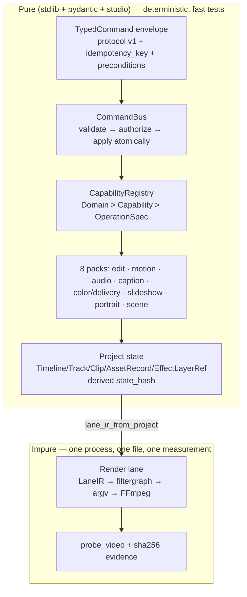

# Nagar Creative Studio

**Status:** Living document (wave state + coverage matrix regenerated each release)
**Scope:** the capability model, the pack substrate, the command bus, the render lane, and the honest coverage ledger
**Verified against:** `main` @ `6624a13` + Vision Phase 1 (re-measured 2026-09-27 during `arena/01a0e1cb` hardening) — numbers below were produced by executing the builders and the CLI, not by reading names

Nagar is the studio inside NEXUS: a typed, permissioned, *pure-by-default* media pipeline whose only impure step is a single FFmpeg process at the very end.

---

## 1. The shape in one picture


```mermaid
flowchart TB
    subgraph pure["Pure (stdlib + pydantic + studio) — deterministic, fast tests"]
        cmd["TypedCommand envelope<br/>protocol v1 + idempotency_key + preconditions"]
        bus["CommandBus<br/>validate → authorize → apply atomically"]
        reg["CapabilityRegistry<br/>Domain > Capability > OperationSpec"]
        packs["8 packs: edit · motion · audio · caption · color/delivery · slideshow · portrait · scene"]
        proj["Project state<br/>Timeline/Track/Clip/AssetRecord/EffectLayerRef<br/>derived state_hash"]
    end
    subgraph impure["Impure — one process, one file, one measurement"]
        lane["Render lane<br/>LaneIR → filtergraph → argv → FFmpeg"]
        probe["probe_video + sha256 evidence"]
    end
    cmd --> bus --> reg --> packs --> proj
    proj -->|lane_ir_from_project| lane --> probe
```

The split is the load-bearing decision: **evidence is gathered above the bus** (probing, analysis, image generation), **handlers inside the bus stay pure**, and **execution happens exactly once, in the lane**. See [`../DECISION_LOG.md`](../DECISION_LOG.md) Wave 2/2c entries.

## 2. Capability model

| Concept | Type | Meaning |
|---|---|---|
| Domain | `Domain` | first id segment: `media`, `timeline`, `motion`, `audio`, `caption`, `color`, `delivery`, `slideshow`, `system` |
| Capability | `Capability` | a named grouping inside a domain (for example `timeline.edit`) |
| Operation | `OperationSpec` | `operation_id`, typed `input_model` (pydantic, `extra="forbid"`), handler, `permission_level`, `undoable` |
| Envelope | `TypedCommand` | Protocol `nagar.command.v1`, envelope schema 1 (legacy) or 2 (explicit `actor`, `target.project_id`, `provenance`); typed `input_refs`, execution policy, request context, optional capability snapshot, idempotency key, preconditions. See [Gate 2](COMMAND_CAPABILITY_CONTRACT.md). |

**Permission ladder** (`PermissionLevel`):

| Level | Name | Behaviour | Example |
|---|---|---|---|
| A | Immediate | non-destructive, always allowed | `media.play`, `timeline.mark` |
| B | Reversible | applied as an atomic `EditTransaction`, undoable | `timeline.trim`, `motion.add_transition` |
| C | Confirmation | requires `confirmed: true` in the envelope | identity/logo ops: `portrait.correct_gaze`, `scene.remove_logo` |
| D | Denied | refused by policy: shell, raw upload, code execution, anything unregistered | — |

**Dispatch pipeline** (`creative/studio/bus.py::_dispatch_locked`) — strict order, each step failing closed:
1. parse → 2. envelope + operation schema → 3. actor/project grant → 4. capability + version + permissions → **4b. capability lifecycle / pack gate** (`creative/studio/lifecycle.py`: `required_packs` must be `AVAILABLE`, or `EXPERIMENTAL` with the bus-level `allow_experimental=True`; unknown / `STUB` / `RETIRED` refuse) → 5. execution policy + A/B/C/D → 6. input refs + pinned time refs → 7. idempotency reserve/replay via :class:`IdempotencyStore` (per-bus :class:`InMemoryIdempotencyStore` today; :class:`FileIdempotencyStore` reference durable backend shipped, DB-tomorrow) → 8. revision preconditions → 9. atomic apply + `EditTransaction` push (deep-copied `project` snapshots for safe reads).

The lifecycle gate is the single seam between the canonical Gate-2 contract and the pack runtime (board task-183): it runs after the actor grant (so an unauthorized actor can never be granted anything by pack metadata) and before the idempotency reservation and the handler (so a refused pack performs zero work). `allow_experimental` is composition-root state, never a command-envelope field and never a queue-row field: the render worker derives it from the canonical operation via the server-controlled `render_jobs.EXPERIMENTAL_OPT_IN_OPERATIONS` (exactly the surface operations on an `EXPERIMENTAL` pack, pinned by test), and `CreativeRenderPayload` (`extra="forbid"`) rejects a row that tries to carry an opt-in. Lifecycle = pack *maturity*; `packs/availability.py` = pack *runnability* at render/preflight time. See [`COMMAND_CAPABILITY_CONTRACT.md`](COMMAND_CAPABILITY_CONTRACT.md) §2.

`Project.state_hash` is **derived** from a canonical JSON serialization on every construction (revision excluded, so revision+hash preconditions survive undo cycles). A stored hash therefore cannot drift from the state it describes.

## 3. The pack substrate (data, never code-on-arrival)

A pack is a directory with a `pack.manifest.json` validated against `nexus.capability-pack.v1` plus pure handler modules:

| Field group | Examples |
|---|---|
| identity | `manifest_schema`, `package_id`, `version`, `display_name` |
| capability surface | `capabilities: ["slideshow.compose", …]` |
| execution | `runtime.native` (`adapter_id`, `sandbox: in_process`, `network_required`), `runtime.browser` (`none`) |
| power | `permissions` (allow-list strings only), `network_policy`, `hardware_requirements`, `resource_budget` |
| supply chain | `artifacts` (with hashes), `security` (signature state), `external_binaries` |

**Rules that are enforced, not requested**
- No executable key at any depth of any manifest (`test_pack_manifest_is_data_only.py`).
- A pack's declared capabilities must equal the operations its registration function adds, and it must activate against its own manifest (`test_slideshow_adapter_boundary.py`).
- An **external** pack that declares an operation the runtime does not know is rejected at registration; a **builtin** pack may register with *pending* capabilities but cannot be activated until they resolve (`creative/packs/registry.py`).
- Verification reports every finding; signature state is reported honestly (`placeholder`, `verified`, `invalid_signature`, `unknown_publisher`, `format_only_unverified` legacy) — builtin packs remain `placeholder` (trust via git), external signed packs can now be `verified` via Ed25519. No pack pretends to verify what it did not check.
- Vision packs are *planning-only*: handlers compute a deterministic ``plan_digest`` (SHA-256 of canonical JSON) and derive ``artifact_content_sha256`` from it; ``provenance.execution_boundary = deterministic_plan_only`` and ``pixel_execution = False``. No pixel/ML execution is claimed.
- **Shared-abstraction decision (task-153):** five strategies were compared — (1) full duplication (copy ``models.py`` per pack), (2) shared vocabulary via ``vision/models.py`` + thin ``portrait/models.py``/``scene/models.py`` shims (``from vision.models import *``), (3) inheritance (``PortraitModels(VisionBase)``), (4) composition (``portrait.models`` wraps ``vision.models``), (5) code-generation (jinja). (2) was chosen: single source of truth for ``Identifier``/``VisionConfidence``/``TimeRangeUS``/``ClipRef`` etc., zero duplication, deterministic ``plan_digest`` shared, and the coverage harness was hardened to count pure re-export shims as **100% when imported** (line-0 filtered) rather than penalizing correct architecture. Evidence: ``continuum/pack_coverage.py::_is_shim_module`` + ``96.83%`` (portrait/scene 100%); duplication would have been 2× maintenance and 2× drift.

## 4. Pack inventory and the activation gap (re-measured 2026-09-24)

`nexus packs list` output at `6624a13` + Vision (re-measured 2026-09-27, executed, not paraphrased):

| Pack | Version | Capabilities | Pending | Signature | Binaries |
|---|---|---:|---:|---|---|
| `nexus.slideshow.compose` | 0.2.0 | 6 | 0 | placeholder | ffmpeg |
| `nexus.language.caption` | 1.0.0 | 10 | 0 | placeholder | — |
| `nexus.edit.timeline` | 1.0.0 | 9 | 0 | format_only_unverified | — |
| `nexus.motion.graphics` | 1.0.0 | 10 | 0 | format_only_unverified | — |
| `nexus.audio.studio` | 1.0.0 | 10 | 0 | format_only_unverified | — |
| `nexus.vision.portrait` | 1.0.0 | 10 | 0 | placeholder | — |
| `nexus.vision.scene` | 1.0.0 | 10 | 0 | placeholder | — |
| `nexus.color.delivery` | 1.0.0 | 7 | 0 | format_only_unverified | — |

The activation gap is **closed** (board task-126, landed) and Vision Phase 1
closes the portrait/scene gap (shims counted as 100% when imported, shared
vision vocabulary 99%): `cli.py::_packs_registry` now composes
`creative.packs.runtime.build_pack_registry()` — the runtime and the CLI see
the same **77** registered operation ids (wave-1 5 + 72 pack ops), and every
builtin manifest verifies clean. Vision packs are ``EXPERIMENTAL`` (lifecycle)
and execute only with explicit ``allow_experimental=True`` at the composition
root — they are planning-only and never claim pixel execution. Activation
remains an explicit, auditable step (``nexus packs activate``), which is why
``packs list`` still reports each pack's ``active`` flag as false until an
operator activates it.

## 5. Coverage ledger vs. the TDD catalogue

Measured 2026-09-27 by diffing the operation ids in
[`../NAGAR_70_OPERATIONS_TDD.md`](../NAGAR_70_OPERATIONS_TDD.md) against
`build_runtime_registry().list_operations()`:

| Metric | Value |
|---|---:|
| Operation ids catalogued by the TDD (parsed, family-filtered) | 69 |
| Registered at runtime (CLI == builders) | **77 unique** |
| TDD ids implemented | 66 |
| TDD ids remaining | **3** |
| Registered beyond the TDD catalogue (post-TDD additions: slideshow 6, `media.pause`, `timeline.mark`, `system.undo`, `delivery.make_proxy_480p`, `delivery.render_master_4k`, plus 20 Vision ops) | 11 (+20 Vision) |

Remaining, by family (only ``color.*`` now):

| Family | Remaining ids |
|---|---|
| `color.*` (3) | `white_balance`, `deband_denoise`, `hdr_tonemap` |

All ``motion.*``, ``audio.*``, ``timeline.*``, ``portrait.*`` and ``scene.*`` TDD ids are now registered. Vision Phase 1 closed the 20-op portrait/scene gap (planning-only, deterministic ``plan_digest``).

## 6. The render lane

| Property | Implementation |
|---|---|
| Typed ops | 9 (`TrimOp`, `SpeedOp`, `ReverseOp`, `FreezeOp`, `XfadeOp`, `TitleOp`, `LoudnormOp`, `DuckOp`, `ExposureOp`) in `creative/rendering/ir.py` |
| Duration algebra | integer microseconds — trim/speed/reverse/freeze/xfade have explicit formulas; no float drift |
| Purity | `compile_lane`, `compile_measure` are pure and golden-tested; `lane_ir_from_project` bridges packs' `Project` IR to lane IR |
| Process policy | one process per call, no shell, one timeout, binary allow-list (`override → NEXUS_FFMPEG_BIN → PATH → imageio-ffmpeg`) |
| Publication | `.<name>.part.<ext>` → atomic rename; `overwrite=False` by default |
| Evidence | `probe_video` + `sha256_file` on the published artifact; a run that cannot probe fails with `LaneExecutionError` |
| Gates | `test_rendering_lane_boundary.py`: no ML imports, import allow-list, no zone cross-over, **exactly one** `subprocess` site, never `shell=True` |

The lane is deliberately the *only* place in the creative tree that spawns a process (`test_slideshow_adapter_boundary.py::test_only_the_render_lane_spawns_a_process`).

## 7. Speech, captions, and offline translation

- `CaptionEnginePort` is the seam; `creative/caption/unavailable_adapter.py` is the fail-closed default (typed `caption_profile_unavailable`, never silent degradation).
- `WhisperLocalCaptionEngine` (extra `[speech]`, CTranslate2 int8, no torch) implements `transcribe`, `align_words`, `diarize`, `translate_local`; offline translation is the `[translate]` extra (argos-translate).
- Pure formatters (`srt`, `vtt`, `ass`) live in the caption pack, including RTL/bidi handling with Vazirmatn styling for Persian — text layout is data, not a rendering process.

## 8. How to verify this document

```bash
# inventory (expect: 8 packs, 77 unique registered ops; CLI == builders)
python - <<'PY'
from nexus_ai_agent.cli import _packs_registry
print(len(_packs_registry().runtime_registry.list_operations()))
PY
from nexus_ai_agent.creative.packs.runtime import build_runtime_registry
print(len(build_runtime_registry().list_operations()))   # also 77
nexus packs list          # pending counts per pack (§4 table — all 0)
nexus packs verify <id>   # every finding, not a summary
pytest -q tests/architecture tests/unit/test_caption_pack.py tests/unit/test_rendering_lane.py
pytest -q tests/unit/test_creative_render_jobs.py tests/unit/test_creative_surface.py
```

## 9. The one-shot Telegram surface (task-166, 2026-09-24)

`/edit`, `/caption`, `/grade` are live commands on the canonical chain:

`Telegram → creative_surface (mapper + staging) → JobQueuePort (idempotency
key = message identity) → worker ``creative_render`` → packs runtime registry
→ CommandBus (typed op, idempotency-keyed) → render lane (allow-listed FFmpeg)
→ measured artifact → translated completion notify.`

- Surface ops are exactly the honestly-executable matrix: `edit trim|speed|reverse`,
  `grade exposure|proxy|otio`, `caption transcribe`. The mapper (and the worker
  map) refuses `lut` — no shipped `.cube` assets and no lane LUT op — and
  `burnin` — no subtitles instrument in the lane IR. Both are refused typed, at
  the surface, never faked (see ADR 0006 for the same anti-silent-degradation
  rule as §7).
- Every user-visible string comes from the i18n catalog (`creative.*` keys in
  all 15 locales); a raw key never reaches Telegram.
- Verification: `tests/unit/test_creative_render_jobs.py` renders real
  two-second clips through the whole chain with the imageio-ffmpeg binary;
  `tests/architecture/test_creative_channels.py` ratchets the wiring.

If a number here disagrees with the output, the document is wrong — fix it in the same PR that changed the code (rule in [`../README.md`](../README.md)).
