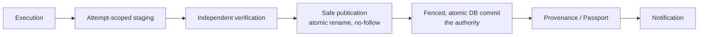

# Execution Core (NEXUS V1) — canonical

> Status: **living view** — enforced by
> `tests/unit/test_execution_contract.py`,
> `tests/architecture/test_execution_contract_boundary.py`,
> `tests/architecture/test_execution_boundary_enforcement.py`,
> `tests/unit/test_execution_staging.py`,
> `tests/integration/test_execution_native_backend.py`,
> `tests/integration/test_execution_races.py`,
> `tests/integration/test_execution_crash_matrix.py`, and the mutation campaign
> `scripts/execution_core_mutations.py`. Delivered by task-254 (merged to
> `main`); this page is task-258. Source modules:
> `src/nexus_ai_agent/execution/contract.py`,
> `src/nexus_ai_agent/execution/staging.py`,
> `src/nexus_ai_agent/adapters/native_local_backend.py`.

The execution core is **one** vertical path from a business intent to one
authoritative, verified completion. It adds a provider-neutral contract on top
of the existing job authority; it never adds a second authority.

## 1. Authority laws

1. **One request, one authoritative job.** A business request is idempotency-
   keyed; a duplicate delivery resolves to the same durable row and the same
   `job_id` (invariant I1, I8).
2. **The contract carries no authority.** `execution/contract.py` is the
   *intent* half only: it names no provider, queue, database, or storage
   engine, and it holds no commit power.
3. **The single execution authority is the durable row.** The one authority is
   `InProcessJobQueue` over its SQLite row; the fencing model is the per-row
   `attempt` counter; the only authoritative completion path is the queue-owned,
   fenced, atomic `_mark_completed` compare-and-set (invariant I3, I4).
4. **A backend delegates, it never duplicates.** `NativeLocalBackend` is a thin
   adapter over that one queue: it creates no second queue, no second
   persistence, no second verifier, and no second commit authority (invariant
   I9).
5. **Physical existence ≠ authority.** A file on disk is not an authoritative
   artifact until the fenced DB commit records it. The filesystem operation and
   the DB mutation are **not** one transaction; the DB commit is decisive.

## 2. The four-verb contract

`ExecutionBackend` exposes exactly four verbs — and deliberately **no**
combined `execute` method. A single `execute` that submitted, polled, verified,
and committed in one call would collapse the intent/authority separation the
rest of the repository enforces (execution success ≠ job success; only the queue
may complete a job), so it is forbidden by construction and asserted by
`tests/architecture/test_execution_contract_boundary.py`.

| Verb | Authority effect | Delegates to |
|---|---|---|
| `submit(request)` | enqueue under the Nexus idempotency key (idempotent) | `InProcessJobQueue.enqueue` |
| `observe(identity)` | read-only point-in-time view; never mutates | `InProcessJobQueue.get_job_facts_async` |
| `cancel(identity)` | fenced reset of an in-flight attempt to `pending` | `InProcessJobQueue.cancel(expected_attempt=…)` |
| `reconcile(identity)` | observe only by default; job-scoped takeover only under an explicit stale window | `InProcessJobQueue.recover_job` |

`cancel` is **attempt-scoped**: it carries the identity's fencing token
(`expected_attempt`) and can only affect the attempt that token names. An
unbound identity (`job_id` without a token) holds no cancellation authority at
all — `job_id` alone is never sufficient. A stale token is rejected at the
queue's fenced CAS and can never cancel a newer attempt.

`reconcile` never takes over a live peer by default. A takeover requires that
the backend was constructed with an explicit `stale_after` window, and even then
it is **job-scoped**: `recover_job` can only touch `identity.job_id`, so an
unrelated in-flight job is never reset. Startup recovery (`resume_pending`) and
runtime reconciliation are deliberately different operations.

## 3. Identity separation

The identities are deliberately distinct and must never be conflated. In
particular, a Nexus *attempt* is not a provider retry, and a provider's own
internal retry must never mint a new Nexus fencing token (invariant I2).

| Identity | Meaning | Authority? |
|---|---|---|
| `request_id` | Nexus business-request identity | idempotency is Nexus-owned (I8) |
| `idempotency_key` | the Nexus dedupe key | yes, for identity only |
| `job_id` | the one authoritative durable row | the row is the authority |
| `attempt_id` | the per-attempt execution identity | binding is immutable |
| `fencing_token` | the `attempt` counter for that execution | the only completion authority (I3, I4) |
| `worker_id` / `backend` | which substrate ran the attempt | no |
| `provider_run_id` | a provider *observation* | **never** authority (I5) |

`provider_run_id` can never be used to complete a job; the queue row is the
authority, and observing a new provider run id never changes observed truth.

## 4. Staging and publication boundary

The filesystem half of publication is isolated per attempt and lives under
`<root>/<job_id>/<attempt_id>/staging/`. `AttemptStaging` reuses the one
security boundary, `WorkspaceFilesystem`, rather than defining a second,
competing one.

- **Cross-attempt isolation** — one attempt can never address another attempt's
  staging tree, so a superseded attempt cannot clobber the current owner.
- **Path-traversal protection** — every component is validated; absolute paths,
  `..`, separators inside a name, and NUL bytes are rejected.
- **Symlink handling** — no path component may be a symlink, and files are
  opened with `O_NOFOLLOW`, so a swapped leaf or ancestor cannot redirect a
  write. The ancestors (`job_id` / `attempt_id` / `staging`), the staged source,
  and every quarantine source/destination component are validated.
- **No provider-controlled final path** — a publish target must be a relative
  path contained in the *declared* `final_root`.
- **Cleanup / quarantine** — a finished or failed attempt is removed or moved
  aside, never left to be mistaken for a published artifact.

The canonical publication order is:

A crash anywhere in this chain must never fabricate success: the physical
artifact may exist, but only the fenced DB commit makes it authoritative. When
the commit is rejected (a stale attempt lost the fence), no success notification
is emitted — notification happens only after the authoritative commit succeeds,
and a notifier failure never reverts a durable completion (invariant I10).

## 5. Failure model

`FailureDisposition` is an execution-layer *projection* of the single business
taxonomy (`jobs.failure_semantics.FailureClass`); it is not a second taxonomy.
The outcomes that are not business failures at all — `UNKNOWN` (the world did
not answer), `CANCELLED` (a process-lifecycle event), `STALE` (a superseded
attempt) — must never be recorded as a terminal business failure. Only
`NON_RETRYABLE` is terminal (`FailureDisposition.is_terminal_business_failure`),
so `UNKNOWN` is never silently converted to `FAILED` (invariant I7).

Verification is independent from execution: `ExecutionResult.verification` is
the verifier's evidence block, and an execution result is never itself verified
evidence. A handler that returns success without independent verification is
not job success (invariant I6).

## 6. Invariant matrix (I1–I10)

The canonical table lives in
`tests/architecture/test_execution_contract_boundary.py` and is mirrored here
for reviewers. Every invariant maps to the code that enforces it and the test
that proves it; the mirror is kept honest by
`tests/unit/test_docs_integrity.py`.

| # | Invariant | Enforcing symbol | Proving test |
|---|---|---|---|
| I1 | one business request → one authoritative job identity | `nexus_ai_agent.adapters.in_process_job_queue:InProcessJobQueue.enqueue` | `tests/integration/test_execution_native_backend.py::test_submit_returns_the_authoritative_identity` |
| I2 | a Nexus attempt ≠ a provider retry | `nexus_ai_agent.adapters.native_local_backend:NativeLocalBackend.observe` | `tests/integration/test_execution_native_backend.py::test_provider_retry_never_mints_a_new_nexus_attempt` |
| I3 | only the current fencing token may authoritatively complete | `nexus_ai_agent.adapters.in_process_job_queue:InProcessJobQueue._mark_completed` | `tests/integration/test_execution_native_backend.py::test_stale_attempt_cannot_complete_after_takeover` |
| I4 | a stale attempt can never produce authoritative completion | `nexus_ai_agent.adapters.in_process_job_queue:InProcessJobQueue._mark_completed` | `tests/integration/test_execution_crash_matrix.py::test_c7_late_stale_worker_is_refused_without_a_success_notice` |
| I5 | `provider_run_id` is never authority | `nexus_ai_agent.adapters.native_local_backend:NativeLocalBackend.observe` | `tests/integration/test_execution_native_backend.py::test_provider_run_id_never_changes_observed_truth` |
| I6 | verification is independent from execution | `nexus_ai_agent.adapters.in_process_job_queue:InProcessJobQueue._verify_safely` | `tests/integration/test_execution_native_backend.py::test_handler_success_without_independent_verification_is_not_job_success` |
| I7 | `UNKNOWN` is not automatically `FAILED` | `nexus_ai_agent.execution.contract:FailureDisposition.is_terminal_business_failure` | `tests/integration/test_execution_native_backend.py::test_observe_unknown_job_is_unknown_not_failed` |
| I8 | idempotency remains Nexus-owned | `nexus_ai_agent.adapters.in_process_job_queue:InProcessJobQueue.enqueue` | `tests/integration/test_execution_native_backend.py::test_submit_is_idempotent_on_the_nexus_key` |
| I9 | `NativeLocalBackend` creates no second queue | `nexus_ai_agent.adapters.native_local_backend:NativeLocalBackend.__init__` | `tests/architecture/test_execution_contract_boundary.py::test_backend_never_constructs_a_queue` |
| I10 | success notification only after the authoritative commit | `nexus_ai_agent.adapters.in_process_job_queue:InProcessJobQueue._notify_completion` | `tests/integration/test_execution_races.py::test_success_notification_only_after_the_commit` |

Boundary laws enforced by architecture tests:

- `execution/contract.py` imports no provider SDK and no adapter, and only the
  two sanctioned Nexus modules (`tests/architecture/test_execution_contract_boundary.py`).
- The `execution` package imports no adapter (`test_execution_package_does_not_import_adapters`).
- `NativeLocalBackend` opens no database, creates no table, and constructs no
  queue (`test_backend_opens_no_database_and_creates_no_table`,
  `test_backend_never_constructs_a_queue`).

## 7. Scope

V1 is provider-neutral and intentionally small. The following are **deferred**,
not part of this core: Trigger.dev, Hatchet, Inngest, Temporal, Windmill,
provider/GPU/quota/cost routers, Redis, Kafka, Kubernetes, multi-region, DAGs,
and AI routing. Wiring `AttemptStaging.publish` into the creative render
publication path is tracked separately (task-255).
