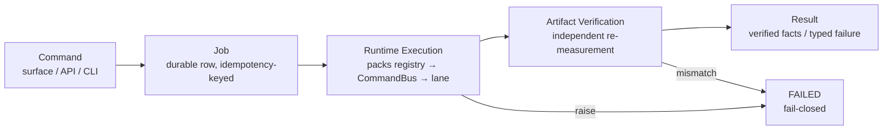
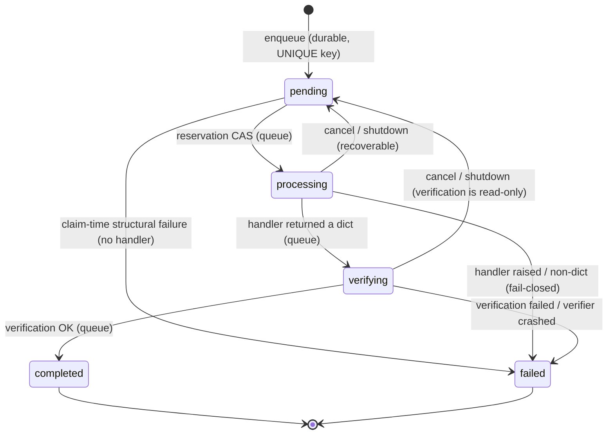

# Job Lifecycle Contract (canonical)

> Status: **living view** — enforced by `tests/unit/test_job_lifecycle.py`,
> `tests/integration/test_job_lifecycle_queue.py`, and the guarded writes in
> `src/nexus_ai_agent/adapters/in_process_job_queue.py`. Delivered by task-178
> (Agent C, 2026-09-24); decision record: `docs/DECISION_LOG.md` D-0013.

## 1. The canonical chain

Every step is explicit. None is implicit, and no step may be skipped by a
handler or a caller:



Ownership map:

| Step | Owner | Module |
|---|---|---|
| Command validation, staging, idempotency key | surface | `bot/creative_surface.py` |
| Durable job row, state machine, verification phase | **Job layer** | `adapters/in_process_job_queue.py`, `application/ports/job_queue.py`, `jobs/` |
| Execution semantics, artifact publication, probe/sha evidence | **Runtime (Agent 1)** | `creative/rendering/*`, `creative/packs/*`, `creative/studio/*`, `creative/slideshow/ffmpeg.py` |
| Worker adapter (chain assembly, typed failures) | worker | `creative/render_jobs.py` |
| Result rendering to the user | notifier | `bot/app.py` (grandfathered) |

The Job layer never re-implements runtime semantics: the verification
evidence functions *are* the runtime's (`sha256_file`, the allow-listed
binary probe `probe_video` — the architecture's ffprobe-equivalent).

## 2. State machine

Persisted values (enum `JobStatus`, compatibility kept — no reasonless
rename): `pending`, `processing`, `verifying`, `completed`, `failed`.
Canonical aliases: `RUNNING ≡ PROCESSING`, `SUCCEEDED ≡ COMPLETED`
(`jobs/lifecycle.py`).



Transition matrix with owner + invariant (`jobs/lifecycle.TRANSITIONS`,
unit-enforced; the adapter enforces each edge with a status-conditioned
`UPDATE … WHERE status IN (…)` — a blind write cannot produce an illegal
edge):

| Edge | Owner | Invariant |
|---|---|---|
| `pending → processing` | queue (reservation CAS) | row not terminal; `started_at` set; one live execution per row per process; `attempt += 1` |
| `pending → failed` | queue (claim-time) | structural failure before any reservation is useful; zero side effects |
| `processing → verifying` | queue | handler returned a dict; nothing trusted yet |
| `verifying → completed` | queue | verification OK; verified facts persisted in the result under `artifact_verification` |
| `verifying → failed` | queue | typed `verification_failed:<code>` persisted; no result payload |
| `processing → failed` | queue (fail-closed) | runtime failure NEVER converted to success |
| `processing/verifying → pending` | queue (cancel/shutdown) | process-lifecycle recovery, not a business failure |
| terminal states | — | no outgoing edges (guarded UPDATEs) |

**Q1 — when does a Job become RUNNING?** At the reservation compare-and-set
(`_mark_processing`), *before* the handler is invoked. It is not "after
authorization" (authorization/preflight lives inside the handler, where the
capability registry and payload schema actually are) and it is not defined
by "the first side effect" (unknowable from the queue). Evidence: the
reservation must be durable *before* the world is touched, so crash
recovery (`resume_pending` claims orphaned `processing` rows) has exactly
one owner to blame, and `started_at`/`attempt` are meaningful. The
side-effect boundary itself is defined below and enforced by contract +
runtime staging.

## 3. Side-effect boundary (exactly one)

`NO EXECUTION SIDE-EFFECT` before **all** of:

1. `authorization` — surface/HMAC gate + payload schema validation
2. `capability` — operation ∈ packs `CapabilityRegistry` allow-list
3. `references` — input media contained in its workspace, readable
4. `idempotency` — durable UNIQUE key collapse at enqueue
5. `revision/precondition` — guarded status CAS (row in expected state)
6. `job reservation` — `pending → processing` owns the execution

Then `SIDE-EFFECT ALLOWED`, and the first lawful side effect is a write to
a **staging** path — never the final destination. The final name appears
only via atomic rename: media through the runtime's `.part` staging
(`creative/rendering/executor.py`), documents through
`render_jobs._atomic_write_text` (temp file → `os.replace`). A
half-written destination is never visible under a final artifact name.

## 4. Artifact verification contract

**Execution success ≠ Job success.**

```
execution success + artifact verification success = SUCCESS eligibility
```

For job types with a registered verifier, the queue moves the row to
`verifying` after the handler returns and re-measures the claim
**independently** — the verifier reads the filesystem; it never trusts
the handler's word, and a crashing verifier fails the job closed
(`verification_failed:verifier_crashed`).

Default registry (task-178 established it; task-180 closed the GAPs —
every job type in `worker.default_job_handlers` is now verified):

| Job type | Verifier | Artifact dialect |
|---|---|---|
| `creative_render` | `jobs.creative_verification.creative_render_verifier` | `output.mp4` / `captions.srt` / `timeline.otio` in the job workspace; media probe |
| `slideshow_render` | `jobs.creative_verification.slideshow_render_verifier` | the rendered master at the dispatched `output_path` inside the job workspace; real media probe |
| `story` | `jobs.feature_verification.story_verifier` | the Pillow-rendered PNG at the dispatched `output_path`; Pillow structural decode |
| `pdf_extract` | `jobs.feature_verification.pdf_extract_verifier` | the extracted text layer persisted at `<stem>.extracted.txt` (atomic temp→replace); whole-file UTF-8 decode |

`tests/architecture/test_verification_registry_ratchet.py` fails if a
handler is ever registered without a verifier — no job type can silently
regress to unverified "execution success = job success" semantics.

Three identities (found in the tree, not assumed; evidence in
`creative/render_jobs.py`, `creative/rendering/compiler.py`):

| Identity | Content | Verified how |
|---|---|---|
| logical | `project_id = shot-<idempotency_key>` + output asset id | re-derived from the payload's key at verification; persisted in the result |
| spec | canonical operation id + compiled lane IR hash (`CompiledLane.ir_hash = sha256(canonical payload)`) | recorded by the worker (`spec_ir_hash`), persisted in the result |
| physical | output path (inside the job workspace) + size + `sha256:<hex>` + probe evidence | **re-measured now**: exists → `size > 0` → expected path per operation (`output.mp4` / `captions.srt` / `timeline.otio`) → containment → sha recompute → probe (media) |

Verification invariants (§ of the mission, all enforced in
`jobs/verification.verify_artifact`): the artifact must exist, be non-empty,
be *the* expected artifact of the operation inside the job's own workspace,
carry a stable identity (recorded sha equals recomputed sha), and for media
carry valid probe evidence (a probe failure is exactly "ffprobe failed" by
runtime semantics). Document artifacts are verified structurally (SubRip
timing-block syntax; OTIO must parse as a JSON object).

Typed user failures (`{"success": false, "error_code": …}`, the durable
dialect of this repository) claim **no artifact**; verification is
`not_applicable` and the job completes so the notifier can translate the
code. Any `success: true` result MUST carry a verifiable artifact — there
is no success-without-artifact path (`verification_failed:success_without_artifact_claim`).

## 5. Failure semantics (testable contract)

| Case | Result | Enforced by |
|---|---|---|
| execution raised / non-dict | `failed`, error persisted, no result | `_process_job` except path (M1) |
| probe failed on claimed media | `failed` `verification_failed:probe_failed` | verifier (M2) |
| zero-byte artifact | `failed` `verification_failed:empty_artifact` | verifier — no exception path bypasses it (M3) |
| sha/size mismatch (tamper/stale claim) | `failed` `verification_failed:sha256_mismatch` / `size_mismatch` | verifier (M4) |
| success claimed without artifact claim | `failed` `verification_failed:success_without_artifact_claim` | verifier |
| verifier itself crashed | `failed` `verification_failed:verifier_crashed` | `_verify_safely` fail-closed (M10) |
| runtime publish → own probe fails | typed dialect, `success=false` — **never success**, no verification block | worker fail-closed + verifier dialect check (M10b) |

The Job layer has no code path that converts a runtime failure into a
success: completion with a verification block only happens on `ok=True`.

## 6. Retry / idempotency contract (deterministic matrix)

| Scenario | Deterministic behavior |
|---|---|
| retry after failed execution (same key) | same job id; `failed` is terminal — no re-execution; operator retry = new key (new message) |
| retry after failed verification | same as above; the typed `verification_failed:<code>` is durable |
| destination exists | the runtime refuses blind replacement (`overwrite` gate) and publishes by atomic rename; `overwrite=True` at the worker is scoped to the job's own key-derived workspace path; a failed re-render leaves previous bytes in place (M5) |
| same key, same payload | same job id, no second effect (redelivery dedupe) |
| same key, different payload | **first payload wins**: same job id, original effect; conflict logged (`job_idempotency_payload_conflict`) — a retry can never smuggle a second, different effect (M6/M7) |
| retry after valid artifact exists (completed job) | same job id + stored verified result; handler not called again (M8) |
| revision changes | revision is part of the payload ⇒ same-key revision = conflict row above; a genuinely revised request takes a new key ⇒ new job + new workspace |
| crash mid-execution / mid-verification | row recoverable (`resume_pending` resets `pending/processing/verifying`); verification is read-only so re-running it is idempotent; `attempt` counts executions |

Hard rule: **a retry cannot covertly overwrite a valid existing artifact.**
Terminal jobs never re-execute; non-terminal retries only ever replace
their own previous attempt's bytes, and only after the new artifact passed
its own runtime checks — the old bytes are replaced by atomic rename, not
deleted first.

## 7. Result contract

`queue.get_result_chain(job_id)` assembles `jobs.lifecycle.JobResult` from
durable facts only: `command_id`, `job_id`, `project_id`, `operation_id`,
`attempt`, `execution_status`, `verification_status`, the three identities,
`sha256`, `size_bytes`, `probe`, `failure_reason`. The verified facts also
ride inside the persisted result under the queue-owned
`artifact_verification` key, so any consumer of `get_result` sees the
verification truth, and the completion notifier delivers after the durable
state is already final.

## 8. Negative-test matrix (M1–M10) and the §17 regression

`tests/integration/test_job_lifecycle_queue.py` (real queue, real FFmpeg
for probe paths):

M1 execution failure · M2 probe failure · M3 zero-byte · M4 sha tamper ·
M5 existing-destination survival · M6 idempotency conflict + exact
redelivery · M7 revision conflict · M8 completed-job reuse · M9 invalid
media after "successful encode" · M10 verifier crash fail-closed · M10b
runtime fail-closed never success · A/B (legacy hole vs canonical queue on
the same lying claim) · VERIFYING observability + cancel/recover ·
attempt accounting · PENDING→FAILED claim-time edge.

§17 regression (`test_succeeded_implies_valid_stable_traceable_artifact`,
real chain): `COMPLETED` ⇒ artifact exists on disk, `size > 0`,
`sha256(result) == sha256(bytes on disk)`, probe evidence present, logical
+ spec + physical identities persisted, `attempt` recorded. That test *is*
the durable answer to the mandatory question — see D-0013 for the A/B
evidence that the pre-contract queue could complete a lying claim and the
canonical queue cannot.
