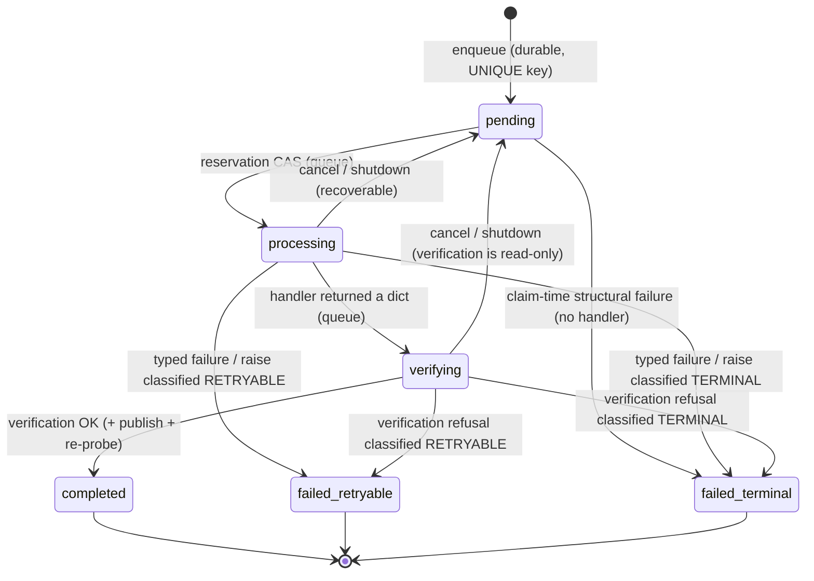

# Job Lifecycle Contract (canonical)

> Status: **living view** — enforced by `tests/unit/test_job_lifecycle.py`,
> `tests/unit/test_failure_semantics.py`, `tests/integration/test_job_lifecycle_queue.py`,
> `tests/integration/test_gate5_closure.py`, and the guarded writes in
> `src/nexus_ai_agent/adapters/in_process_job_queue.py`. Delivered by task-178
> (Agent C, 2026-09-24), closed by task-180 (verification GAPs, 2026-09-24)
> and task-181 (failure semantics + 6-state taxonomy + publication order,
> 2026-09-24). Decision records: `docs/DECISION_LOG.md` D-0013, D-0014,
> D-0015.

## 1. The canonical chain

Every step is explicit. None is implicit, and no step may be skipped by a
handler or a caller:

```mermaid
flowchart LR
    A[Command<br/>surface / API / CLI] --> B[Job<br/>durable row, idempotency-keyed]
    B --> C[Runtime Execution<br/>packs registry → CommandBus → lane]
    C --> D[Artifact Verification<br/>independent re-measurement]
    D --> P[Publication<br/>atomic rename + re-probe (pdf lane)]
    P --> E[Result<br/>verified facts / typed failure]
    C -- raise --> F[FAILED_RETRYABLE / FAILED_TERMINAL<br/>fail-closed, classified]
    D -- mismatch --> F
```

Ownership map:

| Step | Owner | Module |
|---|---|---|
| Command validation, staging, idempotency key | surface | `bot/creative_surface.py` |
| Durable job row, state machine, verification phase | **Job layer** | `adapters/in_process_job_queue.py`, `application/ports/job_queue.py`, `jobs/` |
| Execution semantics, artifact publication, probe/sha evidence | **Runtime (Agent 1)** | `creative/rendering/*`, `creative/packs/*`, `creative/studio/*`, `creative/slideshow/ffmpeg.py` |
| Worker adapter (chain assembly, typed failures) | worker | `creative/render_jobs.py` |
| Result rendering to the user | notifier | `bot/app.py` (grandfathered) |

The Job layer never re-implements runtime semantics: the verification
evidence functions *are* the runtime's (`sha256_file`, the allow-listed
binary probe `probe_video` — the architecture's ffprobe-equivalent).

## 2. State machine

Persisted values (enum `JobStatus`, task-181 failure taxonomy — see
D-0015 for the compatibility mapping): `pending`, `processing`,
`verifying`, `completed`, `failed_retryable`, `failed_terminal`.
Canonical aliases: `RUNNING ≡ PROCESSING`, `SUCCEEDED ≡ COMPLETED`
(`jobs/lifecycle.py`). Rows written by pre-task-181 code as `"failed"` read
back as `failed_terminal` (`jobs.lifecycle.parse_job_status` — the old
contract had one undifferentiated terminal failure).



**Both failure states are terminal as implemented.** The reserved
`failed_retryable → pending` scheduler retry edge is deliberately **outside**
the transition matrix — there is no retry scheduler in this repository, and
`assert_transition` refuses the edge (fail-closed). `failed_retryable`
records retry-*eligibility* for that future edge; it never implies a retry
happened.

Transition matrix with owner + invariant (`jobs/lifecycle.TRANSITIONS`,
unit-enforced; the adapter enforces each edge with a status-conditioned
`UPDATE … WHERE status IN (…)` — a blind write cannot produce an illegal
edge):

| Edge | Owner | Invariant |
|---|---|---|
| `pending → processing` | queue (reservation CAS) | row exists and is `pending` (strict CAS — a `processing` row is never re-claimed as a fresh execution); `started_at` set; `attempt += 1` (monotone execution-generation fence) + fresh `owner_token` minted — the `(id, attempt, owner_token)` lease fingerprint every later write must match |
| `pending → failed_retryable` | queue (claim-time) | structural failure classified RETRYABLE (a deploy can make the identical job succeed); zero side effects; only a still-`pending` row |
| `pending → failed_terminal` | queue (claim-time) | structural failure classified TERMINAL (e.g. no handler); zero side effects; only a still-`pending` row |
| `processing → verifying` | queue (fenced) | handler returned a dict; nothing trusted yet; lease fingerprint validated |
| `verifying → completed` | queue (fenced commit) | verification OK (+ journaled atomic publish + re-probe on published lanes); rowcount>0 = **COMMIT_CONFIRMED** — the only durable success point and the only gate for success notification; verified facts persisted under `artifact_verification` |
| `verifying → failed_retryable` | queue (fenced) | typed `verification_failed:<code>` persisted (artifact-damage class); staged temps retracted + journaled swap rolled back (inode-guarded) |
| `verifying → failed_terminal` | queue (fenced) | deterministic handler defect (no claim / malformed sha / mis-routed publication); staged temps retracted + swap rolled back |
| `processing → failed_retryable` | queue (fenced, fail-closed) | typed user failure / raise classified RETRYABLE — NEVER converted to success |
| `processing → failed_terminal` | queue (fenced, fail-closed) | typed user failure / raise classified TERMINAL |
| `processing/verifying → pending` | queue (fenced self-release **or** lease-expired startup recovery) | process-lifecycle recovery, not a business failure. (a) self-release requires the live owner's execution token — a stale worker's cancel matches zero rows and can never reopen a newer execution; (b) takeover at `resume_pending` only for rows whose lease (`started_at` + TTL; legacy NULL `started_at` counts as expired) lapsed, and it **invalidates** the owner token; `attempt` is preserved (it advances only at reservation) |
| terminal states (incl. both failures) | — | no outgoing edges (matrix + fenced UPDATEs + `attempt`/token validation); `failed_retryable → pending` is RESERVED for a future scheduler — not implemented, fail-closed; `PROCESSING → PROCESSING` re-claim was RETIRED by the Gate-5 repair (it was a real dual-claim ownership bug — R5) |

**Q1 — when does a Job become RUNNING?** At the reservation compare-and-set
(`_mark_processing`), *before* the handler is invoked. It is not "after
authorization" (authorization/preflight lives inside the handler, where the
capability registry and payload schema actually are) and it is not defined
by "the first side effect" (unknowable from the queue). Evidence: the
reservation must be durable *before* the world is touched, so crash
recovery (`resume_pending` reclaims only **lease-expired** `processing`/
`verifying` rows) has exactly one owner to blame per generation, and
`started_at`/`attempt`/`owner_token` are meaningful.

**Execution generations (Gate-5 repair, D-0016).** Ownership of one job's
execution is the lease fingerprint `(id, attempt, owner_token)`:
`jobs/fencing.ExecutionToken`. Every post-reservation transition is one
fenced UPDATE (`InProcessJobQueue._fence_update`):

    UPDATE … WHERE id = ? AND attempt = ? AND owner_token = ? AND status IN (…)

A displaced or cancelled worker matches **zero rows** (Kleppmann fencing at
the storage side: `attempt` is the monotone ratchet, `owner_token` the
durable identity) — it can never move a newer generation's state, journal
over its publication, publish over its artifact, or announce its outcome.
Proven by `tests/integration/test_execution_fencing.py` (T1–T15) and killed
guard-by-guard by `scripts/gate5_mutation_probes.py` (M1–M10).

## 3. Side-effect boundary (exactly one)

`NO EXECUTION SIDE-EFFECT` before **all** of:

1. `authorization` — surface/HMAC gate + payload schema validation
2. `capability` — operation ∈ packs `CapabilityRegistry` allow-list
3. `references` — input media contained in its workspace, readable
4. `idempotency` — durable UNIQUE key collapse at enqueue
5. `revision/precondition` — guarded status CAS (row in expected state)
6. `job reservation` — `pending → processing` owns the execution

Then `SIDE-EFFECT ALLOWED`, and the first lawful side effect is a write to
a **staging** path — never the final destination. The final name appears
only via atomic rename: media through the runtime's `.part` staging
(`creative/rendering/executor.py`), documents through
`render_jobs._atomic_write_text` (temp file → `os.replace`). A
half-written destination is never visible under a final artifact name.

## 4. Artifact verification contract

**Execution success ≠ Job success.**

```
execution success + artifact verification success = SUCCESS eligibility
```

For job types with a registered verifier, the queue moves the row to
`verifying` after the handler returns and re-measures the claim
**independently** — the verifier reads the filesystem; it never trusts
the handler's word, and a crashing verifier fails the job closed
(`verification_failed:verifier_crashed`).

Default registry (task-178 established it; task-180 closed the GAPs —
every job type in `worker.default_job_handlers` is now verified):

| Job type | Verifier | Artifact dialect |
|---|---|---|
| `creative_render` | `jobs.creative_verification.creative_render_verifier` | `output.mp4` / `captions.srt` / `timeline.otio` in the job workspace; media probe |
| `slideshow_render` | `jobs.creative_verification.slideshow_render_verifier` | the rendered master at the dispatched `output_path` inside the job workspace; real media probe |
| `story` | `jobs.feature_verification.story_verifier` | the Pillow-rendered PNG at the dispatched `output_path`; Pillow structural decode |
| `pdf_extract` | `jobs.feature_verification.pdf_extract_verifier` | the extracted text layer **staged** at `<stem>.extracted.txt.staged`, then published (atomic `os.replace`) to `<stem>.extracted.txt` and re-probed — see the publication order below; whole-file UTF-8 decode |

`tests/architecture/test_verification_registry_ratchet.py` fails if a
handler is ever registered without a verifier — no job type can silently
regress to unverified "execution success = job success" semantics.

Three identities (found in the tree, not assumed; evidence in
`creative/render_jobs.py`, `creative/rendering/compiler.py`):

| Identity | Content | Verified how |
|---|---|---|
| logical | `project_id = shot-<idempotency_key>` + output asset id | re-derived from the payload's key at verification; persisted in the result |
| spec | canonical operation id + compiled lane IR hash (`CompiledLane.ir_hash = sha256(canonical payload)`) | recorded by the worker (`spec_ir_hash`), persisted in the result |
| physical | output path (inside the job workspace) + size + `sha256:<hex>` + probe evidence | **re-measured now**: exists → `size > 0` → expected path per operation (`output.mp4` / `captions.srt` / `timeline.otio`) → containment → sha recompute → probe (media) |

Verification invariants (§ of the mission, all enforced in
`jobs/verification.verify_artifact`): the artifact must exist, be non-empty,
be *the* expected artifact of the operation inside the job's own workspace,
carry a stable identity (recorded sha equals recomputed sha), and for media
carry valid probe evidence (a probe failure is exactly "ffprobe failed" by
runtime semantics). Document artifacts are verified structurally (SubRip
timing-block syntax; OTIO must parse as a JSON object).

**Publication order (task-181, D-0015; hardened by the Gate-5 repair,
D-0017).** For lanes whose artifact destination lives *outside* the job
workspace — today exactly `pdf_extract`, its `<stem>.extracted.txt` sidecar
— the order is:

```
execute → stage → verify → BACKUP + JOURNAL + atomic swap → re-probe → fenced commit → retire backup → notify
```

The handler stages at the payload-derived `*.staged` name and claims it; the
queue verifies the staged bytes, publishes via the registered
`ArtifactPublication` protocol — *publish* backs the destination up to
`<name>.bak` (hardlink, copy fallback) and journals the swap
(`_publication{backup, published_inode}`, persisted fenced) before the
atomic `os.replace` — re-runs the same verifier against the published claim,
and only then commits (`_mark_completed`, fenced, rowcount>0 =
COMMIT_CONFIRMED) and retires the backup.

**Previous-artifact preservation (proven, not asserted):** any refusal after
the swap (re-probe failure, publish exception, refused fenced commit) runs
*retract* — inode-guarded restore of the backup (the destination is restored
to its pre-swap bytes **iff it is still this swap's inode**; a newer owner's
publication is never overwritten) — and a crashed predecessor's journaled
swap is rolled back the same way by *recover* before the next execution
starts (a backup without a journal is a byte-duplicate and is dropped). The
pre-repair lane here was **false**: a post-publish re-probe failure left the
refused bytes at the destination and destroyed the previous artifact
(reproduced as R1 at `6b86633`; fixed and proven T9–T11 + R1 NEW-GREEN).
A partial artifact never occupies a final name (stage/swap semantics
unchanged). Workspace-scoped lanes (`creative_render`,
`slideshow_render`, `story`) map the same order as: stage in workspace →
verify → publish at delivery (the notifier sends the verified bytes and owns
cleanup).

Typed user failures (`{"success": false, "error_code": …}`, the durable
dialect of this repository) claim **no artifact** and — since task-181
(D-0015, GAP-A) — are **failures of the job**: the queue classifies them
(`jobs/failure_semantics`) and persists `failed_retryable` / `failed_terminal`
with `typed_failure:<code>`; the typed result payload is preserved so the
notifier can translate the code. A typed failure never reaches `completed`,
and if one ever reached a verifier anyway, the verifier refuses it
fail-closed (`typed_user_failure`) — no layer of the stack may let a
non-success claim complete. Any `success: true` result MUST carry a
verifiable artifact — there is no success-without-artifact path
(`verification_failed:success_without_artifact_claim`).

## 5. Failure semantics (testable contract, task-181 taxonomy)

Every failure lands in exactly one of the two durable failure states —
never in `completed`:

| Case | Result | Class | Enforced by |
|---|---|---|---|
| typed user failure (`success=false` + code) | `typed_failure:<code>` + typed result preserved | per code (table below) | queue short-circuit + verifier refusal (GAP-A regression) |
| execution raised / non-dict | error persisted, no result | per exception (table below) | `_process_job` except path (M1) |
| probe failed on claimed media | `verification_failed:probe_failed` | RETRYABLE | verifier (M2) |
| zero-byte artifact | `verification_failed:empty_artifact` | RETRYABLE | verifier — no exception path bypasses it (M3) |
| sha/size mismatch (tamper/stale claim) | `verification_failed:sha256_mismatch` / `size_mismatch` | RETRYABLE | verifier (M4) |
| success claimed without artifact claim | `verification_failed:success_without_artifact_claim` | TERMINAL | verifier |
| verifier itself crashed | `verification_failed:verifier_crashed` | RETRYABLE | `_verify_safely` fail-closed (M10) |
| publish / re-probe failure | `verification_failed:publish_failed` / `reprobe_failed`, staged retracted | RETRYABLE | `_publish_and_reprobe` (Gate 5 suite) |
| runtime publish → own probe fails | RenderError escapes → fail-closed conversion — **never success**, no verification block | RETRYABLE (corrupt output) | worker fail-closed (M10b) |

The Job layer has no code path that converts a runtime failure into a
success: completion with a verification block only happens on `ok=True` +
successful publication.

### Classification table (`jobs/failure_semantics`)

One principle: **RETRYABLE iff the world can change to make the identical
request succeed; TERMINAL iff the identical request must fail again unless
the request, the credentials, or the code changes.**

| failure family | class | why |
|---|---|---|
| temporary IO (`TimeoutError`, `ConnectionError`, `OSError` errno EAGAIN/EBUSY/ETIMEDOUT/ENOSPC/…) | RETRYABLE | environment can change without the payload changing |
| dependency unavailable (`ImportError`; codes `ffmpeg_unavailable`, `caption_profile_unavailable`) | RETRYABLE | installing the dependency makes the identical job succeed |
| worker crash (unexpected exception) | RETRYABLE | cause unknown and potentially transient; bounded retry is conservative — a deterministic crash re-classifies identically and stays visible |
| invalid input (codes `invalid_request`, `media_missing`, `unusable_image`; `ValueError`/`TypeError`/`KeyError`) | TERMINAL | the identical request must fail again — the payload must change |
| unsupported operation (code; `NotImplementedError`) | TERMINAL | the capability set must change (a deploy, not a retry) |
| artifact verification failure (missing/empty/sha/size/duration/probe, `verifier_crashed`, `publish_failed`, `reprobe_failed`) | RETRYABLE | transient artifact damage is exactly what one clean re-execution is for; verification is read-only and idempotent |
| deterministic handler defects (no claim, malformed sha, mis-routed publication, typed failure at a verifier) | TERMINAL | the identical retry repeats the lie |
| permission error (`PermissionError`, EACCES/EPERM) | TERMINAL | the same credentials fail identically — an operator must act |
| corrupt output (probe of produced artifact fails) | RETRYABLE | a clean re-production may fix transient damage |
| code `render_failed` (the render of THESE inputs failed) | TERMINAL | same inputs + same binary ⇒ same failure; the request must change |
| codes `image_generation_failed`, `internal` | RETRYABLE | environment-side catch-alls |
| unknown typed code / unknown verification reason | TERMINAL | contract drift must be visible, never hidden behind silent retry-spam |

**SCHEDULER: NOT IMPLEMENTED.** The classification is complete; executing
retries is not implemented and not claimed. `failed_retryable` is terminal
as implemented (both failure states have no outgoing edges).

## 6. Retry / idempotency contract (deterministic matrix)

| Scenario | Deterministic behavior |
|---|---|
| retry after failed execution (same key) | same job id; the failure state is terminal — no re-execution; operator retry = new key (new message) |
| retry after failed verification | same as above; the typed `verification_failed:<code>` is durable |
| duplicate after terminal failure | same job id, same failure, **no re-execution** (Gate 5 idempotency matrix) |
| duplicate during PROCESSING | same job id, one execution (per-process task table + UNIQUE key) |
| destination exists | the runtime refuses blind replacement (`overwrite` gate) and publishes by atomic rename; `overwrite=True` at the worker is scoped to the job's own key-derived workspace path; a failed re-render leaves previous bytes in place (M5) |
| same key, same payload | same job id, no second effect (redelivery dedupe) |
| same key, different payload | **first payload wins**: same job id, original effect; conflict logged (`job_idempotency_payload_conflict`) — a retry can never smuggle a second, different effect (M6/M7) |
| retry after valid artifact exists (completed job) | same job id + stored verified result; handler not called again (M8) |
| revision changes | revision is part of the payload ⇒ same-key revision = conflict row above; a genuinely revised request takes a new key ⇒ new job + new workspace |
| crash mid-execution / mid-verification | row recoverable (`resume_pending` resets `pending/processing/verifying`); verification is read-only so re-running it is idempotent; `attempt` counts executions |

Hard rule: **a retry cannot covertly overwrite a valid existing artifact.**
Terminal jobs never re-execute; non-terminal retries only ever replace
their own previous attempt's bytes, and only after the new artifact passed
its own runtime checks — the old bytes are replaced by atomic rename, not
deleted first.

## 7. Result contract

`queue.get_result_chain(job_id)` assembles `jobs.lifecycle.JobResult` from
durable facts only: `command_id`, `job_id`, `project_id`, `operation_id`,
`attempt`, `execution_status`, `verification_status`, the three identities,
`sha256`, `size_bytes`, `probe`, `failure_reason`. The verified facts also
ride inside the persisted result under the queue-owned
`artifact_verification` key, so any consumer of `get_result` sees the
verification truth, and the completion notifier delivers after the durable
state is already final.

## 8. Negative-test matrix (M1–M10) and the §17 regression

`tests/integration/test_job_lifecycle_queue.py` (real queue, real FFmpeg
for probe paths):

M1 execution failure · M2 probe failure · M3 zero-byte · M4 sha tamper ·
M5 existing-destination survival · M6 idempotency conflict + exact
redelivery · M7 revision conflict · M8 completed-job reuse · M9 invalid
media after "successful encode" · M10 verifier crash fail-closed · M10b
runtime fail-closed never success · A/B (legacy hole vs canonical queue on
the same lying claim) · VERIFYING observability + cancel/recover ·
attempt accounting · PENDING→FAILED claim-time edge.

§17 regression (`test_succeeded_implies_valid_stable_traceable_artifact`,
real chain): `COMPLETED` ⇒ artifact exists on disk, `size > 0`,
`sha256(result) == sha256(bytes on disk)`, probe evidence present, logical
+ spec + physical identities persisted, `attempt` recorded. That test *is*
the durable answer to the mandatory question — see D-0013 for the A/B
evidence that the pre-contract queue could complete a lying claim and the
canonical queue cannot.

Task-181 adds `tests/integration/test_gate5_closure.py` (typed-failure
regression across codes/classes, notification matrix, refused-publication
scenarios, trace `job_id`, idempotency matrix, crash-window recovery) and
`tests/unit/test_failure_semantics.py` (the classification table), plus the
mutation harness `scripts/gate5_mutation_probes.py` (6 probes, each
GREEN→RED→restore→GREEN — see `docs/audits/GATE5_CLOSURE_2026-09-24.md`).

## 9. Notification contract (task-181; Gate-5 repair decision, D-0016)

**Truth ("never lie") is the enforced contract; delivery ("eventually
notify") is best-effort and explicitly weaker.** Concretely:

* the durable lifecycle state is the notifier's only source of truth, and a
  terminal fan-out fires **only** when the fenced terminal UPDATE actually
  applied (COMMIT_CONFIRMED): one truthful notification per durable outcome;
  a displaced generation is silent — its outcome is void and the current
  owner announces its own (T4/T15);
* the hook stays strictly fail-safe (a broken notifier can never corrupt the
  queue), but there is **no delivery retry**: delivery is at-most-once per
  outcome. A transactional outbox was evaluated and rejected as an
  unjustified migration — the durable row already *is* the truth record;
  an outbox would only buy delivery-grade retry, which is a declared non-goal
  here (D-0016).

| durable state | user-visible outcome |
|---|---|
| `completed` | success notification / artifact delivery (fires only after COMMIT_CONFIRMED) |
| `failed_retryable` | failure notification (visibly "temporary / retryable") |
| `failed_terminal` | terminal-failure notification (visibly "definitive") |
| `verifying` / `pending` / `processing` | silent — a success message is impossible outside `completed` |
| verification failure | failure notification — never success, never a delivery |

`result.success == true` under a failure status can never produce a success
notification (the claim is a second, independent refusal, never the truth
source), and a bare `{"success": false}` (missing/empty `error_code`) is a
typed failure `typed_failure:untyped_failure` — it can never complete
(Gate-5 repair R4). Evidence:
`tests/integration/test_gate5_closure.py` (notification matrix + lying-result
regression), `tests/integration/test_execution_fencing.py` (T4/T15),
`tests/unit/test_creative_notify.py`, `tests/unit/test_bot_slideshow_notify.py`.

## 10. Trace contract (task-181)

Every event emitted while a job runs carries the durable `job_id`:
structlog contextvars bind it at `_process_job` entry (the worker's events
— e.g. `creative_render_start` — inherit it), the queue's lifecycle lines
name it explicitly (`job_processing` / `job_verifying` / `job_completed` /
`job_failed`), `JobCompletion` and `JobResult` carry it, and the notifier
prints it. A lifecycle event belonging to a job can never record
`job_id = null`. Evidence:
`test_gate5_closure.py::test_every_lifecycle_trace_event_carries_job_id`,
`::test_result_and_completion_carry_the_durable_job_id` (and mutation
probe #4, which turns the first RED).
