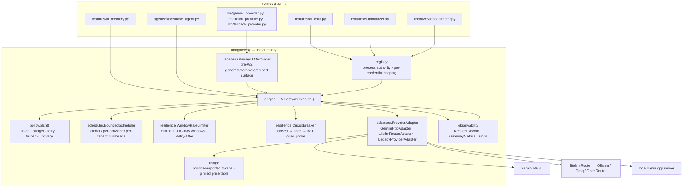

# LLM Gateway — the single authority for every model call

**Status:** candidate branch implementation, **W2 NOT VERIFIED**. This file does
not assert that the candidate has merged to main or passed exact-head CI.
**Decision context:** [D-0024](../DECISION_LOG.md) · [providers](LLM_PROVIDERS.md).
**Enforcement:** `tests/architecture/test_llm_gateway_authority.py`,
`tests/unit/test_llm_gateway_*.py`, `scripts/llm_gateway_mutations.py`.
The mutation inventory is executable (`--list`); historical counts are not proof.

The installed deployment gateway is process-local and executes on one event loop.
It is not a fleet-wide authority and not "one object forever". Non-deployment
credential scopes and explicitly constructed legacy Router facades still have
separate policy state. Two image/vision egress exceptions remain (§12). Therefore
"every model call shares one authority" is a target, not a current guarantee.

## 1. Why an authority, and not another wrapper

Before W2 the same five decisions were re-implemented per caller: whether to retry,
how long to wait, when to give up, which provider to try next, and what a failure
meant. Each copy differed, and the differences were invisible until a provider had
a bad hour. Two symptoms made the cost concrete:

* classification by prose — `if "429" in str(error)` — which makes retryability
  depend on a provider's English and breaks silently when the wording changes;
* blind fallback — `except Exception: try provider B` — which launders a
  moderation decision or a caller's own bug into "the other model answered".

The gateway removes both by making the *type* of a failure the only input to the
retry/fallback decision, and by making fallback a policy evaluation rather than an
exception handler.

## 2. Target architecture

Request path, in the order the engine actually executes it:

1. **refuse closed work** — a closed authority declines before planning;
2. **plan** (`policy.plan`) — resolve routes (pins, capability, privacy, rules),
   scale the `TimeoutBudget` to the caller's deadline, pick retry/fallback policy,
   derive the idempotency key. A plan can be a *typed refusal*, which is returned
   instead of guessed at later;
3. **idempotency** — an in-flight identical request is coalesced (bounded cache,
   keyed by a fingerprint of tenant + operation + pin + payload);
4. **per route, per attempt:** cancellation check → closed check → deadline check →
   admission (bulkhead) → acquire a breaker permit for this attempt → rate gate
   (charge or typed refusal) → adapter call under a per-attempt timeout → typed result;
5. **on failure:** classify (already typed) → breaker accounting → retry decision
   (kind, attempts left, `Retry-After`, backoff that fits the remaining budget) →
   otherwise fallback decision (eligibility, hops, capability, degraded routes) →
   otherwise raise the terminal typed error;
6. **observation:** physical executions emit records without prompt/answer text.
   Coalesced/cached callers receive distinct correlation IDs and records, without
   attributing the original provider's token spend twice. Lifecycle violations
   (closed, foreign PID/loop) are rejected before execution admission.

## 3. The contract

`llm/gateway/contract.py` — frozen dataclasses, validated at construction.

| Type | Carries |
|---|---|
| `Caller` | `category` (agent, surface, summarizer, planner, memory, knowledge, creative, background_job, system), `name`, `tenant_id` — the identity every bound and every record is scoped by |
| `LLMRequest` | caller, `purpose`, `operation`, `prompt`/`system`/`messages`/`parts`, `provider`/`model` pins, `priority`, `deadline_seconds`, `allow_fallback`, `generation`, `output_validator`, `idempotency_key`, `cancellation`, `metadata` |
| `GenerationParams` | `max_output_tokens`, `temperature`, `top_p`, `top_k`, `response_mime_type`, `stop_sequences` — rejected in `__post_init__` when out of range, so an invalid request cannot reach a provider |
| `LLMResponse` | `request_id`, `text`, provider/model actually used, `operation`, caller, purpose, `usage`, `finish_reason`, `policy`, `timings`, `attempts`, `structured`, `embedding` |
| `PolicyOutcome` | attempts, retries, `fallback_used`, `fallback_from`, `degraded`, `admission_rejected`, `circuit_open`, `rate_limited_locally`, `idempotency_hit` |
| `Timings` | queued, rate-waited, executed, backoff, total — each clamped at ≥ 0 |
| `Usage` | `source` (`provider` or `unknown`), token counts, `estimated_cost_usd`, `reported_model` |
| `LLMPriority` | `OWNER(0)`, `REFERRAL_BONUS(1)`, `NORMAL(2)`, `LOW(3)`; values match `features/request_queue.Priority` so a request crosses either scheduler untranslated |

`payload_bytes()` counts binary parts only: a record reports the size of what was
uploaded, not the length of a prompt (which is reported separately as
`prompt_chars`, a count and never a copy).

## 4. Typed errors — the only classification input

`llm/errors.py`: `LLMError` carries `kind`, `status_code`, `provider`, `model`,
`request_id`, `attempt`, `retry_after`, `detail`, and derives two policy facts from
the kind: `retryable` and `fallback_eligible`.

| Kind | Retryable | Fallback-eligible | Raised when |
|---|---|---|---|
| `rate_limited` | yes | yes | provider 429, or the local window is full and policy will not wait that long |
| `transient_provider_failure` | yes | yes | provider 5xx / declared transient status |
| `upstream_timeout` | yes | yes | one attempt exceeded its transport or per-attempt cap |
| `network_failure` | yes | yes | connect/read/transport error |
| `authentication_failure` | no | yes | 401/403 — a different route may hold a valid credential |
| `quota_exhausted` | no | yes | daily budget gone (provider or local) |
| `unsupported_capability` | no | yes | declared `UNIMPLEMENTED`/unsupported model or operation |
| `invalid_request` | no | no | 400 — the request is wrong; retrying cannot help |
| `context_token_limit` | no | no | prompt exceeds the route's context window |
| `content_blocked` | no | **never** | a moderation/safety decision; another provider must not launder it |
| `malformed_provider_response` | no | no | 200 with a body that is not a valid answer |
| `structured_output_invalid` | no | no | the answer failed the caller's validator |
| `policy_refusal` | no | no | the plan refused: no capable route, privacy forbids all, bad pin |
| `deadline_exceeded` | no | no | the caller's budget ran out |
| `gateway_overloaded` | no | no | shed by a bulkhead or the bounded queue |
| `cancelled` | no | **never** | the caller withdrew, or its task was cancelled |
| `gateway_closed` | no | no | the authority is shut down |
| `internal_gateway_failure` | no | no | a bug or a contract violation at the adapter boundary |

Substring classification is banned structurally, not by convention:
`tests/architecture/test_llm_gateway_authority.py` walks the AST of every file in
`src/` and fails on the shape `"<error keyword>" in str(...)` (including
`f"{...}"` and `.lower()` variants), with a liveness test proving the detector
still fires. Adapters classify from the HTTP status code and the provider's
declared machine-readable `error.status` field; a `message` that *mentions* a rate
limit on a 400 stays `invalid_request`.

## 5. Policy lives in exactly one place

`llm/gateway/policy.py` holds the knobs; `plan()` is the only function that turns
them plus a request into a `Plan`. Migrated canonical callers do not own a second retry or fallback policy;
the explicit image/vision exceptions in §12 still own their own resilience.

| Policy | Defaults | What it bounds |
|---|---|---|
| `TimeoutBudget` | total 60s, queue 30s, connect 5s, read 45s, per-attempt 50s, max backoff 8s | layered timeouts, mutually consistent by construction (`validate()` rejects `connect+read > per_attempt`, `per_attempt > total`, `max_backoff > total`); `with_total()` scales the inner layers down to a caller's shorter deadline, never up |
| `RetryPolicy` | 3 attempts, base 0.5s, max 8s, ×2, full jitter, honours `Retry-After` up to 30s | attempts by *kind*, not by exception type; a wait the provider asked for is bounded by its own ceiling, a wait we invented by the jitter ceiling |
| `ConcurrencyPolicy` | 4 global, 2 per provider, 2 per tenant, queue 32, `REJECT` | bulkheads: one sick provider cannot consume the fleet; `WAIT` mode blocks for a queue slot instead of shedding |
| `RateLimitPolicy` | `max_wait_seconds` 5.0, per-provider `requests_per_minute` / `requests_per_day` | local rolling minute window + UTC day counter per provider, charged exactly once per served request; refusals are counted as throttles even when no charge happened |
| `CircuitPolicy` | 5 failures, 30s recovery, 1 half-open probe | per-route breaker; only provider-health kinds count (a content block or a caller cancellation says nothing about provider health); an open circuit stays in the plan so it can recover |
| `FallbackPolicy` | enabled, 2 hops, capability match required, degraded routes allowed last | fallback as a decision: eligibility from the typed error, capability from the route, ordering from rank and health |
| `PrivacyPolicy` | `strict=False`, forbidden suffixes `:free` | routes a request may never be sent to, applied before ranking |
| `Route` / `RouteRule` | rank 100, text modality, chat+completion operations | what exists, what it can serve, and which caller/purpose/priority prefers it |

Retry and fallback interact through one rule: a retry is the *same* route again, a
fallback is a *different* route, and both are bounded by the caller's total budget.
A backoff that cannot fit in the remaining budget is declined — the chain stops and
reports `deadline_exceeded` instead of sleeping past the moment the caller stopped
caring.

## 6. Cancellation is sacred

Three distinct stop signals, three distinct outcomes:

| Signal | Mechanism | Outcome |
|---|---|---|
| caller's task cancelled | `asyncio.CancelledError` | propagates untouched — never converted into a typed error, never retried, never fallen back from; any concurrency slot won in the meantime is released |
| caller withdraws | `request.cancellation` — an `asyncio.Event`, an awaitable, or any object with `wait()`/`is_set()` | typed `CancelledByCallerError` (`kind=cancelled`, not retryable, not fallback-eligible); the caller's task stays alive so it can report the withdrawal |
| authority shuts down | `gateway.aclose()` | typed `GatewayClosedError`; waiters are woken with it rather than hanging; the retry chain stops at its next boundary and says which boundary stopped it |

Every sleep in the engine is cancellation-aware (`_sleep(delay, token)` returns how
long it actually slept), so a withdrawal during a 2-second backoff lands in
milliseconds, not after the nap. Provider tasks are raced explicitly against the
budget and the withdrawal watcher; a task that ignores cancellation is abandoned
and tracked until it actually settles (grace 0.25s/0.05s). New provider attempts
are refused while any abandoned task remains live; reference eviction cannot
conceal ongoing work. No Python coroutine mechanism can forcibly kill a hostile
adapter or undo a request already received by a remote provider,
and a *late* answer that arrives after the budget expired is reported as
`deadline_exceeded` rather than handed back as a kept promise. `KeyboardInterrupt`,
`SystemExit` and `GeneratorExit` are re-raised verbatim: Ctrl-C is the operator
talking, not a provider failing.

## 7. Observability by default, and what is never recorded

Every request produces exactly one `RequestRecord` — success, degraded success,
error, cancellation, deadline, overload, refusal or closed — emitted to every
attached `ObservationSink` (`StructlogSink`, `CollectingSink`, or your own).

Recorded: request id, caller (category/name/tenant), purpose, operation, outcome,
provider and model that actually served it, error kind + status code + retryable,
usage, finish reason, the five timings, the `PolicyOutcome`, one `AttemptRecord`
per attempt (index, provider, model, started, duration, outcome, kind, status),
`prompt_chars`, `payload_bytes`, sanitized metadata, idempotency key.

Never recorded: prompt text, system text, message content, binary parts, the
provider's answer, credentials, and **`str(error)`** — a provider message can echo
part of a prompt or a key, so `build_error_record` copies typed fields only.
Metadata passes `sanitize_metadata`, which drops blocked keys (`prompt`, `system`,
`message`, `text`, `content`, `api_key`, `token`, `secret`, `authorization`,
`cookie`, `image`, `audio`, `data`, … case-insensitively) and bounds the rest to 8
fields × 128 characters. `redact_secrets` catches `x-goog-api-key`, `Bearer`,
`api_key=` pairs and URL userinfo in anything that does get logged.

`RequestRecord.otel_attributes()` maps onto the OTel GenAI semantic conventions
(`gen_ai.operation.name`, `gen_ai.request.model`, `gen_ai.usage.*`,
`gen_ai.response.finish_reasons`, `error.type`), with prompt/completion content
left out — the conventions make content opt-in events, and NEXUS does not opt in.

`GatewayMetrics` is bounded too: a 256-record ring buffer, counters for
requests/attempts/retries/outcomes/kinds/usage, and `recent(limit)` for the
`/status` view. Nothing grows without limit.

## 8. Usage and cost: never invent a number

`Usage.source` is `provider` only when the provider reported token counts;
otherwise it is `unknown` with `None` fields — never `0`, never an estimate from
prompt length. `is_known` is derived from the source, so a consumer cannot mistake
an absent report for a free call. `apply_cost` attaches `estimated_cost_usd` only
when the usage is provider-reported **and** the model has a pinned price in
`DEFAULT_PRICE_TABLE` (`PRICE_TABLE_VERSION = "2026-09-28"`); an unpriced model
stays `None`, which means "no pinned price", not "free". Gemini/Groq model names
and local-model aliases do not identify a billing contract: their default prices
are UNKNOWN. Only the explicit OpenRouter `:free` endpoint is pinned to zero;
operators can inject their own finite, nonnegative price table, including zero.
Malformed SDK token counts (booleans, negatives, strings, fractions, NaN/Infinity)
remain unknown rather than being coerced into invented measurements.

Metrics expose `known_cost_subtotal_usd` and `cost_unknown_requests` separately.
The aggregate `estimated_cost_usd` is null if any physical request lacks cost
provenance, including earlier failed attempts in a retry/fallback chain. Logical
idempotency reuse and proven pre-execution refusals add no provider spend. This
is not an invoice or full infrastructure cost accounting.

## 9. Adapters: where the wire lives

`ProviderAdapter` is the whole extension surface: `name`, `operations`,
`modalities`, `async execute(request, route, *, budget, request_id, attempt) ->
AdapterResult`, `async aclose()`. An adapter translates; it does not decide. It
must not retry, must not pick another provider, must not swallow its own errors —
the engine returns a typed `internal_gateway_failure` if an adapter hands back
anything that is not an `AdapterResult`.

| Adapter | Talks to | Notes |
|---|---|---|
| `GeminiHttpAdapter` | Gemini REST over httpx | classifies from status code + declared `error.status`; honours `Retry-After`; treats a blocking `finishReason` as `content_blocked`, not as an empty answer; `base_url` is validated (https unless loopback, no userinfo, host required) — `None` means the default endpoint, an explicit empty string is refused |
| `LitellmRouterAdapter` | a `litellm.Router` chain | the Router stays the *deployment* selector inside one route; the chain's exhaustion maps to `quota_exhausted` by exception identity, never by message |
| `LegacyProviderAdapter` | any pre-W2 `LLMProvider` | wraps `gemini_provider`, `local_server_provider`, `local_llama_cpp` with an explicit `{ExceptionType: kind}` map, so a legacy typed error becomes a gateway kind at the boundary |

## 10. Registry: installed deployment authority and explicit credential scopes

`registry.py` answers "which gateway do I use?" without letting callers build
policy:

* `install_llm_gateway` / `get_llm_gateway` / `set_llm_gateway` /
  `reset_llm_gateway` — the process authority, installed once by a composition
  root (`build_gateway_from_settings` reads `config/settings.py` and registers
  every configured provider as a route);
* `gateway_for_credentials(key, model, …)` — three cases: the deployment key
  returns the process authority; a *different* key returns a scoped single-route
  gateway (capacity-capped at 16, fallback disabled, so one caller's credentials cannot
  borrow another's routes); an empty key gets a typed refusal instead of a silent
  anonymous call;
* both accessors build under a lock (`_AUTHORITY_LOCK`, `_CREDENTIAL_LOCK`) with a
  double-checked read. They are process globals that **synchronous** constructors
  call (`SummarizerEngine.__init__` resolves its gateway inline), and this codebase
  runs synchronous work in `asyncio.to_thread` workers (job queue, whisper,
  ffmpeg/render, RAG) and starts fresh loops with `asyncio.run` (CLI, maintenance),
  so "one authority per process" has to survive two threads reaching *first use* at
  the same instant. Without the lock each thread builds its own gateway — two sets
  of concurrency bounds, rate windows, breaker state and metrics — and the loser
  keeps serving its caller while nobody owns its adapter's HTTP pool any more
  (`tests/unit/test_llm_gateway_registry_race.py`, including a deadlock test for
  the locks themselves);
* all installers use the same lock; a second live installation is a typed conflict
  and the rejected idle candidate is revoked. Reset revokes stale idle references,
  returns the old object for async cleanup, and refuses active work. An old
  reference cannot continue execution after reset. Close/drain precedes restart;
* execution binds to the first event loop and construction PID. A foreign loop
  or inherited worker object is refused. Fresh worker processes construct their
  own authority; forking a multithreaded live runtime is not a supported lifecycle;
* live credential scopes are never evicted. Overflow rejects until an owner closes
  a scope. This prevents eviction-induced split brain, but does not merge quotas
  across models/credentials;
* `DEGRADED_PROVIDER = "local-degraded"` — the marker for local/fake routes that
  may serve as a last hop and must be visible on the response.

## 11. Compatibility: the pre-W2 surface still works

`facade.GatewayLLMProvider` keeps the interface existing callers already use —
`generate(prompt, system)`, `complete(...)`, `embed(text)` — and executes it on the
authority. User-facing failure strings (`UNAVAILABLE_MESSAGE`,
`DEGRADED_DISCLAIMER`, the busy message) are byte-for-byte the pre-W2 ones, because
they are product copy, not diagnostics; provider detail never reaches a chat
surface. `embed` raises a typed `internal_gateway_failure` rather than returning
`None` or an invented vector, and `json_object_validator` / `pydantic_validator`
turn "the model almost returned JSON" into `structured_output_invalid`.
`llm/fallback_provider.py` keeps its API but decides on `exc.fallback_eligible`;
its `error_keywords` parameter is retained but inert (warning by count only).
Successful model text is never reclassified by substring, even in this legacy
shim; native and typed cancellation from the backup both propagate.

## 12. Caller inventory (the real call graph)

Every path from a caller to a provider, as verified by
`tests/architecture/test_llm_gateway_authority.py` — which discovers the set
mechanically (endpoint literal, provider wire path, or provider SDK import) and
fails if it drifts from this table in either direction.

| Caller | Path to the model | Mechanism |
|---|---|---|
| `features/ai_chat.py` | gateway | `gateway_for_credentials(..., base_url=BASE_URL)` → `LLMRequest` → `execute` |
| `features/summarizer.py` | gateway | `gateway_for_credentials(...)`; `allow_fallback=False` so a summary is never silently another provider's answer. Its own httpx client fetches *user-supplied URLs* under the SSRF guard — not LLM egress |
| `features/ai_memory.py` | gateway | duck-typed `provider.gateway` → `execute` with `json_object_validator`; falls back to the plain `LLMProvider` contract only for injected doubles |
| `agents/store/base_agent.py` | gateway | duck-typed `gemini.gateway` → `execute` with gateway `Message` turns; otherwise the legacy provider contract |
| `creative/video_director.py` | gateway | `gateway_for_credentials(api_key, model)` → `execute` |
| `llm/gemini_provider.py` | gateway | `GeminiProvider.execute` runs through the ChatEngine's gateway and exposes it as `.gateway` |
| `llm/litellm_provider.py` | adapter / explicit legacy bridge | canonical registry uses `build_raw_routing_adapter` with Router retries/fallbacks disabled; explicitly constructed legacy `LiteLLMRoutingProvider` retains a private gateway and SDK routing chain, outside the deployment-authority guarantee |
| `llm/local_server_provider.py` | gateway | wrapped by `LegacyProviderAdapter` in `registry._build_llama_server_adapter` |
| `llm/local_llama_cpp.py` | gateway | wrapped by `LegacyProviderAdapter` in `registry._build_llama_cpp_adapter` |
| `llm/fallback_provider.py` | gateway-typed | provider-level compatibility wrapper; decisions from typed `fallback_eligible` |
| `llm/fake_llm.py` | none | in-process double for tests; no I/O |
| `config/settings.py` | none | declares endpoints and credentials as data; performs no I/O |

### Pinned bypasses (2, ratcheted)

Two files still perform LLM egress outside the authority. They are named here,
justified in the test, and the count may only fall:

| File | Why it is outside | What migration needs |
|---|---|---|
| `creative/image_gen/gemini_adapter.py` | Gemini **image generation**: `:generateContent` with `responseModalities: [TEXT, IMAGE]`, inline base64 image parts, aspect-ratio validation, paid-tier fail-closed guard, per-image cost estimate. The gateway's contract and adapters are text/modality-scoped for chat and embeddings | a binary-output adapter contract (`AdapterResult` with image parts) plus cost accounting per image — a separate mission, not a one-line move |
| `creative/slideshow/analysis.py` | **synchronous** httpx vision scoring for slide ordering. Default provider is `local_heuristic` (Pillow + numpy, no network); the hosted leg is fail-closed behind `NEXUS_SLIDESHOW_ALLOW_IMAGE_UPLOAD` and uploads downscaled copies only | a sync entry point into an async engine (or a job-queue hop), plus image-input support in the contract |

Both raise their own typed errors (`ImageGenerationError`, `AnalysisError`) and
neither classifies by substring, so LAW 3 holds everywhere even where LAW 1 does
not yet. Adding a third bypass requires raising `MAX_PINNED_BYPASSES` in the
architecture test — deliberately a review, not an edit.

## 13. Extension recipes

**Add a provider.** Write an adapter (`name`, `operations`, `modalities`,
`execute`, `aclose`) that translates one provider's wire format into
`AdapterResult` and its failures into typed `LLMError`s. Register it with a
`Route` (or let `register(adapter, None)` synthesize one). Do not add retry,
fallback, caching or metrics inside the adapter — the engine owns them, and a
second copy means two authorities.

**Add a caller.** Build an `LLMRequest` with a real `Caller` (category, name,
tenant), a `purpose` you would want to read in a dashboard, and the `operation`.
Resolve the gateway from the registry rather than constructing one: policy belongs
to the composition root. Set `allow_fallback=False` when a substituted answer
would be a lie (summaries, memory extraction), and pass `cancellation` when the
caller can be withdrawn.

**Add a policy knob.** Add the field to the relevant policy dataclass, validate it
in `__post_init__`, apply it inside `plan()` or the single component that owns that
dimension, and add a test that states the invariant. A knob that is read in two
places is two policies.

## 14. Verification

| Gate | Command | What it proves |
|---|---|---|
| structure | `pytest tests/architecture/test_llm_gateway_authority.py` | the call graph is exactly the inventory; only the gateway, its wrapped providers and the 2 pinned bypasses make provider requests; no substring classification anywhere; the detectors are live |
| behaviour | `pytest tests/unit -k llm_gateway` | contract, errors, policy, resilience, scheduler, adapters, engine, observability, cancellation, facade, adversarial, security, load, registry races, golden schedules |
| mutations | `python scripts/llm_gateway_mutations.py` | the executable battery weakens named invariants; a survivor fails the run and is answered with a stronger test, never a deleted mutation |
| types | `mypy src` | the contract is checked, not documented |
| style | `ruff check src tests scripts` | — |

The mutation harness copies `src/nexus_ai_agent` to a temporary directory, refuses
to mutate a red baseline, runs each mutant against its designated test, restores
the file, and re-verifies the restored copy is green. It never edits the working
tree.

## 15. Known limits

* **Two bypasses remain** (§12). They are pinned and ratcheted, not hidden.
* **Bounds are per-process.** The scheduler, rate windows and idempotency cache are
  in-memory. Two processes get two sets of bounds; a fleet-wide limit needs a
  shared store, which no current deployment requires.
* **The price table is pinned, not live.** An unpriced model reports no cost rather
  than a guess; adding a model means editing `DEFAULT_PRICE_TABLE` and its version.
* **The engine is async.** A synchronous caller cannot enter it directly, which is
  precisely why `creative/slideshow/analysis.py` is still outside.
* **Idempotency coalesces, it does not persist.** The cache is a bounded in-memory
  window (`idempotency_ttl_seconds`, default 300s); a restart forgets, and a
  duplicate across processes is not detected.

## 16. Golden hardening contracts

* **Probe ownership:** `CircuitPermit` records whether this attempt acquired a
  half-open slot and the breaker generation. Its idempotent release cannot consume
  another attempt's slot. Outcome accounting no longer releases slots implicitly.
  Late successes cannot heal a newer trip. Every retry reacquires permission.
  `test_probe_a_never_releases_probe_b` covers success, failure, cancellation,
  invalid result, raw exception and timeout with two controlled in-flight probes.
* **Admission:** at most `max_inflight_global + max_queued` logical requests can
  remain admitted, including coalesced waiters. WAIT cannot create an unbounded
  second waiting population. Sinks are capped at 128. Live idempotency entries are
  rejected at capacity, never evicted. Completed entries remain a bounded LRU.
* **Retry-After:** above either the provider-wait ceiling or the configured backoff
  budget, decline the retry; never truncate the provider's lower bound.
* **Idempotency:** length-framed content hashes include all binary parts, message
  parts, generation settings and caller identity. A waiter has its own deadline
  and cancellation token, without cancelling the owner's execution.
* **Security:** internal errors do not emit traceback chains; shutdown logs omit
  raw exceptions. Records hash caller-supplied idempotency tokens before any sink
  sees them. Provider/model/purpose/caller labels are bounded and redacted;
  error metric cardinality is capped at 128 named labels plus an overflow bucket.
  Metadata remains redacted by known patterns, not a universal detector of arbitrary
  personal data; application-supplied labels must not carry user content.
* **Canonical CLI:** `build_llm_provider` returns a registry-bound facade for real
  model paths. Local route pins preserve server/GGUF selection. The process routing
  adapter calls Router directly, not another gateway; local hash embeddings retain
  their old 384-dimensional algorithm via an embeddings-only legacy adapter.
  Routing-chain compositions have one gateway attempt, preventing nested retries.
  FakeLLM with no model configured is still a non-model compatibility stub.
* **Proof commands:** `python scripts/w2_golden_proof.py race --runs 40`,
  `... engine --runs 40`, `... full --runs 20`. Logs are disposable under
  `ci-artifacts/w2`; summaries bind HEAD, content hash, interpreter, hash seed,
  exit status and log digest. Fresh pytest processes are not clean machines or
  independent evidence of unavailable PostgreSQL/model infrastructure.
