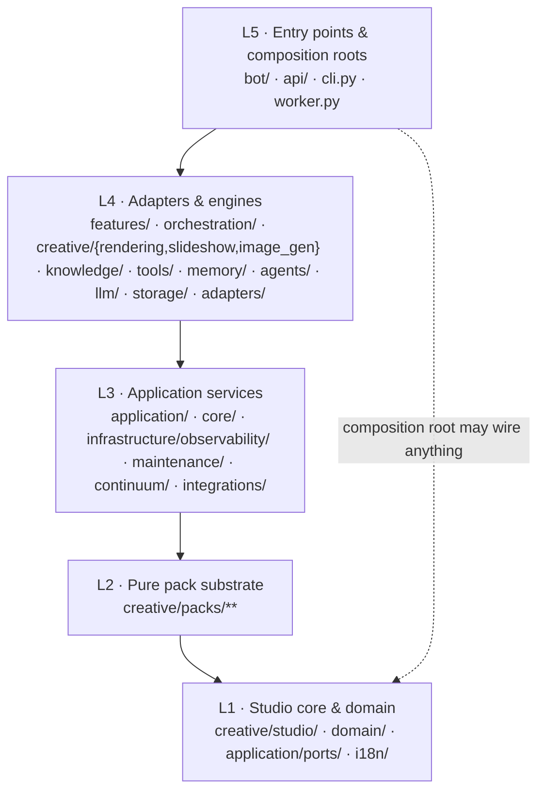

# Module Map & Boundary Laws

**Status:** Living document — every rule here names the test that enforces it
**Scope:** package inventory, allowed dependency directions, fitness-function catalogue, extension recipes
**Verified against:** `main` @ `7573249`

This is the *structural* contract of the repository. If a rule is not in §3 or §4, it is a convention, not a law. If a rule is in this file and **not** enforced by a test, that is a documentation bug — file it against zone `docs-architecture`.

---

## 1. Layering

Dependencies point **downward**. A lower layer may never import a higher one, and no layer may import its own siblings across a zone boundary (see §3 R7).

## 2. Package inventory and role

| Package | Layer | Role | Notable entry symbols |
|---|---|---|---|
| `domain/` | L1 | vocabulary, retention/reconciler policies — pure functions and enums | `EntityType`, `SOURCE_OF_TRUTH`, `purge_allowed`, `health_gate_ok` |
| `application/ports/` | L1 | the six hexagonal contracts (`LLMPort`, `JobQueuePort`, `ObjectStoragePort`, `ConversationStorePort`, `CheckpointLifecyclePort`, `CaptionEnginePort`) | see [`PORTS.md`](PORTS.md) |
| `creative/studio/` | L1 | Nagar core: typed `Project`, `CommandBus`, `CapabilityRegistry`, `PermissionLevel`, reference resolver | `build_wave1_registry`, `CommandBus.dispatch` |
| `creative/packs/` | L2 | seven data-only packs + manifest schema, verifier, registry | `register_*_operations`, `PackRegistry.register_builtin` |
| `i18n/` | L1 | 15 locales × 63 keys, key-parity guarded | `I18n`, `i18n` |
| `core/` | L3 | SSRF guard, resilient HTTP client, async DB helper, instrumentation decorator | `SafeAsyncTransport`, `ResilientHttpClient`, `AsyncDB` |
| `application/` | L3 | use-case composition with no framework imports | `get_image_gen_provider` |
| `infrastructure/observability/` | L3 | metrics registry, structured lifecycle events, redaction | `MetricsRegistry`, `log_lifecycle_event`, `redact` |
| `continuum/`, `maintenance/`, `integrations/` | L3 | project-state snapshot, housekeeping/backup, external integrations | `snapshot`, `housekeeping` |
| `storage/` | L4 | SQLModel tables, Alembic bootstrap, checkpoint adapters, lifecycle store, reconciler, R2 | `get_session`, `get_checkpointer`, `CheckpointReconciler` |
| `adapters/` | L4 | port implementations: in-process job queue, Whisper caption engine, LangGraph lifecycle hooks | `InProcessJobQueue`, `WhisperLocalCaptionEngine` |
| `llm/` | L4 | provider chain (litellm router), local llama.cpp server provider, fake provider for tests | `build_router`, `LocalServerProvider`, `FakeLLMProvider` |
| `orchestration/` | L4 | LangGraph state machine + intent router + persona selection | `compile_graph`, `classify_intent` |
| `features/` | L4 | 26 product engines (chat, memory, gamification, RAG, moderation, …) | per-module services |
| `creative/rendering/` | L4 | the **only** media process lane: `LaneIR → filtergraph → argv → one FFmpeg` | `compile_lane`, `render_lane`, `probe_video` |
| `creative/slideshow/` | L4 | slideshow adapter: Pillow/numpy probing, plan→render dispatch through the bus | `render_from_files`, `probe_video` |
| `creative/image_gen/` | L4 | image providers behind a provider protocol, bounded retry + cache | `ImageGenProvider`, `CachedImageAdapter` |
| `bot/` | L5 | Telegram surface: access guard, middleware, handlers, surface modules, notifications | `build_application`, `build_access_guard` |
| `api/` | L5 | FastAPI app: `/healthz`, Telegram webhook, creative endpoints, dashboard router | `app`, `require_dashboard_token` |
| `cli.py`, `worker.py` | L5 | composition roots: migrations, checkpoints, jobs, packs, slideshow, bot run | `main()` |

(`agents/`, `agent/`, `personality/`, `presence.py`, `knowledge/`, `tools/`, `memory/` sit at L4 and are intentionally small: 98–461 lines each.)

## 3. Boundary laws → enforcement

| # | Law | Test (file → what fails) |
|---|---|---|
| R1 | `domain/` and `application/ports/` never import adapters, and never leave the frozen import baseline | `test_import_boundaries.py::test_new_boundary_files_do_not_import_adapters`, `::test_domain_and_ports_respect_baseline` |
| R2 | `langgraph`, `sqlmodel`, `telegram` are framework imports confined to the composition roots and their sanctioned adapters | `test_import_boundaries.py::test_global_legacy_baseline_has_no_new_violations` (+ `tests/architecture/legacy_baseline.json`) |
| R3 | Raw LangGraph savers (`SqliteSaver`, `AsyncSqliteSaver`) appear only in `storage/langgraph_checkpoint.py` and `adapters/langgraph/` | `test_saver_boundary.py` (both tests) |
| R4 | No Celery/Redis import, no distributed dispatch (`.delay(`, `celery_app`), no such dependency, compose has exactly `{bot, dashboard}` | `test_modular_monolith.py` (all three tests) |
| R5 | Ports keep their typed method surface, deletion requires an explicit idempotency key, ports never import adapters | `test_port_signatures.py` (all three tests) |
| R6 | The studio core imports only stdlib + pydantic + itself, and its default registry is **exactly** the Wave-1 catalogue | `test_nagar_studio_isolation.py` (all three tests) |
| R7 | Each pack may import only stdlib, pydantic, `creative.studio`, `creative.packs`; no `subprocess`/`socket`/`ctypes`/`shutil`/`os.system`, no `storage`/`llm`/`bot` reach-through, and every shipped manifest validates with **zero executable keys at any depth** | `test_pack_manifest_is_data_only.py`, plus per-pack gates `test_{edit,motion,audio,delivery}_pack_boundary.py`, `test_caption_substrate_boundary.py` |
| R8 | A pack's declared capabilities must equal the operations its registration function actually adds; the pack must activate against its own manifest; tone templates stay data-only | `test_slideshow_adapter_boundary.py` |
| R9 | The render lane is lean: no ML/CV imports, an import allow-list, **exactly one `subprocess` site** (`rendering/executor.py`), never `shell=True`, no spawning from packs | `test_rendering_lane_boundary.py`, `test_slideshow_adapter_boundary.py::test_only_the_render_lane_spawns_a_process` |
| R10 | Image generation never imports the bot/storage layers, directly or dynamically | `test_image_gen_boundary.py` |
| R11 | The domain glossary and retention constants stay live (a deleted guarantee is a failing test) | `test_glossary_liveness.py` |

**Legacy baseline.** `tests/architecture/legacy_baseline.json` freezes the pre-existing `langgraph`/`sqlmodel`/`telegram` import set with an explicit `approval: ARCH_BASELINE_APPROVED`. New violations fail; removing a baseline entry is allowed (and should be celebrated, not blocked).

## 4. Fitness-function catalogue (why these are tests, not prose)

The repository follows the evolutionary-architecture practice of turning structural intent into executable guards — the mechanism described by Ford/Parsons/Kua and popularised as *architecture fitness functions* ([InfoQ overview](https://www.infoq.com/articles/fitness-functions-architecture/), [agentic pattern entry](https://aipatternbook.com/architecture-fitness-function)). Two properties make it work here:

- **Fast**: the whole `tests/architecture/` suite is pure AST/JSON analysis — no imports of production modules, no I/O, milliseconds per file.
- **Actionable**: each assertion names the offending file and rule, so a coding agent can fix the violation without asking a human.

| Signal | Rule | Cadence |
|---|---|---|
| forbidden edge present | R1–R4, R7, R9, R10 | every push (`pytest -m "not slow"`) |
| required edge/API missing | R5, R6, R8 | every push |
| frozen contract drift | R2, R11 | every push |
| manifest/data-only purity | R7, R8 | every push |

Honest limits: the gates verify **structure**, not behaviour; they cannot prove that a declared capability does what its name says (behavioural proof lives in `tests/unit/`), and AST checks ignore dynamically constructed imports unless a test explicitly bans the dynamic escape hatch (R10 does).

## 5. Extension recipes

**Add a pack operation (e.g. `color.deband_denoise`)**

1. `creative/packs/<pack>/models.py` — typed input model (`extra="forbid"`), an `OPERATION_*` constant.
2. `creative/packs/<pack>/operations.py` — a pure handler `(Project, OperationContext) -> OperationOutcome` (stdlib + pydantic + studio only), registered in `register_<pack>_operations`, plus the operation id in `build_<pack>_registry()`.
3. `creative/packs/<pack>/pack.manifest.json` — add the capability (manifest ↔ code coherence is enforced by R8).
4. `tests/unit/test_<pack>_pack.py` — deterministic handler test; `tests/architecture/test_<pack>_pack_boundary.py` — the purity gate.
5. If the operation must reach a real file, extend the lane in `creative/rendering/ir.py` + `compiler.py` (never spawn a process from the handler).
6. Update [`CREATIVE_STUDIO.md`](CREATIVE_STUDIO.md) §5 coverage table and the TDD ledger in `../NAGAR_70_OPERATIONS_TDD.md`.

**Add a port**

1. `application/ports/<name>.py` — `Protocol` with fully typed async methods; destructive operations take `idempotency_key`.
2. `tests/architecture/test_port_signatures.py` — add the method tuple (the test is the API contract).
3. An adapter in `adapters/` (never inside `application/`), wired only from an L5 composition root.
4. [`PORTS.md`](PORTS.md) + [`RUNTIME_FLOWS.md`](RUNTIME_FLOWS.md) entry.

**Add a Telegram command**

1. New `bot/<area>_handlers.py` (or a `bot/surface/*.py` module) — never edit a file another zone owns; `handlers.py` is the single highest-conflict file in the repo.
2. Register in `bot/app.py::build_application`, behind the access guard group `-1`.
3. Localised strings for all 15 locales; `tests/unit/test_i18n_parity.py` fails on a missing key.
4. Long work (media, LLM batch) is enqueued through `JobQueuePort`, never awaited inside a handler — [`RUNTIME_FLOWS.md`](RUNTIME_FLOWS.md) §3.

**Retire a module** — delete it, delete its baseline entry if present, update §2 here and the package table in [`OVERVIEW.md`](OVERVIEW.md) §8. `tests/unit/test_docs_integrity.py` will fail if a linked path disappears.
