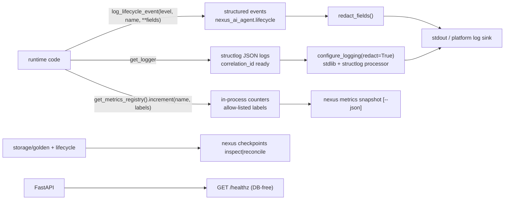

# Observability

**Status:** Living document
**Scope:** logs, metrics, health, inspection tooling, and what to actually alert on
**Verified against:** `main` @ `7573249`

Observability here has three properties: **dependency-free** (stdlib + structlog, no exporter process), **redaction-first** (secrets are removed *before* a line or a metric exists), and **never fatal** (an observability failure can never break a request — that rule is itself the design, not an afterthought).

---

## 1. Three surfaces

## 2. Structured events (the lifecycle channel)

`infrastructure/observability/structured.py` exposes `log_lifecycle_event(level, name, **fields)`:

- one event = one named message + named key/value fields (never a formatted blob);
- fields are redacted **before** they exist (`redact_fields`), and if the redactor itself raises, every field degrades to `[REDACTED]` — fail closed;
- the helper never raises; a logging failure cannot take the runtime down;
- `error_field(exc)` produces a one-line `Type: message` string (no raw traceback in structured fields).

Representative events and where they come from:

| Event name | Emitted by | Meaning |
|---|---|---|
| `lifecycle operation skipped` | `adapters/langgraph/lifecycle_recording.py` | the loop was closed/absent; the operation was dropped, not retried |
| `lifecycle operation failed` | same | lifecycle metadata write failed; the user-visible flow continued |
| `reconcile … failed …` (`scan`, `backfill`, `purge`, per-thread) | `storage/checkpoint_reconciler.py` | a reconciler step degraded; mutation stops rather than guessing |
| `effect_created` / `effect_claimed` / `effect_succeeded` / `effect_failed` / `effect_recovered` / `effect_duplicate` | `adapters/observability_backend.py::emit_effect_event` | effect-lifecycle states; fields stay tight (`effect_key_prefix`, `operation_type`, `outcome`, `reason`, `attempt`) and the full key never leaves the process |

Design rule: **an event exists for every path where the system chose to continue despite a failure** — silent degradation is the thing observability is here to prevent.

## 3. Metrics

`infrastructure/observability/metrics.py` is a low-cardinality, in-process registry:

| Property | Value |
|---|---|
| Name pattern | `nexus_<lifecycle_operation>_total` (for example `nexus_touch_total`, `nexus_aput_total`) plus `nexus_effect_<state>_total` (effect layer) |
| Allowed labels (hard allow-list) | `backend`, `scope`, `error_code`, `reason`, `outcome` |
| Banned labels | `telegram_id`, `effect_key` (full token), payload fields, secrets/API keys, attempt ids — any high-cardinality identifier raises or is stripped |
| Unknown label | **raises** `ValueError` — cardinality explosions are a programming error, not a runtime surprise |
| Read path | `nexus metrics snapshot [--json]` |
| Failure mode | increments are wrapped best-effort: a metrics failure logs one warning and never affects the request |

Why no Prometheus exporter: the deployment target is a single scale-to-zero process with an operator, not a fleet with a scrape budget. Adding a registry service would violate the modular-monolith constraint (§[`OVERVIEW.md`](OVERVIEW.md) §4) for zero operational gain; the snapshot command plus platform logs cover the same questions.

## 4. Health and readiness

| Endpoint | Contract | Why |
|---|---|---|
| `GET /healthz` | 200 `{"status": "ok"}`, **touches no database and no engine** | a platform health gate must not mark a healthy process unhealthy because the DB is cold, and must not hold a connection open on a scale-to-zero deploy |
| `POST /webhook/telegram` | 403 on secret mismatch, 400 on malformed payload, **503 when the application is not yet published** | 503 makes Telegram retry instead of dropping an update — a "ready" signal, not a "healthy" one |
| `GET /creative/jobs/{job_id}` | job status or 404 | the queue is the source of truth for long work; the surface never guesses |

## 5. Inspection tooling

| Question | Command | Reads |
|---|---|---|
| What is the queue doing? | `nexus jobs resume` (dry scheduling of pending only) + job status endpoint | queue sidecar |
| Is checkpoint lifecycle metadata sane? | `nexus checkpoints inspect [--json]` | lifecycle index (read-only, access timestamps untouched) |
| Is anything drifting? | `nexus checkpoints reconcile` (dry-run) then `--apply` | reconciler + policies |
| Is the schema at head? | `nexus migrate` (idempotent) / CI `migrate-postgres` job | Alembic |
| Did the project state change? | `nexus continuum` | `.nexus/continuum.json` |
| Are packs coherent? | `nexus packs list|verify <id>` | manifests + runtime registry |
| What metrics exist right now? | `nexus metrics snapshot --json` | in-process registry |

## 6. What to alert on (an honest short list)

No alert means *act*, so the list is deliberately small. Each item is observable today without new infrastructure.

| Alert | Signal | Source | First action |
|---|---|---|---|
| Bot is down | `/healthz` non-200 or polling process exited | platform probe | [`../ops/DEPLOY_RUNBOOK.md`](../ops/DEPLOY_RUNBOOK.md) |
| Webhook deliveries failing | repeated 403/503 in platform logs | app logs | check secret rotation / cold-start; 503 is retryable |
| Provider chain drained | `nexus smoke` failing **and** provider 429s in logs | logs | wait for cooldown or configure another provider ([`LLM_PROVIDERS.md`](LLM_PROVIDERS.md)) |
| Job queue stuck | pending jobs older than the render timeout, repeated `failed` outcomes | job status + metrics | `nexus jobs resume`; inspect the typed `error_code` |
| Cleanup running away | many `reconcile … failed` events or the circuit breaker tripping (≥1 % or ≥500) | structured events | stop (`--apply` off), review redacted reasons |
| Disk filling | creative temp workspaces not pruned / stale > 24 h | filesystem check | `nexus maintenance housekeeping` |

Latency SLOs are intentionally **not** claimed: the system is single-process with external free-tier providers, so a latency promise would be a claim about other people's infrastructure. What is promised instead is *bounded* work: one timeout per media process, one bounded retry policy for images, and a typed failure when a bound is hit.

## 7. Rules for adding observability

1. New event → `log_lifecycle_event` with named fields (never `f"..."`), and a redaction-safe key set.
2. New metric → a name following `nexus_<thing>_total` and labels from the allow-list; add a label only with a bounded value set.
3. Never log: prompt text, file contents, tokens, user identifiers beyond what the redactor keeps, or raw exception reprs.
4. An observability call must not be able to raise into the caller's path (wrap it, as `_mirror_metric` does).
5. If it is worth alerting on, name the signal and the first action here — otherwise it is noise.
