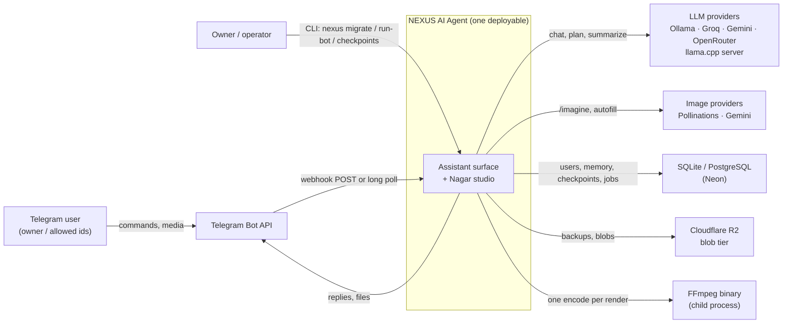
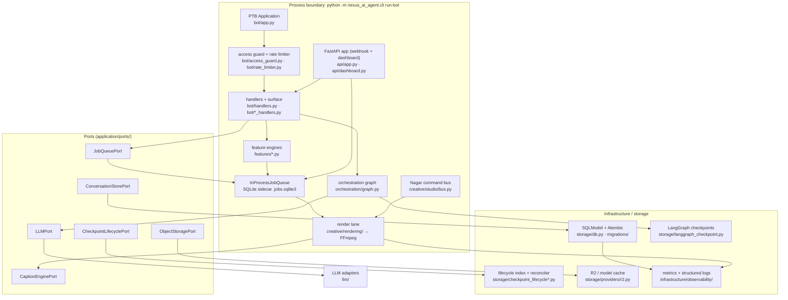

# Architecture Overview — NEXUS AI Agent

**Status:** Living document (updated in place; contradictions are bugs)
**Scope:** System context, container view, quality attributes, frozen constraints, deployment topologies
**Verified against:** `main` @ `7573249` (v3.13.0) — every path and number below is reproducible from the tree
**Owner zone:** `docs-architecture` (see `.agents/board.json`)

> **Reading order.** This page answers *what the system is and what binds it*.
> Then: [`MODULE_MAP.md`](MODULE_MAP.md) (what may import what) →
> [`RUNTIME_FLOWS.md`](RUNTIME_FLOWS.md) (what happens on a request) →
> [`CREATIVE_STUDIO.md`](CREATIVE_STUDIO.md) (the Nagar studio) →
> [`DATA_AND_STORAGE.md`](DATA_AND_STORAGE.md) → [`SECURITY.md`](SECURITY.md) →
> [`OBSERVABILITY.md`](OBSERVABILITY.md) → [`TESTING.md`](TESTING.md).
> Decisions live in [`../DECISION_LOG.md`](../DECISION_LOG.md) (historical, authoritative)
> and [`adr/`](adr/README.md) (doc-layer decisions, machine-checked).

---

## 1. Purpose

NEXUS AI Agent is an **offline-first, single-process, multi-agent system** with two products on one runtime:

1. **A Telegram assistant surface** — chat, memory, tools, moderation, gamification, community features, 15 locales (`src/nexus_ai_agent/features/`, `src/nexus_ai_agent/bot/`, `src/nexus_ai_agent/i18n/locales/`).
2. **Nagar, a creative studio** — typed, permissioned media operations (edit / motion / audio / caption / color / delivery) that compile to deterministic FFmpeg invocations and measured artifacts (`src/nexus_ai_agent/creative/`).

Both products share one runtime, one persistence layer, and one quality contract. Nothing is a fleet: there is no broker, no worker cluster, no sidecar database. See §4.

## 2. Stakeholders and their concerns

| Stakeholder | Primary concern | Where the concern is answered |
|---|---|---|
| Repository owner / operator | cost = 0 at idle; nothing leaves the machine without explicit consent; a failed job never lies | §3 Q1/Q2, [`SECURITY.md`](SECURITY.md), [`../ops/DEPLOY_RUNBOOK.md`](../ops/DEPLOY_RUNBOOK.md) |
| End user (Telegram) | responsive commands, predictable failures, own language | [`RUNTIME_FLOWS.md`](RUNTIME_FLOWS.md), `src/nexus_ai_agent/i18n/locales/*.json` |
| Maintainer / coding agent | a rule that is written down is a rule that a test enforces; no collateral edits | [`MODULE_MAP.md`](MODULE_MAP.md) §4, [`TESTING.md`](TESTING.md) §3 |
| Parallel agents (multi-agent network) | zero overlap, claim before code, one gates owner | [`../../AGENTS.md`](../../AGENTS.md), `.agents/board.json`, `scripts/agent_board.py` |
| Deployment platform (Koyeb/Neon/R2) | health semantics, cold starts, durable state off ephemeral disk | [`../ops/deployment-koyeb.md`](../ops/deployment-koyeb.md), [`DATA_AND_STORAGE.md`](DATA_AND_STORAGE.md) §5 |

## 3. Quality attributes (the top five, and what protects each)

| # | Attribute | Concrete promise | Enforced by |
|---|---|---|---|
| Q1 | **Offline-first / zero marginal cost** | The whole core runs with no cloud credentials; cloud is an ordered *fallback chain*, never a requirement | `src/nexus_ai_agent/llm/` (router chain), [`LLM_PROVIDERS.md`](LLM_PROVIDERS.md), `nexus smoke` (CLI) |
| Q2 | **Deny-by-default security and privacy** | No user reaches a handler unless allowed; no prompt, image, or transcript leaves the process without an explicit consent flag | `bot/access_guard.py`, `bot/middleware.py`, `features/ai_memory.py` (consent), `tests/unit/test_access_gate.py`, `tests/unit/test_ai_memory_consent.py`, [`SECURITY.md`](SECURITY.md) |
| Q3 | **Evidence over assumption** | Every rendered artifact is reported with probed measurements; a job that cannot verify its output fails loudly | `creative/rendering/executor.py` (`probe_video` + `sha256`, staging + atomic publish), `tests/unit/test_rendering_lane.py` |
| Q4 | **Evolvability under parallel authorship** | Layer laws, pack purity, and monolith constraints are executable; a violation fails CI, not review | `tests/architecture/` (15 files), [`MODULE_MAP.md`](MODULE_MAP.md) §4 |
| Q5 | **Operability with no moving parts** | Liveness is DB-free, migrations are idempotent, queue state is durable and resumable, one CLI entrypoint | `src/nexus_ai_agent/api/app.py::healthz`, `src/nexus_ai_agent/cli.py`, `adapters/in_process_job_queue.py`, [`../ops/DEPLOY_RUNBOOK.md`](../ops/DEPLOY_RUNBOOK.md) |

Secondary (documented, not yet automated): localisation completeness and latency budgets — see [`TESTING.md`](TESTING.md) §5 for the honest gap list.

## 4. Frozen constraints

These are decisions, not preferences. Changing one is an architecture event requiring a `DECISION_LOG.md` entry and an ADR.

| Constraint | Rationale | Enforcement |
|---|---|---|
| **Modular monolith**: no Celery, no Redis, no distributed queue | One process and one SQLite sidecar are enough at this scale; a broker adds a failure domain, not throughput | `tests/architecture/test_modular_monolith.py` (imports, `pyproject.toml`, `docker-compose.yml`, dispatch call sites) |
| **Pure packs**: capability-pack code is stdlib + pydantic + `creative.studio` only | A pack must stay deterministically testable and dependency-light | `tests/architecture/test_{edit,motion,audio,delivery,caption}_pack_boundary.py` |
| **Ports never import adapters** | The domain must survive any storage/runtime swap | `tests/architecture/test_import_boundaries.py`, `tests/architecture/test_port_signatures.py` |
| **Framework at the edges only**: `telegram`, `langgraph`, `sqlmodel` may not spread inward | Keeps the seams testable without the network or a platform | `tests/architecture/test_import_boundaries.py` (frozen baseline) |
| **Optional capabilities are extras and fail closed** | A missing `[speech]`/`[translate]`/`[pdf]` extra must raise a typed error, never degrade silently | `pyproject.toml` extras, `creative/caption/unavailable_adapter.py`, `tests/unit/test_caption_engine_adapters.py` |
| **Python ≥ 3.10, CI on 3.12** | The deployment image and the gate versions are pinned in `.github/workflows/ci.yml` | `pyproject.toml`, CI |

## 5. System context (C4 level 1)

Everything crosses a trust boundary except the FFmpeg child process, which is spawned with an allow-listed binary path and no shell ([`SECURITY.md`](SECURITY.md) §4).

## 6. Container view (C4 level 2)

**Level 3 (component) views are deliberately not duplicated** — they are the package tables in [`MODULE_MAP.md`](MODULE_MAP.md) §2 plus the flows in [`RUNTIME_FLOWS.md`](RUNTIME_FLOWS.md). A diagram that mirrors `ls` rots faster than the code it copies; a diagram that encodes a *rule* does not.

## 7. Deployment topologies

| Mode | Entry point | State | Trade-off accepted |
|---|---|---|---|
| **Local / always-on polling** | `nexus run-bot --mode polling` | SQLite (`data/*.sqlite`), checkpoints on disk | simplest; machine must stay on |
| **Webhook + scale-to-zero** (Koyeb) | `NEXUS_RUN_MODE=webhook`, `api/app.py` serves `/webhook/telegram` + `/healthz` | Postgres/Neon + R2; local disk is ephemeral | cold-start latency; platform health gate must not touch the DB |
| **CLI / batch** | `nexus migrate`, `nexus checkpoints …`, `nexus jobs resume`, `nexus packs …`, `nexus slideshow …` | same stores as the mode above | none — this is the operator's window into the same contracts |
| **Dashboard (read-only)** | `api/dashboard.py`, bearer-token gated | reads the app DB | PII surface kept minimal and redacted |

Secrets never live in the image: the full list and the rotation procedure are in [`../ops/DEPLOY_RUNBOOK.md`](../ops/DEPLOY_RUNBOOK.md) and `.env.example` (78 settings total).

## 8. Repository shape (verified at `7573249`)

| Area | Files | Lines | Role |
|---|---:|---:|---|
| `src/nexus_ai_agent/creative/` | 54 | 12 305 | Nagar: studio core, packs, render lane |
| `src/nexus_ai_agent/features/` | 26 | 6 374 | product engines (chat, memory, gamification, RAG, …) |
| `src/nexus_ai_agent/storage/` | 27 | 4 450 | schema, checkpoints, lifecycle, blobs |
| `src/nexus_ai_agent/bot/` | 18 | 4 016 | Telegram surface + guards |
| `src/nexus_ai_agent/adapters/` | 6 | 1 295 | port implementations (job queue, whisper, langgraph hooks) |
| `src/nexus_ai_agent/llm/` | 8 | 804 | provider chain + litellm + local server |
| rest (core, api, orchestration, domain, observability, …) | 76 | 6 187 | cross-cutting |
| **total** | **215** | **35 431** | |

Tests: 112 files / 19 334 lines, of which 15 are architecture gates. Counts are regenerated by the review checklist in [`TESTING.md`](TESTING.md) §6.

## 9. Change rules

1. **New module** → add it to [`MODULE_MAP.md`](MODULE_MAP.md) §2 and, if it defines a boundary, add or extend a gate in `tests/architecture/`.
2. **New external dependency** → `pyproject.toml` + a pack/manifest decision if it touches `creative/` (pure packs must stay stdlib + pydantic).
3. **New port** → `application/ports/` + `tests/architecture/test_port_signatures.py` + [`PORTS.md`](PORTS.md).
4. **New doc** → index it in [`../README.md`](../README.md); an unindexed document fails `tests/unit/test_docs_integrity.py`.
5. **Architecture-level decision** → `DECISION_LOG.md` entry (historical record) *and* `docs/architecture/adr/` only if the decision is about how the documentation/architecture layer itself works.
