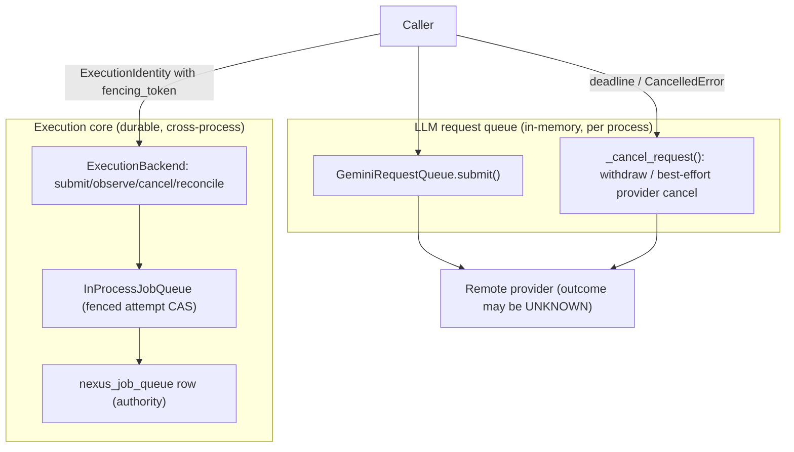

# Request Queue vs Execution Core — Cancellation Boundary

NEXUS has **two independent cancellation surfaces** that must never be confused:

1. the **in-process LLM request queue** (`GeminiRequestQueue`), which governs a
   *provider call* inside one process; and
2. the **execution core** (`ExecutionBackend` → `InProcessJobQueue`), which
   governs a *durable Nexus job* and its attempt fence.

They share no state, no identity model, and no durable store. This page maps each
surface to its authority and identity model so that a caller, a reviewer, or an
operator never treats one as the other. It is a **living view**: update it in the
same PR that changes either surface.

## 1. Two surfaces, two authorities

| | LLM request queue | Execution core |
|---|---|---|
| Module | `src/nexus_ai_agent/features/request_queue.py` (`GeminiRequestQueue`) | `src/nexus_ai_agent/execution/contract.py`, `src/nexus_ai_agent/adapters/native_local_backend.py` |
| Unit of work | one **provider coroutine** (a Gemini/LLM call) | one **durable Nexus job** with attempts |
| Identity | `_Request.request_id` (process-local counter) + `user_id` + `Priority` | `request_id` / `idempotency_key` / `job_id` / `attempt_id` / `fencing_token` (`ExecutionIdentity`, `contract.py:195`) |
| Cancellation authority | the caller's deadline / `asyncio.CancelledError`; the queue withdraws the request | the **fencing token** (`identity.fencing_token`); `job_id` alone is never authority (`native_local_backend.py:160-169`) |
| Durability | **in-memory only** — not durable, not cross-process | **durable** SQLite sidecar (`nexus_job_queue`), CAS-fenced |
| Scope | the whole process (one bot process) | the job row, across processes |
| Concurrency primitive | `asyncio.Event` (`_Request.cancel_event`) + the queue lock | SQLite `UPDATE … WHERE attempt = ?` CAS + attempt ledger |

The request queue is instantiated once by the bot at
`src/nexus_ai_agent/bot/app.py:252`; it is an **admission/rate/priority control
plane for provider calls**, not a job authority.

## 2. Where each cancellation happens

### LLM request queue (`features/request_queue.py`)

`submit(...)` (`:178`) queues a coroutine and waits on a shielded future. When the
caller's deadline or an outer cancellation fires, the queue settles the request and
records **two distinct counters** — operators must not read one for the other:

- **timeout** (the caller's `asyncio.wait_for` deadline expires, or the worker
  detects the deadline) — `_cancel_request(req, timed_out=True)` at `:248` (and the
  worker path `_settle_timed_out` at `:620`) increments **`_logical_timed_out`**
  (`:629`/`:691`), never `_logical_cancelled`;
- **cancellation** (an outer `asyncio.CancelledError` reaches `submit`) —
  `_cancel_request(req, timed_out=False)` (`:259`) increments
  **`_logical_cancelled`** (`:694`);
- **queue close** — `close()` (`:297`) settles queued/in-flight work as
  `_logical_closed`.

In every case: **not yet started** — the coroutine factory is never invoked and the
queued item is removed; **provider call in flight** — the local provider coroutine
is cancelled, and the queue **cannot prove the remote provider stopped** (module
docstring, lines 8-10, and `close()` at `:297`). The remote outcome may be
*unknown*. `get_status()` (`:270`) exposes both `logical_timed_out` and
`logical_cancelled` separately.

There is **no durable record** and **no fencing token** here. A cancelled request
leaves no job row; a retried provider call is a new request, unrelated to any
execution attempt.

### Execution core (`execution/contract.py`, `adapters/native_local_backend.py`)

The backend exposes exactly four verbs — `submit`, `observe`, `cancel`, `reconcile`
— and deliberately **no** `execute` (`contract.py:404-424`). `cancel(identity)`
(`native_local_backend.py:160`) is **attempt-scoped**:

- an **unbound** identity (`fencing_token is None`) is refused — `job_id` alone is
  not cancellation authority (`:167-168`, fail closed);
- a **bound** identity cancels only its own attempt via the queue's fenced CAS,
  `InProcessJobQueue.cancel(job_id, expected_attempt=…)` (`in_process_job_queue.py:812`).

This is what makes a *stale* execution identity unable to mutate a *newer*
execution: the queue CAS carries `AND attempt = ?`, so an older token is rejected
and can never cancel the current attempt or reopen a terminal row.

## 3. The boundary (no cross-subsystem authority leak)

The two paths **never meet**:

- cancelling an LLM request never mutates a Nexus job row (the request queue owns no
  job state);
- cancelling a Nexus job attempt never cancels an unrelated in-flight provider call
  (the backend owns no provider coroutine);
- neither surface may borrow the other's authority: the request queue has no fencing
  token, and the execution core never treats a provider run as its attempt identity
  (`provider_run_id` is observation only — `contract.py:30-48`).

## 4. Audit note (no cross-subsystem authority leak)

- **No shared identity.** The request queue's `request_id` and the execution core's
  `ExecutionIdentity.request_id` are distinct namespaces; nothing maps one to the
  other. `GeminiRequestQueue` increments `self._request_id` locally inside
  `submit()` (`request_queue.py:221`); the later `_ready_event.set()` (`:237`) is a
  readiness signal, not the ID-allocation site. `ExecutionIdentity` is constructed
  by the backend from the durable row.
- **No shared store.** The request queue is in-memory only; the execution core's
  authority is the SQLite row (`InProcessJobQueue`, `_mark_processing` /
  `_mark_completed`). A cancelled provider call cannot write a job row.
- **No authority inference.** A provider timeout or a cancelled coroutine is a
  provider observation, not a job verdict; the execution core derives job state
  only from its own fenced transitions (`observe` returns `UNKNOWN` for a missing or
  unreadable row rather than inventing `FAILED`).
- **Enforcement.** The execution-core boundaries named here are guarded by
  `tests/integration/test_execution_native_backend.py` (attempt-scoped cancel, stale
  attempt rejection, `provider_run_id` never authority) and
  `tests/architecture/test_execution_contract_boundary.py` (no provider imports, no
  second queue/authority). The request-queue cancellation behaviour is covered by
  `tests/unit/test_request_queue.py`.

## 5. Related reading

- [JOB_LIFECYCLE.md](JOB_LIFECYCLE.md) — the durable job lifecycle, owners, and the
  side-effect boundary.
- [LLM_PROVIDERS.md](LLM_PROVIDERS.md) — the provider chain, cooldowns, and the
  anti-retry-storm rule.
- [PORTS.md](PORTS.md) — the hexagonal ports, including the job-queue port.
- `src/nexus_ai_agent/execution/contract.py` — the identity separation and the four
  execution verbs.
