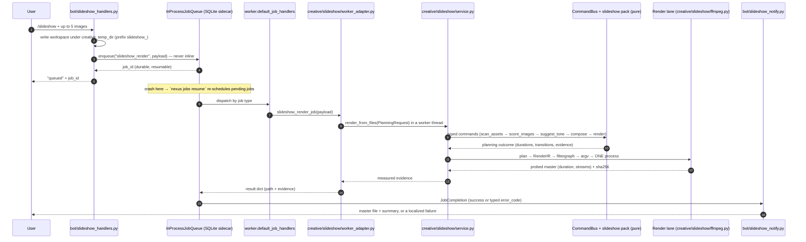
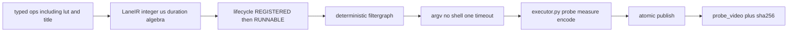
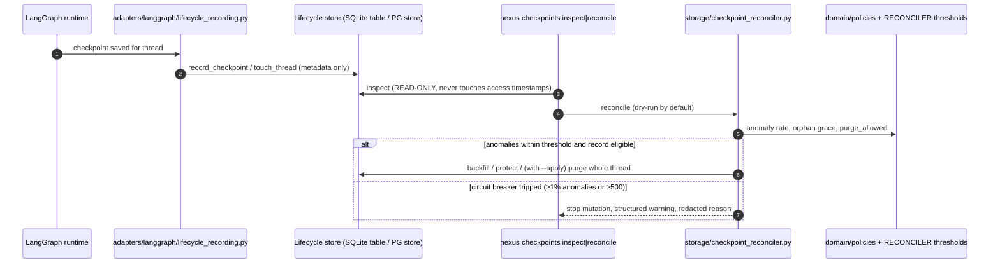
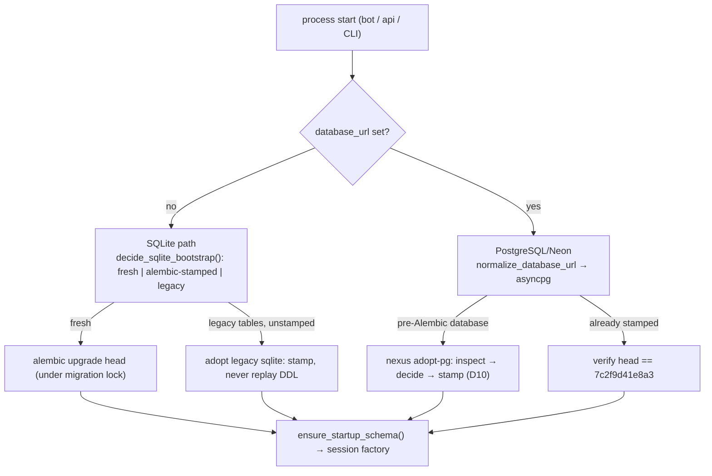
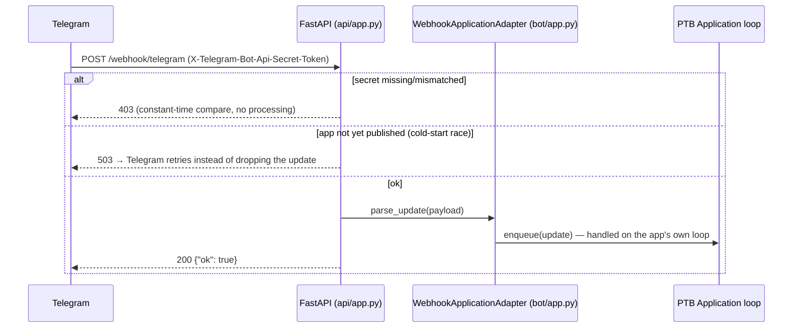

# Runtime Flows

**Status:** Living document
**Scope:** the end-to-end paths that matter — message handling, creative jobs, the render lane, checkpoint lifecycle, schema bootstrap, webhook/cold-start
**Verified against:** `main` @ `7573249`

Each flow below is written from the code, and each has a **failure contract** — what the user/operator sees when it breaks. "It works" without a failure path is not a flow, it is a hope.

---

## 1. Telegram message → answer

```mermaid
sequenceDiagram
    autonumber
    participant U as User
    participant TG as Telegram Bot API
    participant PTB as PTB Application (bot/app.py)
    participant G as Access guard + rate limiter (group -1)
    participant H as Handler (bot/handlers.py or bot/*_handlers.py)
    participant R as Intent router (orchestration/router.py)
    participant GR as LangGraph state machine (orchestration/graph.py)
    participant LLM as LLM chain (llm/)
    participant M as Long-term memory (features/ai_memory.py)
    participant CK as Checkpointer (storage/langgraph_checkpoint.py)

    U->>TG: command / text
    TG->>PTB: Update
    PTB->>G: first handler group
    alt sender not allowed (deny-by-default)
        G-->>U: localized refusal (error.access_denied / error.owner_only)
    else allowed
        G->>H: pass-through
        H->>R: classify_intent(text) → chat | task | memory
        R->>GR: route (persona selection: phi | qwen | gemma)
        GR->>CK: load thread state (resumable workflow)
        GR->>M: memory reader (opt-in; may be disabled)
        GR->>LLM: complete(prompt, idempotency_key)
        LLM-->>GR: text (provider chain, cooldown-aware)
        GR->>GR: moderation node (phi.moderate)
        GR->>CK: persist checkpoint (lifecycle hook records metadata)
        GR->>M: memory writer (fail-safe: errors never abort the answer)
        GR-->>H: response
        H-->>U: localized reply
    end
```

**Failure contract**
- Denied sender → localised refusal, no engine touched (`bot/access_guard.py`).
- Throttled sender → rate limiter response, no LLM call (`bot/rate_limiter.py`, default 10 messages/60 s).
- Provider failure → the chain moves down (Ollama → Groq → Gemini → OpenRouter); a drained free tier is cooled down, never retried in place ([`LLM_PROVIDERS.md`](LLM_PROVIDERS.md)).
- Checkpoint write failure → the answer still returns; the lifecycle hook logs a redacted structured event and mirrors a metric ([`OBSERVABILITY.md`](OBSERVABILITY.md) §2).
- Memory write failure → swallowed by design (`orchestration/graph.py::_memory_writer`); a memory outage must not become a chat outage.

## 2. Slideshow: uploads → durable job → one FFmpeg encode → delivery



**Invariants**
- The bot never renders inline; the queue is the only path (`worker.py::default_job_handlers`, `creative/slideshow/worker_adapter.py`).
- Envelope: ≤ 5 images, ≤ 30 s target; payloads are a **trust boundary** and are re-validated inside the adapter (`tests/integration/test_bot_slideshow_flow.py`).
- Exactly one encode per job; the file is written as `.<name>.part.<ext>` and published by atomic rename, never overwritten by default.
- Failures are a closed vocabulary of `error_code`s mapped to localised text; a partial generation failure cleans inputs and generated files.
- Orphan workspaces older than 24 h are pruned on the next job.

## 3. The apply lane: pure IR in, measured artifact out



- Duration algebra is integer microseconds — no float drift ([`../NAGAR_70_OPERATIONS_TDD.md`](../NAGAR_70_OPERATIONS_TDD.md), `creative/rendering/ir.py` docstring).
- `compile_lane` and `compile_measure` are **pure**; `lifecycle.py` is gates only; `executor.py` is the only process site (filter probe, loudness measure, encode) (`tests/architecture/test_rendering_lane_boundary.py`).
- Binary resolution order: explicit override → `NEXUS_FFMPEG_BIN` → `PATH` → the `imageio-ffmpeg` wheel. Capabilities are probed (`ffmpeg -filters`); encode is forbidden before RUNNABLE.
- Shipped identity LUT and Vazirmatn font are real fixtures; LUT intensity is 1.0 only. Telegram `/grade lut` remains refused at the surface (D-0011) until that mapper is wired.

**Failure contract** — a lane run that cannot probe its own output raises `LaneExecutionError` and leaves the previous master untouched (no half-written file can be mistaken for a master).

## 4. Checkpoint lifecycle: write → inspect → reconcile → retention



**Hard rules** (see [`DATA_LIFECYCLE.md`](DATA_LIFECYCLE.md), [`RETENTION_DECISION.md`](RETENTION_DECISION.md)):
- Deletion unit is the **whole thread**; per-checkpoint delta surgery is `POST_V1` and blocked by a marker test.
- Unknown lineage / schema / metadata / lock state ⇒ **no delete** (fail closed).
- Messages are the source of truth for history and are never deleted by checkpoint cleanup; after the 30-day resumability window a continuation forks a new thread.

## 5. Schema bootstrap and migration



- Chain (3 revisions): `47903d282ede` (initial) → `f4a9c2e71b08` (checkpoint lifecycle table) → `7c2f9d41e8a3` (ai-memory consent) = **head**.
- Migrations are idempotent: re-running `nexus migrate` at head is a no-op; CI proves it on a real `pgvector/pgvector:pg16` service container.
- Schema drift fails fast rather than silently repairing: `storage/checkpoint_fingerprint.py` compares a DB fingerprint against a golden manifest, and `nexus golden update` is human-only.

## 6. Webhook mode, cold start, and scale-to-zero



- `GET /healthz` is deliberately **DB-free**: 200 means "process is up and accepting requests", which is exactly what a platform health gate should ask before routing traffic.
- Dashboard traffic is bearer-token gated (`api/dashboard.py::require_dashboard_token`, constant-time compare); responses are PII-free.

## 7. Image generation (with consent)

| Step | Where | Note |
|---|---|---|
| Request | `features/image_gen.py`, `/imagine` | rate-limited like any command |
| Provider choice | `application/image_generation.py::get_image_gen_provider` | `pollinations` (default) or `gemini` (paid, fail-closed) |
| Resilience | `creative/image_gen/resilience.py` | bounded retry, validation of returned bytes, on-disk cache |
| Consent | slideshow autofill requires an explicit flag | no egress without consent; tests assert the provider is never called when consent is absent (`tests/integration/test_bot_slideshow_flow.py`) |
| Cost visibility | `image_gen_estimated_cost_usd` + cost events | published in the reply path, not hidden in logs |

## 8. Operator entry points (same contracts, no side doors)

| Command | Contract exercised |
|---|---|
| `nexus migrate` / `nexus adopt-pg` | §5 |
| `nexus checkpoints inspect` / `reconcile` | §4 (inspect is read-only; reconcile is dry-run unless `--apply`) |
| `nexus jobs resume` | §2 (pending-only re-scheduling; never re-runs completed work) |
| `nexus metrics snapshot` | [`OBSERVABILITY.md`](OBSERVABILITY.md) |
| `nexus packs list|verify|activate` | [`CREATIVE_STUDIO.md`](CREATIVE_STUDIO.md) §4 (activation refuses unknown capabilities) |
| `nexus slideshow plan|render` | §2–§3 without Telegram |
| `nexus smoke` | §1 without Telegram |
| `nexus maintenance backup|housekeeping` | R2 backups + temp prune |
