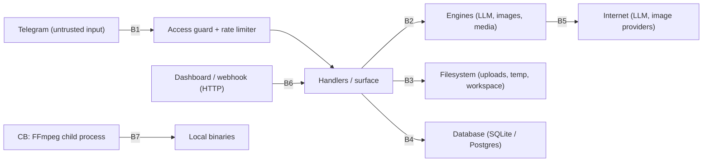

# Security Architecture

**Status:** Living document — the threat table is the checklist for every PR touching a boundary
**Scope:** trust boundaries, deny-by-default model, threat → control → evidence mapping, P0 audit follow-through
**Verified against:** `main` @ `7573249`; audit source: [`../audits/AUDIT_REPORT_2026-09-21.md`](../audits/AUDIT_REPORT_2026-09-21.md)

The security posture is **deny-by-default, local-first, and consent-gated**. Every claim below names the code and the test that keeps it true.

---

## 1. Trust boundaries

| Boundary | Untrusted side | Controls |
|---|---|---|
| B1 | any Telegram user | `bot/access_guard.py` (group −1, blocks before all handlers), `bot/middleware.py` rate limiter, denial reply capped at 3/60 s |
| B2 | user text/media | typed command envelopes, closed failure vocabularies, JobQueue payload re-validation inside the adapter |
| B3 | filenames, uploads, remote keys | `bot/safe_paths.py` (`resolve()` + `is_relative_to`), allow-listed temp dirs, `.part` staging |
| B4 | any query built from input | SQLModel/SQLAlchemy parameterisation; no string-built SQL outside audit-grade DDL |
| B5 | third-party APIs | SSRF guard, allow-listed providers, consent gates, strict-privacy flag |
| B6 | internet | constant-time secret/token compares, 403 on mismatch, 503 on not-ready (so the sender retries instead of losing data) |
| B7 | local shell/executables | one process site in the render lane; shell tool gated by `enable_shell` with an allow-list and path validation |

## 2. STRIDE-style threat table

| # | Threat | Scenario | Control (code) | Evidence (test) | Status |
|---|---|---|---|---|---|
| T1 | **Spoofing** | stranger finds the bot and commands it | deny-by-default access gate at handler group −1 | `tests/unit/test_access_gate.py`, `tests/unit/test_auth_middleware.py` | closed (PR#34, P0-2) |
| T2 | **Spoofing** | forged webhook deliveries | `X-Telegram-Bot-Api-Secret-Token` compared with `secrets.compare_digest` | `tests/unit/test_webhook_mode.py` | closed |
| T3 | **Spoofing** | dashboard scraping | bearer token required, constant-time compare, PII-free payloads | `tests/unit/test_dashboard_api.py`, `tests/unit/test_dashboard_privacy.py` | closed (P0-5) |
| T4 | **Elevation** | bypassing force-join gates | real `get_chat_member` check with cache; confirmation button cannot self-approve | `tests/unit/test_force_join_gate.py` | closed (P0-3) |
| T5 | **Tampering** | path traversal on `/cloud`, `/download`, uploads | `safe_paths.safe_join` + `sanitize_file_name` | `tests/unit/test_safe_paths.py`, `tests/unit/test_security_hardening.py` | closed (P0-6) |
| T6 | **Tampering** | prompt-injected tool execution / shell escape | shell tool off by default, allow-listed commands, path validation | `tests/unit/test_shell_sandbox.py`, `tests/unit/test_tools_sandbox.py` | closed |
| T7 | **Information disclosure** | private prompts or transcripts sent to a third party | per-user consent gate (tri-state) + minimum-egress interval + strict-privacy provider removal | `tests/unit/test_ai_memory_consent.py` | closed (P0-7) |
| T8 | **Information disclosure** | secrets in logs | redaction at the observability boundary (bearer values, `token=`, `api_key=`, `password=`, bot tokens, URL userinfo) | `tests/unit/test_observability.py`, `tests/unit/test_structured_events.py` | closed |
| T9 | **Information disclosure** | SSRF via summariser/WebTrainer/image URLs | DNS/address validation + validating transport (private ranges refused) | `tests/unit/test_http_client_ssrf.py`, `tests/unit/test_summarizer_ssrf.py` | closed |
| T10 | **Denial of service** | message flooding, LLM quota drain | rate limiter; per-provider cooldowns; one bounded retry policy for images; one timeout per media process | `tests/unit/test_rate_limiter.py`, `tests/unit/test_image_gen_adapters.py` | closed |
| T11 | **Tampering (supply chain)** | a pack ships executable code or an unknown operation | data-only manifests (no executable key at any depth), external packs cannot register unknown operations, activation refuses pending capabilities | `tests/architecture/test_pack_manifest_is_data_only.py`, `tests/unit/test_pack_manifest_verify.py` | closed |
| T12 | **Elevation** | media command escapes the studio permission ladder | `PermissionLevel` A–D enforced in the bus before any handler runs | `tests/unit/test_creative_studio.py`, `tests/unit/test_nagar_wave1_green_cockpit.py` | closed |
| T13 | **Information disclosure** | destructive cleanup deletes history | messages never deleted by checkpoint cleanup; unknown state ⇒ no delete; human-only golden updates | `tests/unit/test_checkpoint_lifecycle.py`, `tests/unit/test_lifecycle_adversarial.py`, `tests/unit/test_reconciler.py` | closed |
| T14 | **Elevation** | any user mutates another chat's data by guessing an id (the ad engine's `pause/resume/delete_campaign` take a bare `campaign_id`) | `bot/surface/ads.py::_load_owned` re-reads the row and compares `chat_id`; the owner bypasses; channel moderation commands are owner-gated and no longer answer anyone with a fake success | `tests/unit/test_surface_ads.py::test_pausing_another_chats_campaign_is_refused_and_changes_nothing`, `tests/unit/test_surface_channel_management.py::test_ban_is_owner_only_and_sends_nothing` | closed (D-0009) |

## 3. P0 audit follow-through (honest status)

The 2026-09-21 audit produced ten P0 findings. Current state on `main`:

| Finding | Subject | Status |
|---|---|---|
| P0-2 | auth on ~80 commands | ✅ closed — global access guard (T1) |
| P0-3 | force-join always accepted | ✅ closed — real membership check (T4) |
| P0-4 | referral loop dead | ✅ closed — `ReferralEngine.process_referral` is invoked from `bot/feature_handlers.py` |
| P0-5 | dashboard PII leak | ✅ closed — token gate + redaction (T3) |
| P0-6 | path traversal | ✅ closed (T5) |
| P0-7 | unconsented egress to Gemini | ✅ closed — consent + egress gate (T7) |
| P0-1 | “simulated features” honesty | ✅ closed — README status-honesty matrix; commands that are stubs say so |
| P0-10 | unusable anonymous chat / force-join without bot | ✅ closed — engines are injectable and wired (`bot/feature_handlers.py`) |
| P0-8 | double wiring of engines (documented engine bypassed) | ⚠️ **open** — board **task-124**: enforce exactly one wiring path per engine with a ONE-OWNER guard test |
| P0-9 | long-term graph memory is read-only/empty | ⚠️ **open** — board **task-124**: write path + round-trip test |

Anything in this table marked open is a security-relevant gap, is tracked on the board with acceptance criteria, and must not be silently dropped.

## 4. The FFmpeg boundary

The single process boundary in the creative tree is treated as hostile-input handling:

- binary resolved from an allow-list order (explicit override → `NEXUS_FFMPEG_BIN` → `PATH` → `imageio-ffmpeg` wheel), never from user input;
- **no shell**: `shell=True` is banned repo-wide for the lane by an architecture test (`test_rendering_lane_boundary.py::test_exactly_one_subprocess_site_and_no_shell_true`);
- argv is built from typed ops, never from string interpolation of user text (title text is escaped by the compiler);
- one timeout per call, output written to `.part` and atomically renamed, `overwrite=False` by default;
- the produced file is probed by the same binary — evidence, not assumption.

## 5. Secrets and configuration

- No secret has a default value. Missing credentials disable the feature (for example: no `GEMINI_API_KEY` ⇒ the paid image path stays closed) rather than degrading silently.
- `.env.example` documents all 78 settings; the deployment runbook documents rotation ([`../ops/DEPLOY_RUNBOOK.md`](../ops/DEPLOY_RUNBOOK.md)).
- Consent flags that widen the boundary (`NEXUS_LLM_STRICT_PRIVACY`, `slideshow_allow_image_upload`, `ai_memory_enabled`) are opt-in and fail closed.
- The bot is private by construction: an empty allow-list means *nobody*, not *everybody*.

## 6. Review checklist for a boundary-touching PR

1. Which boundary (§1) does this change touch, and which control in §2 covers it?
2. Does a test fail if the control is removed? (If not, the control is aspirational.)
3. Does it add egress, a file path, a process, or a permission? If yes, does it preserve deny-by-default?
4. Are new secrets absent-by-default and documented in `.env.example`?
5. Are new log fields redaction-safe (`redact_fields` at the boundary)?
