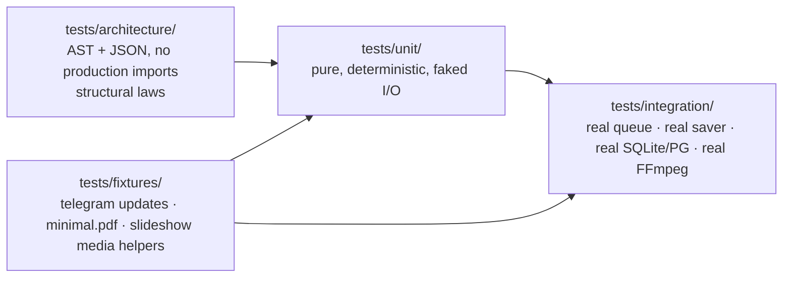

# Testing & Quality Gates

**Status:** Living document
**Scope:** test taxonomy, the four gates, determinism rules, local reproduction, honest gaps
**Verified against:** `main` @ `7573249` — the baseline numbers in §5 were produced locally on 2026-09-21

---

## 1. The gate contract

| Gate | Command | Runs in CI | Blocks merge |
|---|---|---|---|
| Lint | `ruff check .` | `test` job | yes |
| Format | `ruff format --check .` | `test` job | yes |
| Types | `mypy src` | `test` job | yes |
| Tests | `pytest -q -m "not slow"` | `test` job | yes |
| Migrations on real PostgreSQL | `nexus migrate` ×2 + 3 contract suites + head assertion | `migrate-postgres` job (`pgvector/pgvector:pg16`) | yes |

`make lint && make types && make test` is the local equivalent. **One agent owns the gates at a time** (`.agents/board.json` → `gates_owner`); everyone else may run read-only diagnostics but must not race the same CI job deliberately.

## 2. Taxonomy



| Layer | What it may touch | Speed | Purpose |
|---|---|---|---|
| architecture | source text only | ms | laws from [`MODULE_MAP.md`](MODULE_MAP.md) §3 |
| unit | pure modules; fakes for LLM/providers; SQLite `tmp_path` | ms–s | behaviour, contracts, failure vocabularies |
| integration | the queue, savers, Alembic, a real FFmpeg encode | s–min | wiring that unit tests cannot prove |

**Determinism rules**
- No network in unit tests; external services are faked (`llm/fake_llm.py`, `tests/unit/surface_fakes.py`).
- Time is injected or frozen; ordering is asserted explicitly (no "usually sorted").
- Golden files (`tests/architecture/legacy_baseline.json`, checkpoint fingerprints, caption/tone fixtures) are **updated by a human-run command** (`nexus golden update`), never auto-rewritten by a test run.
- Real binaries are used where "it worked" would otherwise be a guess: the render lane runs genuine FFmpeg encodes supplied by the `imageio-ffmpeg` wheel (a dev extra), and CI installs it.
- Byte stability is asserted where determinism is claimed (canonical JSON, filtergraph strings, `.srt`/`.vtt`/`.ass` output).

## 3. Fitness functions

The files under `tests/architecture/` are the executable form of the boundary laws; the rule → test mapping is maintained in [`MODULE_MAP.md`](MODULE_MAP.md) §3 and must stay in sync (a test without a documented rule, or a rule without a test, is a defect). Nagar's Gate 2 adds R13 for the command boundary; behavioural refusals live in `tests/unit/test_command_capability_contract.py`. They run in the same `pytest` job as everything else — the standard practice for architecture fitness functions ([InfoQ](https://www.infoq.com/articles/fitness-functions-architecture/), [fitness-function pattern](https://aipatternbook.com/architecture-fitness-function)).

## 4. Documentation is tested too

`tests/unit/test_docs_integrity.py` (added with this suite) turns the documentation rules into gates:

| Assertion | Why |
|---|---|
| every file under `docs/` is indexed in `docs/README.md` | an unindexed document is a document nobody reads |
| every relative link inside `docs/` resolves to a real file | dead links are how documentation becomes fiction |
| every ```mermaid fence is balanced, non-empty, and starts with a known diagram type | catches the "empty diagram" and copy-paste mistakes |
| no `TODO`/`FIXME`/placeholder tokens in architecture docs | architecture pages are claims, not notes |
| `VERSION` == `pyproject.toml` == latest `CHANGELOG` heading | the release-drift guard (task-111 partner) |

Documentation linting beyond this (Vale prose linting, `markdownlint-cli2`, Mermaid's own parser via [`mermaid-lint`](https://github.com/jasonworden/mermaid-lint), link checkers such as Lychee — the toolchain GitLab documents in its [docs testing](https://docs.gitlab.com/development/documentation/testing/)) is deliberately **not** wired in yet: it would add a Node/Chromium toolchain to a Python-only CI for a documentation set that is currently < 20 files. The trade-off is recorded in [`adr/0002-docs-as-code-enforcement.md`](adr/0002-docs-as-code-enforcement.md).

## 5. Baseline (2026-09-21, local)

```bash
python -m venv .venv && . .venv/bin/activate
pip install -e ".[dev]"        # editable install matters — see below
pytest -q -m "not slow"
# 1106 passed, 23 skipped, 4 warnings in ~61s
```

| Metric | Value |
|---|---:|
| Test files | 111 (83 unit · 13 integration · 15 architecture) |
| Test lines | ~19 300 |
| Passed / skipped (this machine) | 1106 / 23 |
| Skips | PostgreSQL-dependent suites (`NEXUS_DATABASE_URL` unset) + optional heavy extras |

**The editable-install gotcha (worth knowing):** running `pytest` with only `PYTHONPATH=src` fails 5 tests for purely environmental reasons — 4 race-condition tests spawn `python -m nexus_ai_agent.cli` subprocesses that cannot import a non-installed package, and `test_version_command::test_running_version_matches_installed_distribution` needs distribution metadata. `pip install -e . --no-deps` fixes all five. CI installs the package properly, so it never sees this; a contributor with a bare `PYTHONPATH` will. This is a documentation fix, not a code bug.

## 6. Reproducing the numbers in these documents

```bash
# file/line inventory (OVERVIEW §8)
find src -name '*.py' | wc -l; find src -name '*.py' -exec cat {} + | wc -l

# operation inventory (CREATIVE_STUDIO §4–5)
nexus packs list

# migration chain (DATA_AND_STORAGE §2)
ls migrations/versions/

# locale/key parity (this file + i18n)
pytest -q tests/unit/test_i18n_parity.py

# docs gates
pytest -q tests/unit/test_docs_integrity.py
```

## 7. Known gaps (stated, not hidden)

| Gap | Impact | Where it is tracked |
|---|---|---|
| No full Mermaid syntax validation (structural checks only) | a syntactically invalid diagram could pass the gate | [`adr/0002`](adr/0002-docs-as-code-enforcement.md) — adopt `mermaid-lint` if `docs/` grows past ~30 files |
| Optional heavy extras (`[speech]`, `[translate]`, `[local-llm]`, Chroma/sentence-transformers) are not exercised in the default CI job | a broken optional path may survive until a user opts in | `tests/unit/test_caption_engine_adapters.py` covers the fail-closed path; enabling an extras CI matrix is board work |
| PostgreSQL suites skip locally without `NEXUS_DATABASE_URL` | local confidence is lower than CI confidence | CI `migrate-postgres` job |
| No browser/E2E UI test | the dashboard is HTML-by-render, not a UI framework | deliberate: see [`OVERVIEW.md`](OVERVIEW.md) §7 (dashboard is read-only by design) |
| P0-8/P0-9 have no guard test yet | engine double-wiring and empty graph memory can return unnoticed | board **task-124** [`SECURITY.md`](SECURITY.md) §3 |

## 8. Adding a test

| You changed | Minimum evidence |
|---|---|
| a pure pack operation | one deterministic unit test + the pack's purity gate still green |
| a port or adapter | a contract test against the fake *and* the real backend (unit + integration) |
| a boundary (imports, process spawn, manifest) | a fitness function in `tests/architecture/` **and** a row in [`MODULE_MAP.md`](MODULE_MAP.md) §3 |
| a failure path | an assertion that the failure is typed and the user-visible message is localised |
| documentation | `pytest -q tests/unit/test_docs_integrity.py` |
| a release | `VERSION` + `pyproject.toml` + `CHANGELOG` head all in lockstep (task-111 guard) |
