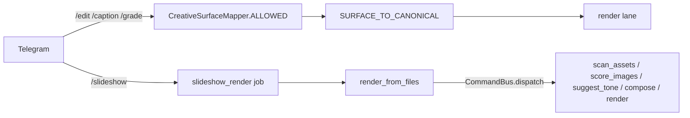

# Gate 2.2 — Operation Truth → Executable Evidence Gate (audit)

**Date:** 2026-09-24 · **Base:** `035a896dd2ed1293de6accf2ef4309da2fd64c89` (`main`)
**Audited baseline:** PR #70, head `94505f51e56b148f18d92255706df5a0e1452084`
**Deliverable:** `OPERATION_TRUTH.json` (generated) + `src/nexus_ai_agent/nagar/` + the gate tests below.

This document is the evidence record for Gate 2.2. Every number in it was
measured during this gate and can be reproduced with the commands in §15. Where
a claim could not be verified it is marked `NOT VERIFIED` or `NOT AVAILABLE` and
left standing as a gap — it is **not** rounded up.

---

## 0. What Gate 2.2 is, and what it is not

Gate 2.2 does not rebuild the Operation Matrix. It converts Operation Truth from
a set of assertions into an **executable evidence gate**: a check that fails in
CI whenever the product catalogue, the runtime registry, the executable surface
or a consumed piece of evidence changes without the derived projection changing
with it.

The enforced chain, with each arrow a *separate measurement*:

```
Product Definition → Runtime Registration → Executable Surface
  → Runtime Proof → Artifact / Result Evidence
```

`registered` never implies `proven`. `surface` never implies `runtime proof`.
`documentation` never implies `evidence`.

---

## 1. Repository truth (fetched, not remembered)

| Item | Value |
|---|---|
| `origin/main` | `035a896dd2ed1293de6accf2ef4309da2fd64c89` |
| Session branch base | `035a896d…` (`main`) |
| `refs/heads/arena/01a0d43d-nexus-ai-agent` | `94505f51e56b148f18d92255706df5a0e1452084` |
| Local clone | grafted/shallow — history before `035a896` is not present, so no claim here depends on earlier commits |

### The four pull requests, re-verified

| PR | Title | base | head | state | mergeable_state | changed files | +/- |
|---|---|---|---|---|---|---|---|
| #67 | artifact-producing Creative Runtime | `main` | `9c3a34f107b4b5f3c878a0ec2a7d82e8c24614d3` | OPEN | `CLEAN` | 71 | +22675 / −2692 |
| #68 | versioned command and capability boundary | `main` | `eef827641b0627f3581976d494eb0e71f4dd16b6` | OPEN | `CLEAN` | 34 | +1961 / −266 |
| #69 | Gate 4 cross-layer vertical slice + Truth Matrix | `main` | `749807486709f08810ae801395004cf1c7945938` | OPEN | `CLEAN` | 99 | +24028 / −503 |
| #70 | Operation Matrix + Evidence Gate | `main` | `94505f51e56b148f18d92255706df5a0e1452084` | OPEN | `UNSTABLE` | 10 | +2898 / −1 |

**Why PR #70 reads `UNSTABLE`:** not a failure. At the time of review the four
required checks on run `36031827544` were all green (`lint`, `lint-fast`,
`migrate-postgres`, `test`); a *second* workflow run `36031819953` was still
`IN_PROGRESS` on the same head. `UNSTABLE` here means "a required check has not
reported", not "a required check is red".

---

## 2. Five-search protocol (names only; the design consequence is in §3)

| # | Venue | Query | What was taken |
|---|---|---|---|
| 1 | GitHub | evidence-driven capability registries | `model-evidence-registry`: derive records from sources, publish a checksummed artifact, never manufacture equivalence; each record carries a trust level |
| 2 | GitHub | architecture fitness functions / executable architecture tests | ArchUnit / import-linter / dependency-cruiser: encode the rule as a test in the existing pipeline, fail the named check, no extra stage |
| 3 | GitHub | artifact/evidence graphs and provenance chains | evidence as a graph of records with digests; the *consumer* verifies, the producer only proposes |
| 4 | Web | in-toto provenance and attestations | **layout vs link**: a declared expectation set, and per-step link metadata recording command + materials + products + digest; verification walks the chain and requires step N's products to match step N+1's materials |
| 5 | Web | SLSA provenance / artifact verification | provenance binds `subject{name,digest}` to a source revision and a build definition; **verifying beats chasing levels**; L3's isolation is not reproducibility |

The three rejected-in-spirit temptations: adding `import-linter` as a
dependency, adding `in-toto`'s Python package, and adopting SLSA level names as
Nagar maturity labels. §3 explains why each was rejected.

---

## 3. Top-1 selected pattern, and why the alternatives were rejected

**Selected: a recomputed evidence graph with a declared projection header —
"measure the sources, compare the artifact, red the build".**

| Criterion | Weight | How the selected pattern scores |
|---|---|---|
| Nagar architectural fit | 35 % | lives inside `nexus_ai_agent.nagar`, reads the three sanctioned sources, adds no layer and no service |
| Correctness / integrity | 25 % | every layer is a predicate over a live source; the projection cannot assert anything the sources do not |
| Anti-drift capability | 20 % | mutation probes A–J (§13); 16/16 turn the gate red |
| Testability | 10 % | 17 architecture + 20 unit + 16 mutation + 3 runtime-confirmation tests |
| Operational simplicity | 10 % | stdlib + existing repo imports; one command (`python -m nexus_ai_agent.nagar --write`) |

Rejected alternatives:

* **`import-linter` / ArchUnit-style external fitness framework (search 2).**
  Rejected: a new runtime/dev dependency for a check this repository already
  expresses in `pytest`. The *pattern* is kept (a named CI step that fails on
  drift); the package is not.
* **`in-toto` / `slsa-verifier` (searches 4, 5).** Rejected as packages — both
  assume a signing identity, a trusted control plane and a build-service
  boundary that Nagar does not have and cannot get from a pull request. What was
  taken is the *shape*: a declared expectation set, per-step link metadata, and
  the materials→products digest rule (§12 uses it at the job→artifact seam) plus
  a `subject`-style digest binding and an explicit source revision in the header
  (§17 of the brief).
* **A second hand-written matrix, checked against the first.** Rejected outright:
  that is the JSON → Markdown → JSON → assertion structure the brief forbids, and
  §13 shows it is exactly what makes a gate blind.
* **Pinning the measured counts as test constants.** Rejected: measurement showed
  `57` becomes `77` the moment a sibling change lands (§9). A gate that hard-codes
  a measurement turns a *correct* tree red — it manufactures a false blocker
  instead of detecting drift.

---

## 4. Current truth: 70 / 57 / 47 / 23 / 10 / 80 — independently recomputed

Recomputed from the three sources, not copied from any document
(`python -m nexus_ai_agent.nagar`, §15):

| Formula | Value |
|---|---|
| `catalog = \|C\|` | **70** |
| `runtime = \|R\|` | **57** |
| `overlap = \|C ∩ R\|` | **47** |
| `missing = \|C − R\|` | **23** (portrait 10, scene 10, color 3) |
| `runtime_only = \|R − C\|` | **10** |
| `universe = \|C ∪ R\|` | **80** |
| `surface` (derived, §6) | **12** — *not 9* |
| `artifact_proven` | **1** — `timeline.trim` only |

The catalogue count is `70` **only** with a table-aware parser. A naive regex for
backticked `a.b` tokens over the same document returns **71**, because it also
matches a prose example (`media.play`). Both numbers were observed during this
gate; the table parser is the one that agrees with Gate 4's authoritative rule
(`T01..T70` = rows of the seven pack tables, document order).

`docs/README.md` had described the same file as "71 operation ids". That is a
`PARTIALLY VERIFIED` description and is corrected in this gate.

**The 23 gaps are preserved verbatim** — no stub, no mock, no fake registration
was added to close one. `tests/unit/test_operation_truth_sources.py` and the
mutation probe `B` both exist to keep it that way.

---

## 5. Corrected claim: "9 surface operations"

**Original claim (PR #70):** three layers `= 70 / 57 / 9`, with the nine derived
as `set(SURFACE_TO_CANONICAL.values()) | {"slideshow.compose", "slideshow.render"}`.

**Finding: the `9` was not derivable from any source.** Two of its members were a
hard-coded literal inside the test, and the slideshow contribution was
under-counted.

Measured surface derivation, from three independent probes:

| Probe | Source | Count |
|---|---|---|
| `surface_allow_list` | `CreativeSurfaceMapper.ALLOWED` | 7 pairs → 7 operations |
| `worker_closed_set` | `creative/render_jobs.py::SURFACE_TO_CANONICAL` | 7 pairs → 7 operations |
| `slideshow_entrypoint` | `creative/slideshow/service.py` `bus.dispatch(_command(OPERATION_*, …))` | **5** operations |

The first two agree **exactly** (asserted in the gate; a disagreement is
`surface_contract_drift`). The `/slideshow` Telegram handler reaches **five**
canonical operations through the `CommandBus` — `slideshow.scan_assets`,
`slideshow.score_images`, `slideshow.suggest_tone`, `slideshow.compose`,
`slideshow.render` — verified by executing the real path (§15), not by reading a
constant. PR #70 named only two of them.

**Derived surface = 7 + 5 = 12.**
**Claim as originally written: `NOT VERIFIED` → corrected to 12, with the
derivation recorded in the projection.**

Note the near-miss: on PR #69's branch `SURFACE_TO_CANONICAL` grows to **9** pairs
(adding `caption.burnin` and `grade.lut`), so a "9" also appears there — a
*different* nine, from a *different* mechanism. Two different sets reporting the
same cardinality is precisely how a hand-written count hides a real change.

---

## 6. Corrected claim: "9 Operations = READY & VERIFIED (L4)" and "47 implemented"

**Original claim (PR #70):** 9 surface operations are `L4`/`SURFACE_PROVEN`;
`docs/OPERATION_CONTRACT_MATRIX.md` says "All 9 surface operations verified in
CI"; `docs/L0_L4_MATURITY.md` says the same nine are `EvidenceClass.VERIFIED`
`L4`, and the remaining 48 registered operations are `L3` / `RUNTIME_PROVEN`;
all 57 carry `runtime_proven: true`.

**Verification:** Gate 4's cross-layer matrix (`docs/audits/GATE4_TRUTH_MATRIX.json`,
adopted from PR #69 and consumed here) records, for the five-operation slice:

| Layer | T01 | T02 | T22 | T31 | T64 |
|---|---|---|---|---|---|
| Product | MISSING | PASS | MISSING | MISSING | MISSING |
| Command | PASS | PASS | PASS | PASS | PASS |
| Capability | PASS | PASS | PASS | PASS | PASS |
| Job | MISSING | PASS | MISSING | MISSING | MISSING |
| Runtime | MISSING | PASS | MISSING | MISSING | MISSING |
| Artifact | MISSING | PASS | MISSING | MISSING | MISSING |
| Reopen | MISSING | PASS | MISSING | MISSING | MISSING |
| E2E | MISSING | PASS | MISSING | MISSING | MISSING |

`timeline.trim` (`T02`) is the **only** operation with a Runtime, Artifact, Job,
Reopen and E2E pass. The other four are `CONTRACT = PASS, DOMAIN = PASS`, and
`MISSING` everywhere downstream.

**Downgrade.** PR #70's `runtime_proven: true` on all 57 registered operations is
`NOT VERIFIED`. It is contradicted from two independent directions:

1. Gate 4 proves a *runtime artifact* for exactly one operation.
2. PR #69's own TDD appendix states the honest classification in Persian:
   pack operations are **State-Only** (they write deterministic
   `AssetRecord`/`EffectLayerRef` records); the only path that produces real
   media is the render lane.

So the corrected layers, per operation, are the eight independent predicates in
`OPERATION_TRUTH.json` — not a stored level token. Measured on this baseline:

* `defined` = 70, `registered` = 57, `domain_ready` = 57
* `executor_ready` = 7 (the render lane has an execution branch for exactly the
  seven `SURFACE_TO_CANONICAL` values)
* `surface_reachable` = 12
* `runtime_proven` = 1, `artifact_proven` = 1
* `production_like` = **NOT AVAILABLE** for all 80 (no source defines it)

**"47 implemented & registered"** is accurate as *registered-and-defined* (the
set overlap, §4) and is `VERIFIED`. It is **not** a claim about execution:
`executor_ready` is 7, not 47, and `artifact_proven` is 1, not 47. The phrase is
kept only with that qualifier attached; the separate layers are enumerated in the
projection so the two can no longer be read as one.

### Maturity vocabulary: definition preserved, claims corrected

The brief asks that a repository definition be kept if one exists. Two exist, and
they conflict — see §8. Gate 2.2 therefore:

* keeps both ladders **as definitions** and fingerprints them (§10), so neither
  can be silently edited and a fourth cannot appear unseen;
* refuses to emit a bare `L4`;
* emits the eight evidence layers instead, each with its own predicate and the
  source that decided it.

---

## 7. Executable-surface evidence

Three probes; two must agree exactly and the third is a different, larger set.



The parser reads the dispatch call sites; a runtime measurement executes
`render_from_files` and compares the recorded commands. Both are asserted to
agree in `tests/unit/test_operation_truth_runtime_confirmation.py`. A static
derivation is only trustworthy when an independent execution confirms it.

---

## 8. Contract drift across PR #67 / #68 / #69 / #70

Concept-by-concept, measured on each branch:

| Concept | PR #67 | PR #68 | PR #69 | PR #70 | Canonical (chosen here) |
|---|---|---|---|---|---|
| Operation ID | `domain.operation` | `domain.operation` | + engineered `T01..T70` row rule | `domain.operation` only | `operation_id` is canonical; `T-id` is derived from the catalogue and never stored as an identity |
| Command protocol | `nagar.command.v1` (14 files) | `nagar.command.v1` (11 files) | `nagar.command.v1` (14 files) | unchanged | `nagar.command.v1` — **no drift** |
| Envelope schema version | not present | `schema_version = 2` | `schema_version = 2` | not present | PR #68's `2` is the envelope version; PR #70's `nagar.operation_matrix.v1` is a *file* schema and must not be confused with it |
| Capability | pack lifecycle + `required_packs` | capability descriptor (id/version/ops/availability/modes/permissions) | consumes both | does not define | PR #68's `CapabilityRegistry` + `OperationSpec`, with PR #67's pack lifecycle as the gate for `required_packs` |
| Job | queue `JobStatus` (4 states) | unchanged | Gate 4 consumes the durable row | does not define | 4-state `JobStatus`; the absence of a retry/terminal split is recorded as a gap (§11) |
| Artifact | `sha256` + `size_bytes` + ffprobe | unchanged | measured + reopened | does not define | Agent 1's artifact record; Gate 2.2 consumes it and redefines nothing |
| Revision | `state_revision` (7 files) | `state_revision` (6 files) | 1..5 in the slice | not defined | the bus `state_revision` |
| **Evidence** | contract ladder | `L0..L4` = design/code/reachable/real-execution/production-like | four cell verdicts (`PASS`/`FAIL`/`MISSING`/`NOT_VERIFIED`) | `EvidenceClass` + **a different `L0..L4`** | PR #69's four verdicts, plus Gate 2.2's eight layers — **DRIFT** |
| **Maturity** | contract ladder | `L2` = reachable through a real entry point | — | `L4` = surface reachable | **DRIFT (three-way)** |

### The maturity-ladder drift, stated precisely

| Level | PR #68 `COMMAND_CAPABILITY_CONTRACT.md` | PR #70 `L0_L4_MATURITY.md` | `MODULE_MAP.md` (pre-existing) |
|---|---|---|---|
| L0 | design only | NOT_IMPLEMENTED (spec text only) | — |
| L1 | code + unit/contract evidence | SPECIFIED (typed schema) | module: vocabulary / ports / studio core |
| L2 | reachable through a real entry point | REGISTERED (in the registry) | module: packs |
| L3 | operational with real execution | RUNTIME_PROVEN (pure reducer + bus dispatch) | module: core / application / observability |
| L4 | production-like | SURFACE_PROVEN (Telegram-reachable) | — |

These are not compatible. `timeline.trim` is **L4** under PR #70's ladder and
**L2** under PR #68's — the same operation, the same day, the same base commit.
`MODULE_MAP.md` uses the same symbols for a third purpose (module maturity).

**Recorded as a merge-blocking contract drift; not resolved here.** Resolving it
is an owner decision (it requires deciding whether Nagar maturity is a
*reachability* ladder or an *execution* ladder). Gate 2.2's contribution is that
the conflict is now *machine-visible*: `contract_drift` in the projection carries
the `maturity_ladder_conflict`, and `read_maturity_vocabulary()` fingerprints
every definition line so this table cannot change silently.

---

## 9. The reconciliation hazard: `57` is true only on this baseline

Measured by building the runtime registry in a worktree of each branch:

| Tree | catalog | runtime | overlap | missing | runtime_only | universe | composition |
|---|---|---|---|---|---|---|---|
| PR #70 baseline (this branch) | 70 | **57** | **47** | **23** | 10 | 80 | clean |
| PR #67 / PR #69 | 70 | **77** | **67** | **3** | 10 | 87 | clean |

PR #67 and PR #69 add the `nexus.vision.portrait` and `nexus.vision.scene` packs
(ten registered operations each), which **implement twenty of PR #70's
twenty-three declared gaps**. PR #69's own TDD appendix states the same figures
("۶۷ از ۷۰ … ۷۷ عملیات در ۸ پک … سه شناسه‌ی باقی‌مانده") — so the two open pull
requests contradict each other, and PR #69's numbers are the current ones.

PR #70's guard test asserts `len(runtime_ops) == 57`, `len(missing) == 23`,
`len(portrait_missing) == 10` and `len(scene_missing) == 10` as literals. On a
tree where PR #67 or PR #69 has landed, that suite **fails** — and the failure is
in the *test*, not in the product.

**This is why Gate 2.2 stores no counts in code.** The measured numbers live in
the generated projection; the gate compares a fresh recomputation against it. On
an integrated tree the comparison reds, the reviewer regenerates, and the
projection records `77 / 67 / 3` — the drift is *detected* rather than *asserted
away*.

---

## 10. Anti-drift gate

`python -m nexus_ai_agent.nagar --check` (a named CI step), plus
`tests/architecture/test_operation_truth_gate.py`.

Detected without regenerating: catalogue change, runtime change, surface change,
contract change, evidence change, owner fabrication, provenance-chain break.

**Exit-code contract.** `--check` distinguishes the two failure classes, so a CI
consumer can tell a broken tree from a drifted projection without parsing stderr:

| Exit | Meaning |
|---|---|
| `0` | the sources load, and they agree with the projection |
| `1` | the sources load, and they **disagree** (`Operation Truth drifted (N finding(s))`) |
| `2` | a source is **not loadable** — reported as a named finding, not a traceback |

Exit `2` exists because a real mutation was measured that produces a load
failure rather than a disagreement: swapping one pack's registrar for another in
`creative/packs/runtime.py` raises `ValueError: duplicate operation:
'audio.detect_beats'` while the registry is built. That is still a red build,
but a traceback names a Python frame rather than the rule the tree broke.
`test_probe_a2_an_unloadable_source_is_named_not_a_traceback` pins the contract,
restoring the edited file **byte-exactly and file-scoped** — an earlier draft of
that test restored with `git checkout -- src`, which passed while silently
reverting an unrelated uncommitted change, since the constant it asserted on had
already been imported. Directory-level checkouts are forbidden in these probes.

**False-positive discipline.** `generated.generated_at` and
`generated.source_revision` change on every run and every commit, and artifact
digests vary with the local FFmpeg build. All are declared in
`generated.non_deterministic_fields` and excluded from the comparison;
`test_volatile_fields_do_not_produce_false_positives` asserts that a new
timestamp, a new revision *and* a different artifact digest together produce **no**
finding. The gate compares shape and equality, never a hard-coded digest.

---

## 11. Job boundary and artifact evidence (§13, §14)

Gate 2.2 does **not** implement job lifecycle. It declares what it consumes:

| Field | Available | Evidence / reason |
|---|---|---|
| job exists | yes | Gate 4 `reopen.fresh_instance_status` |
| job terminal state | yes | `JobStatus` = pending/processing/completed/failed |
| runtime outcome | yes | `creative/render_jobs.py` typed `error_code` taxonomy |
| artifact verification | yes | reopen digest equality + probe facts |
| artifact identity (logical/spec/physical) | **NOT AVAILABLE** | no such field in `JobQueuePort` or the render record; Agent 1 owns that schema |
| `job_id` in the deterministic artifact | **NOT AVAILABLE** | `uuid4` per run; Gate 4 excludes it as volatile |
| retry/terminal split (`FAILED_RETRYABLE` / `TERMINAL_FAILED`) | **NOT AVAILABLE** | the 4-state `JobStatus` has no such states — the same limitation Gate 4 recorded |

Artifact evidence for the one proven operation: exists ✔, size > 0 ✔,
`sha256:…` well-formed ✔, probe facts (duration, height) ✔, reopen verification
`completed` ✔ — and logical/spec/physical identity `NOT AVAILABLE` with the
reason recorded. **Job-lifecycle work beyond this boundary is a gap for Agent C;
Gate 2.2 neither implements nor assumes it.**

---

## 12. Provenance graph

For `T02`, mechanically verified rather than asserted:

```
timeline.trim  (T02)
  → command_id    cmd-gate:42:4242:1001-timeline.trim      [names the operation ✔]
  → idempotency   gate:42:4242:1001
  → job_id        NOT AVAILABLE (uuid4, volatile)          [reason recorded]
  → revision      2                                        [positive int ✔]
  → artifact      sha256:3bc1bd62…f135 · 51611 B           [well-formed, > 0 ✔]
  → verification  reopened: exists, status=completed, digest matches ✔
```

The last link is the in-toto rule applied at the job→artifact seam: the reopening
interpreter's digest must equal the recorded artifact digest. Both
`fresh_interpreter.sha256` and `fresh_interpreter.file_sha256` are checked, and
the chain is asserted `intact`. A tampered digest, a rewritten `command_id` or a
deleted `command_id` each break it (§13, probes I/J/J2).

The artifact digest itself is **not** pinned: it is encoder-dependent and
declared non-deterministic. Pinning it would make the gate red on a different
FFmpeg build and teach reviewers to ignore it.

---

## 13. Adversarial mutations

Seventeen probes in `tests/unit/test_operation_truth_mutations.py`, all green.
Two mutations of the *same kind* were first run against PR #70's own guard test,
to establish that the defect was real rather than theoretical:

**Probe hygiene.** A probe must prove it changed the tree. Three of these probes
were first written against wrong targets — a module **docstring bullet** rather
than the `COMPOSITION` entry, and two string literals (`| T70 |`, a truncated
digest) that did not exist in the file — and each reported a spurious **GREEN**
that would have been read as a gate defect. A mutation that changes no bytes
tests nothing, so the suite asserts `mutated != original` before measuring.

| Probe | Mutation | PR #70's guard test | Gate 2.2 |
|---|---|---|---|
| A | remove a runtime operation (drop the `delivery` pack: 57 → 50) | **RED** (4 failed) ✔ | RED ✔ |
| B | register a fake operation (`timeline.fake_inflation`) | — | RED ✔ |
| C | remove a surface mapping (`edit.trim`) | **GREEN** ✗ | RED ✔ |
| D | add a fake surface mapping (`/edit deess`) | **GREEN** ✗ | RED ✔ |
| E | change the catalogue count (delete the `timeline.trim` row) | **GREEN** ✗ | RED ✔ |
| E2 | empty the catalogue | — | RED (refuses to measure) ✔ |
| F | rewrite the `L4` definition | **GREEN** ✗ | RED ✔ |
| F2 | add a fourth competing `L3` ladder | — | RED ✔ |
| G | flip T02's Artifact verdict `PASS` → `MISSING` | — | RED ✔ |
| G2 | promote T01's Runtime verdict `MISSING` → `PASS` | — | RED ✔ |
| H | fabricate an owner | **GREEN** ✗ | exempt — no source names an owner; the projection reports `NOT_AVAILABLE` and cannot invent one ✔ |
| H2 | inject an owner drift into the projection | — | RED ✔ |
| I | alter T02's artifact digest | — | RED ✔ |
| J | rewrite the chain's `command_id` | — | RED ✔ |
| J2 | delete the chain's `command_id` | — | RED ✔ |
| A2 | make a source unloadable (duplicate pack registration) | — | RED, **named** (exit 2, no traceback) ✔ |
| — | volatile fields (timestamp, revision, digest) | — | no false positive ✔ |

Four of the six mutation classes PR #70's suite could express left it **green**.
That is the measurement that justifies Gate 2.2's existence; it is recorded here
rather than described as a principle.

### A defect the gate caught in its own deliverable

`executor_ready` was built as `operation_id in lane_ops or operation_id in
surface_ops`, which made it a **synonym of** `surface_reachable` — both 12 —
while this package's own docstring documented it as "the render lane has a
`canonical_id ==` branch" and `docs/L0_L4_MATURITY.md` published it as **7**. The
projection therefore disagreed with the documentation that described it.

Nothing caught this until the two assertions added for it: a layer-set
comparison, and `test_executor_ready_is_derived_from_the_render_lane_alone`,
which pins the derivation to the render-lane probe. `executor_ready` is now 7.

The naive form of the first assertion was itself wrong and is recorded as such:
it required all eight layer sets to be pairwise **unequal**, which fails on
`registered == domain_ready` (every registered operation happens to have a
well-formed spec) and `runtime_proven == artifact_proven` (Gate 4's single
end-to-end slice proves both tiers). Those are benign coincidences — forbidding
them would forbid the data from improving. Independence is a property of the
*derivation*, so the test now pins each layer to its own source instead.

---

## 14. Tests and CI

| Suite | Result |
|---|---|
| `tests/unit/test_operation_truth_mutations.py` | 17 passed |
| `tests/unit/test_operation_truth_sources.py` | 20 passed |
| `tests/unit/test_operation_truth_runtime_confirmation.py` | 3 passed (the `slow`-marked render probe ≈ 2.5 min) |
| `tests/architecture/test_operation_truth_gate.py` | 19 passed |
| `tests/architecture/` (whole suite) | 110 passed |

CI additions (`.github/workflows/ci.yml`, `test` job, no `needs: lint` — the
existing parity rule is preserved):

* `Operation Truth drift (Gate 2.2)` → `python -m nexus_ai_agent.nagar --check`,
  a **named** step so drift reports as drift;
* `Operation Truth runtime confirmation (Gate 2.2)` → the `slow` render probe,
  named rather than hidden in the bulk suite.

**Executed on the runner, not assumed.** CI run
[`36034831629`](https://github.com/bot523h/nexus-ai-agent/actions/runs/36034831629)
on this branch (`e8ff2d0`) finished 4/4 green, and the job API confirms both new
steps ran *in the `test` job* with `conclusion: success`:

```
lint (ruff + mypy + version lockstep)   success
migrate-postgres                        success
lint-fast (pinned ruff, no install)     success
test (pytest -m "not slow")             success
  └─ Operation Truth drift (Gate 2.2)                      success
  └─ Operation Truth runtime confirmation (Gate 2.2)       success
```

Locally the full non-`slow` suite is **1941 passed, 7 failed**; those same seven
tests fail identically at the base commit `035a896` in a detached worktree
(`test_migrate_race_condition.py` ×4, `test_database_url.py`, `test_litellm_provider.py`,
`test_version_command.py`), i.e. they are pre-existing environment artefacts of a
partial local venv, not regressions from this change.

**Reproducibility from a clean checkout.** A fresh `git clone` of `e8ff2d0`
recomputes `70 / 57 / 47 / 23 / 10 / 80 / surface 12` and passes `--check` with
no local state, which is what makes the `--check` step meaningful in CI.

---

## 15. Reproduction

```bash
git fetch --all --prune
git ls-remote origin refs/heads/main            # 035a896dd2ed1293de6accf2ef4309da2fd64c89

# the measurement
python -m nexus_ai_agent.nagar                  # 70/57/47/23/10/80, surface 12, proven 1
python -m nexus_ai_agent.nagar --check          # must print "consistent"

# the gate
pytest -q tests/architecture/test_operation_truth_gate.py
pytest -q tests/unit/test_operation_truth_mutations.py
pytest -q tests/unit/test_operation_truth_sources.py
pytest -q -m slow tests/unit/test_operation_truth_runtime_confirmation.py

# the cross-branch hazard (§9)
git worktree add --detach /tmp/wt69 <PR#69 head>
PYTHONPATH=/tmp/wt69/src python -c \
  "from nexus_ai_agent.creative.packs.runtime import build_runtime_registry as b; \
   print(len(b().list_operations()))"          # 77
```

---

## 16. Changed files

| Path | Change |
|---|---|
| `src/nexus_ai_agent/nagar/{__init__,sources,truth,__main__}.py` | new — the gate |
| `OPERATION_TRUTH.json` | new — the generated projection (supersedes the two hand-written files) |
| `OPERATION_MATRIX.json`, `RECONCILIATION.json` | **removed** — hand-written claims, replaced by the projection |
| `tests/unit/test_operation_matrix_reconciliation.py` | **removed** — its expectations came from the document under test (§13) |
| `tests/architecture/test_operation_truth_gate.py` | new — fitness gate |
| `tests/unit/test_operation_truth_{sources,mutations,runtime_confirmation}.py` | new |
| `docs/audits/GATE4_TRUTH_MATRIX.json` | adopted from PR #69 — consumed evidence, not re-derived |
| `docs/audits/GATE22_OPERATION_TRUTH_AUDIT_2026-09-24.md` | new — this audit |
| `docs/{L0_L4_MATURITY,OPERATION_CONTRACT_MATRIX,RECONCILIATION}.md` | corrected claims (§6, §8) |
| `docs/architecture/adr/0005-three-layer-operation-truth.md` | amended — Gate 2.2 supersession + drift record |
| `docs/README.md`, `.github/workflows/ci.yml` | index + named CI gates |

---

## 17. Remaining gaps

| # | Gap | State |
|---|---|---|
| 1 | `production_like` has no definition and no measurement | `NOT AVAILABLE` — 80/80 operations |
| 2 | 22 of 23 catalogue gaps remain unimplemented (`color.white_balance`, `color.hdr_tonemap`, `color.deband_denoise` are the only three that stay open once the vision packs land) | `MISSING` — preserved, never stubbed |
| 3 | 56 of 57 registered operations have no runtime artifact proof | `NOT VERIFIED` |
| 4 | Only 7 operations reach the render lane | measured |
| 5 | Maturity ladder is defined three incompatible ways | **merge-blocking drift**, owner decision |
| 6 | Job-lifecycle retry/terminal states absent; artifact identity fields absent | `NOT AVAILABLE` → Agent C |
| 7 | `job_id` is volatile and excluded from the deterministic artifact | recorded, not hidden |
| 8 | Bus state history is in-memory per `CommandBus` (PR #68 contract); cross-restart reopen is not verifiable | `NOT VERIFIED` (Gate 4 limitation, inherited) |
| 9 | This gate consumes Gate 4's matrix; it does not re-run the slice. If PR #69's matrix is wrong, Gate 2.2 inherits that | means-of-verification limitation, stated |
| 10 | Gate 2.2 measures the tree it runs on. It cannot see PR #67/#69's future effect except by reding when they land (§9) | by design |

---

## 18. Merge blockers

1. **Maturity-ladder contract drift** (§8) — PR #68 and PR #70 define `L0..L4`
   incompatibly. Blocking for any PR that asserts a level.
2. **Reconciliation conflict** (§9) — PR #70's `57/47/23` is falsified by PR #67
   and PR #69 (`77/67/3`). PR #70's guard test hard-codes the stale numbers and
   will fail after they land. Gate 2.2 removes the assumption by construction;
   PR #70's own test file still carries it and is superseded here.
3. **PR #70's L4 / READY / `runtime_proven: 57` claims** (§6) — downgraded to the
   evidence-backed layers in `OPERATION_TRUTH.json`.

Non-blocking: items 1, 2, 4, 6, 7, 8, 9, 10 of §17.

---

## 19. What this gate does **not** prove

Stated explicitly, so the report is not read as a stronger claim than it is:

* It does not prove the product catalogue is *right* — it proves the projection
  matches the catalogue. A wrong catalogue yields a faithfully wrong projection.
* It does not prove Gate 4's slice is correct; it consumes Gate 4's matrix.
* It does not prove any operation runs in production.
* It does not resolve the maturity-ladder drift; it makes it visible.

---

## 20. Final status

**`READY_WITH_NONBLOCKING_GAPS`**

Gate 2.2's own deliverable is complete and green: the three sources are read
independently, the counts are recomputed rather than asserted, the mutation
probes red the gate, the gate reads no projection as evidence, the job/artifact
boundaries are represented with absences recorded, and the docs are synchronised
with the measurement.

It is **not** `READY`, because §18 lists real merge blockers that this gate
detects but does not own: the three-way maturity-ladder drift, and the
`57/47/23` ↔ `77/67/3` reconciliation conflict between PR #70 and PR #67/#69.
Neither can be closed from inside an evidence gate — the first needs an owner to
pick a ladder, the second needs a merge order. Claiming `READY` would itself be
the kind of unsourced claim this gate exists to catch.
