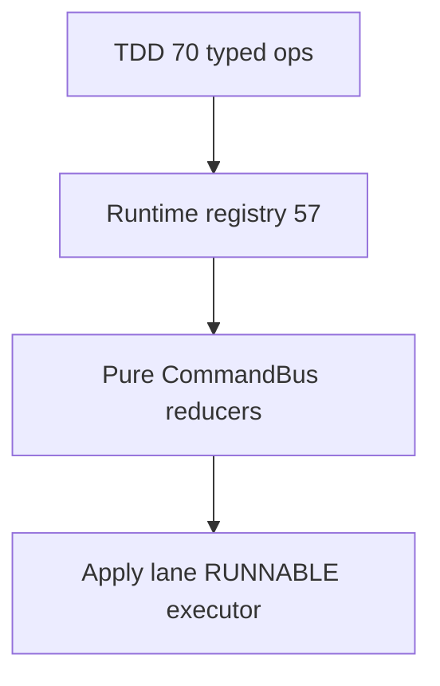

# Nagar 70 operations — Agent-3 research (measured 2026-09-24)

**Status:** Dated audit (not a living architecture page)  
**Sources:** `docs/NAGAR_70_OPERATIONS_TDD.md` (proposed catalog), `build_runtime_registry()` (implemented), apply lane (`creative/rendering/`)  
**Method:** inventory the TDD’s 7×10 catalog, dump the live registry, classify each id as registry / pure reducer / pixel-or-audio execution. No unimplemented engine is described as shipped.

**Live registry count (this checkout):** **57** operations from `build_runtime_registry()`.  
**TDD catalog:** **70** operations across seven packs.  
**Gap:** **20 vision ops never registered** (portrait + scene) **+ 3 color ops named in TDD but not in the delivery pack**. Extra registered ids that are **not** in the 70: Wave-1 `media.play` / `media.pause` / `timeline.mark` / `system.undo` and the six slideshow ops.

---

## 1. Why the TDD exists (research protocol, restated from evidence)

The TDD’s claim is not “70 FFmpeg filters”. It is: **an agent cannot operate a UI-shaped NLE**. Hidden selection, click coordinates, and account-bound models have no contract. Nagar’s answer is:

- Agent emits only `nagar.command.v1` envelopes (`operation`, typed `input`, `preconditions`, `idempotency_key`).
- Packs are data + allow-listed handlers; no free `post_install` / shell.
- Time is integer microseconds; OTIO is interchange, not the source of truth.
- Master encode is Filter IR → argv, never agent-authored shell.

That protocol is **partially implemented**: CommandBus + Pydantic inputs + permission A/B/C/D exist. Browser Preview/WebGPU/ONNX paths in the TDD are **not** in this Python runtime.

---

## 2. Three honesty layers

| Layer | What “implemented” means | Who owns it |
|---|---|---|
| L1 Registry | id is in `CapabilityRegistry`; unknown ids fail closed | `studio/capabilities.py`, pack `register_*` |
| L2 Reducer | handler mutates `Project` / history, no process | pack `operations.py` |
| L3 Instrument | pixels or samples change via the apply lane or a measured engine | `rendering/executor.py`, caption engines, slideshow encode |

Most of the 57 ids are **L1+L2**. L3 is small: slideshow render, loudnorm/duck/title/lut/trim/speed/reverse/freeze/xfade on the apply lane, proxy encode, optional `[speech]` transcribe.

`color.apply_lut` at L2 still hashes provenance onto a new `AssetRecord`. L3 `LutOp` exists (identity cube + `lut3d`) but Telegram `/grade lut` remains `unsupported_operation` (D-0011 / D-0013).

---

## 3. Pack-by-pack ledger

Legend: **R** = registered (L1), **P** = pure reducer (L2), **X** = real instrument in this repo (L3), **—** = not in registry.

### 3.1 `nexus.edit.timeline` (TDD 10)

| Operation | TDD level | Live | Notes |
|---|---|---|---|
| `timeline.split_at_playhead` | B | R+P | Wave-1 reducer |
| `timeline.trim` | B | R+P | Lane `TrimOp` can execute if bound |
| `timeline.ripple_delete` | B | R+P | State only |
| `timeline.insert_gap` | B | R+P | State only |
| `timeline.speed_ramp` | B | R+P | Lane `SpeedOp` is a single factor, not a curve |
| `timeline.reverse_segment` | B | R+P | Lane `ReverseOp` |
| `timeline.freeze_frame` | B | R+P | Lane `FreezeOp` |
| `timeline.attach_b_roll` | B | R+P | State overlay; no dual-input composite beyond xfade |
| `timeline.sync_multicam` | A | R+P | Analysis stub / project fields — not a measured A/V aligner |
| `timeline.retime_to_music` | B | R+P | Needs a real `BeatGrid`; not DSP |

Wave-1 extras: `timeline.mark`, `media.play`, `media.pause`, `system.undo` (all R+P; playback does not drive a decoder).

### 3.2 `nexus.vision.portrait` (TDD 10) — entire pack **—**

`portrait.detect_landmarks`, `smooth_skin`, `retouch_blemish`, `relight_face`, `whiten_teeth`, `correct_gaze` (C), `enhance_eyes`, `mask_hair`, `background_blur`, `stabilize_face`.

No package under `creative/packs/`. No ONNX/WebGPU in the apply-lane allow-list (architecture gate forbids `torch`/`cv2` in `rendering/`). **Do not schedule these on the FFmpeg executor.** They need a separate analysis runtime + confirmation for gaze/identity.

### 3.3 `nexus.vision.scene` (TDD 10) — entire pack **—**

`scene.segment_subject`, `remove_object`, `replace_sky`, `remove_background`, `track_object`, `track_face`, `detect_shot_boundaries`, `find_subject_moment`, `remove_logo` (C), `auto_reframe_subject`.

Same gap. `remove_logo` / `remove_object` are confirmation-grade even in the TDD; inpainting is native-heavy, not a LUT.

### 3.4 `nexus.motion.graphics` (TDD 10)

All ten **R+P**. Lane twins:

| Operation | L3 today |
|---|---|
| `motion.add_transition` | `XfadeOp` (fixed kinds) |
| `motion.add_title` | `TitleOp` + Vazirmatn; **`drawtext` missing** on imageio-ffmpeg 7.0.2 in this sandbox |
| `motion.stabilize` / `warp` / `parallax` / `particles` / `glow` / `motion_blur` / `apply_mask` / `keyframe_transform` | no lane op |

### 3.5 `nexus.audio.studio` (TDD 10)

All ten **R+P**. Lane twins: `LoudnormOp` (`audio.normalize_loudness` is **CONFIRMATION** in the live registry, TDD said B — live is stricter), `DuckOp`. Beats, stems, RNNoise, deess, EQ, stretch, vocal removal: reducers / placeholders, not measured DSP.

### 3.6 `nexus.language.caption` (TDD 10)

All ten **R**. Transcribe is L3 only with `[speech]` extra (`faster-whisper`); otherwise typed fail-closed (`caption_profile_unavailable`). ASS/SRT/RTL formatters exist as pure-ish adapters. `caption.burn_in` is CONFIRMATION; surface `burnin` still refused. Lane title-burn is not subtitle burn-in.

### 3.7 `nexus.color.delivery` (TDD 10 vs live 7)

| Operation | Live |
|---|---|
| `color.apply_lut` | R+P; L3 `LutOp` + shipped `assets/luts/identity.cube` |
| `color.adjust_exposure` | R+P; L3 `ExposureOp` |
| `color.auto_balance` | R+P |
| `color.match_shot` | R+P |
| `delivery.make_proxy_480p` | R + real proxy encode path |
| `delivery.export_otio` | R + real `.otio` document |
| `delivery.render_master_4k` | R, confirmation; not a guaranteed 4K color-managed master |
| `color.white_balance` | **—** (exposure op carries kelvin/tint instead) |
| `color.hdr_tonemap` | **—** |
| `color.deband_denoise` | **—** |

### 3.8 Slideshow (not in the 70, but live)

`slideshow.scan_assets`, `score_images`, `suggest_tone`, `compose`, `upscale`, `render` — the only end-to-end product path with a real FFmpeg master.

---

## 4. Arithmetic that must not be fudged

| Set | Count | Evidence |
|---|---:|---|
| TDD catalog | 70 | 7 packs × 10 tables in the TDD |
| Registered runtime | 57 | `build_runtime_registry()` dump 2026-09-24 |
| Portrait + scene | 20 | zero files |
| TDD color ops missing | 3 | `white_balance`, `hdr_tonemap`, `deband_denoise` |
| Extra vs TDD | 4 Wave-1 + 6 slideshow = 10 | registry |
| Check | 70 − 20 − 3 + 10 = 57 | matches live count |

---

## 5. Apply-lane contract (relevant to execution, not to the 70 names)

Implemented 2026-09-24 (D-0013): REGISTERED → RUNNABLE via probed filters; `lifecycle.py` has no `subprocess`; `executor.py` is the only process site in the apply lane.

Probed on this machine’s imageio-ffmpeg 7.0.2: `lut3d`, `loudnorm`, `eq`, `xfade`, `atempo`, `format`, `scale` present; **`drawtext` absent**. Persian title burn-in is therefore a skip, not a green fake.

---

## 6. Strongest objections (steelman) vs this repo

1. **“Registering 57 ops means 57 engines.”** False. Most handlers mint `AssetRecord` hashes. Pixel truth is the lane + slideshow encode + optional ASR.
2. **“Port the 20 vision ops into FFmpeg.”** Wrong tool. Segmentation/inpaint/gaze need an analysis runtime and C-level confirmation; the lane forbid-list exists to keep encode lean.
3. **“WebGPU preview is in the TDD so it must be in CI.”** This codebase is a Python modular monolith + Telegram/API. Browser preview is an unbuilt product surface.
4. **“WhisperX in the browser.”** TDD already rejects this; live path is local `[speech]` or fail-closed.

---

## 7. Recommended build order (enterprise, not a wishlist)

1. Keep L1 completeness tests (`pending=0` after activate) — already a gate.
2. Publish an **execution matrix** (this audit) as the coverage ledger; fail CI if a doc claims L3 without a test that runs a binary.
3. Wire `/grade lut` only after surface mapper + identity-LUT proof (D-0011 reopen).
4. CI FFmpeg with freetype for `drawtext` / `caption.burn_in`.
5. Do not start portrait/scene until a signed ONNX pack + SubjectRef confidence policy exists.
6. Split `audio.normalize_loudness` docs: TDD B vs live C — pick one and ratchet it.
7. Replace hash-only LUT reducer with optional bind to `LutOp` when a cube is staged.
8. `timeline.sync_multicam` / `detect_beats`: either implement measured analysis or rename to `*.plan_*` so agents cannot believe they ran DSP.
9. Freeze “70” as a TDD number; the product metric is **57 registered / N executed**.
10. Sequence: (a) surface honesty, (b) caption burn-in on a freetype binary, (c) audio DSP opt-in pack, (d) vision packs last.

---

## 8. What this research is not

It is not an implementation of the 20 vision operations.  
It is not a claim that WebGPU/WASM preview exists in NEXUS.  
It is not a replacement for `docs/NAGAR_70_OPERATIONS_TDD.md` (that file remains the proposed design).
