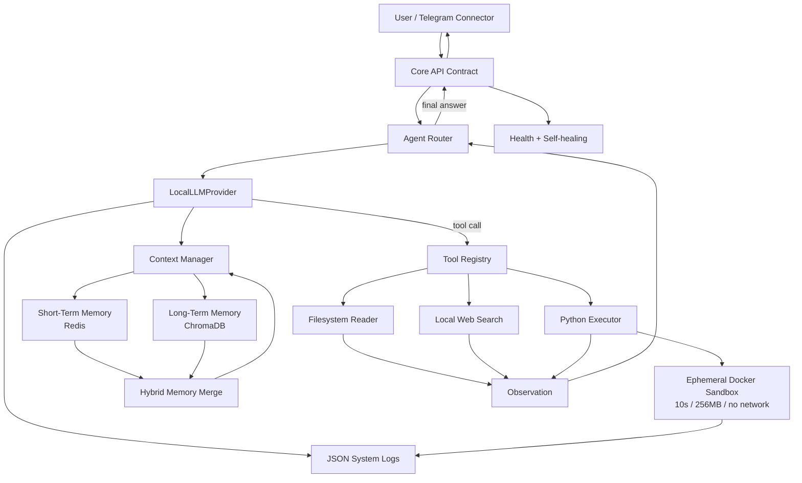

# NEXUS Platform — ساختار فازهای ۲ و ۳

## ساختار دایرکتوری

```text
src/nexus_ai_agent/
├── core/
│   ├── domain/                 # مدل‌ها و قوانین مستقل از provider
│   ├── ports/                  # Protocolهای LLM، memory، tools و connectors
│   ├── services/               # use-caseهای سطح دامنه
│   └── errors.py               # خطاهای طبقه‌بندی‌شده و قابل retry
├── llm/
│   ├── provider.py             # قرارداد legacy فعلی؛ برای سازگاری حفظ می‌شود
│   ├── schemas.py              # Pydantic request/response/tool schemas
│   ├── backends.py             # Backendهای llama.cpp و Ollama
│   ├── context.py              # محاسبه بودجه و truncate امن context
│   ├── local_provider.py       # LocalLLMProvider و fallback policy
│   └── fake_backend.py         # backend سریع مخصوص تست
├── memory/
│   ├── short_term.py           # Redis session state
│   ├── long_term.py            # Chroma persistent store
│   ├── embeddings.py           # sentence-transformers local adapter
│   └── manager.py              # hybrid recall و merge نتایج
├── knowledge/
│   ├── document_processor.py   # متن/PDF، chunking و ingestion
│   └── loaders.py
├── tools/
│   ├── base.py                 # schema و قرارداد ابزار
│   ├── registry.py             # ثبت و lookup ابزارها
│   ├── python_executor.py     # اجرای Python داخل container موقت
│   ├── web_search.py           # SearXNG یا DuckDuckGo رایگان
│   └── filesystem.py           # مسیر امن و ضد path traversal
├── sandbox/
│   ├── container_runtime.py    # docker-sdk adapter
│   └── limits.py               # timeout، memory و network policy
├── orchestrator/
│   ├── react_loop.py           # Thought/Action/Observation/Answer
│   ├── router.py               # routing به agent تخصصی
│   ├── strategies.py           # Strategyهای orchestration
│   └── retry.py                # self-correction حداکثر ۳ بار
└── observability/
    ├── logging.py              # JSON logs
    ├── health.py               # liveness/readiness
    └── metrics.py
```

## جریان داده



## قرارداد LocalLLMProvider

`LocalLLMProvider` فقط orchestration providerها، بودجه context و fallback را مدیریت می‌کند. Backendها از طریق Protocol تزریق می‌شوند؛ بنابراین تست‌ها به `llama-cpp-python` یا Ollama نیاز ندارند و هسته به API پولی وابسته نیست.

ترتیب انتخاب backend به‌صورت صریح است: ابتدا GGUF محلی با llama.cpp، سپس Ollama در صورت فعال بودن و در نهایت خطای طبقه‌بندی‌شده. fallback فقط برای خطاهای زیرساختی مجاز است؛ خطای اعتبارسنجی درخواست نباید مخفی شود. streaming نیز از همان مسیر context management استفاده می‌کند.

## ملاحظات واقع‌گرایانه

Function calling در llama.cpp و Ollama به قالب مدل وابسته است؛ provider در این قدم schema استاندارد OpenAI-like تولید می‌کند، اما adapter backend مسئول تبدیل نهایی به قالب مدل است. این کار از hardcode کردن یک prompt فرمت خاص جلوگیری می‌کند. خلاصه‌سازی واقعی بدون یک مدل دوم ممکن نیست؛ بنابراین قدم اول truncate امن و deterministic است و summarization در فاز حافظه با یک strategy جدا اضافه می‌شود.
