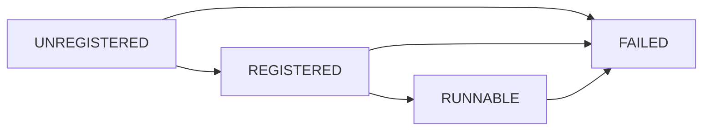

# Apply-lane lifecycle (REGISTERED → RUNNABLE)

**Status:** Living runbook — describes the implemented lane, not an aspiration  
**Code:** `src/nexus_ai_agent/creative/rendering/{lifecycle,executor,compiler,ir}.py`  
**Gates:** `tests/architecture/test_rendering_lane_boundary.py`, `tests/unit/test_apply_lane_lifecycle.py`, `tests/unit/test_apply_lane_lut_and_burnin.py`

## States

| State | Meaning | Encode |
|---|---|---|
| UNREGISTERED | no binary recorded | forbidden |
| REGISTERED | path exists as a file; filters not applied | forbidden |
| RUNNABLE | required filters observed on that binary | allowed |
| FAILED | registration or probe failed; terminal | forbidden |

Illegal transitions raise `LaneLifecycleError`.

## Boundary

- `lifecycle.py` — states, transitions, shipped fixture paths. No `subprocess`.
- `executor.py` — the only process site: `ffmpeg -filters`, loudness measure, encode. `shell=False`, one timeout, staging `.part` + atomic rename, unlink on failure.
- Compiler remains pure (argv + filtergraph).

## Required filters (probed, never assumed)

`drawtext`, `eq`, `lut3d`, `loudnorm`, `xfade`, `atempo`, `format`, `scale`.

## Fixtures

| Asset | Path | Use |
|---|---|---|
| Identity 2×2×2 CUBE | `assets/luts/identity.cube` | `LutOp` / `lut3d` proof |
| Vazirmatn | `assets/fonts/Vazirmatn.ttf` | Persian `TitleOp` / `drawtext` proof |

## Failure semantics

- Missing binary → FAILED (`fail_unregistered`).
- Missing required filter → FAILED (`apply_probe`).
- Encode with REGISTERED or FAILED runtime → `LaneLifecycleError`.
- FFmpeg non-zero or timeout → `LaneExecutionError`; staging file removed; destination untouched unless `overwrite=True` after a successful publish.
- Telegram `/grade lut` is still `unsupported_operation` at the surface. The lane op exists; the surface mapper is not claimed here.

## Test strategy

- Lifecycle: illegal transitions, encode-before-RUNNABLE, real `activate_runtime`.
- Architecture: AST ratchet (subprocess attribute loads only in `executor.py`).
- Instrument proofs: real identity-LUT encode and Persian burn-in through `render_lane`.
