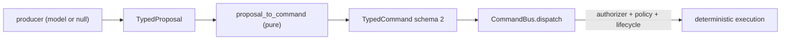

# Model-Optional Cognition Boundary

Status: **IMPLEMENTED + VERIFIED** (unit + adversarial + architecture tests).
Not ARTIFACT-PROVEN and not PRODUCTION-PROVEN — see the honest limits below.

## Why

On `main` @ `e5b326b`, the deterministic substrate is strong: the
`CommandBus` validates, authorizes and atomically applies typed commands;
the capability registry is the only allow-list; the pack lifecycle gate is
fail-closed; the job lifecycle has fencing tokens and an independent
artifact verifier. What is missing is a *reasoning* boundary: the only model
surface is `LLMProvider.generate(prompt) -> str`
(`src/nexus_ai_agent/llm/provider.py:6`), which returns free text with no
type, no refusal, no budget and no authority separation.

Nagar must be **model-optional, not model-dependent**: with no model it must
still execute deterministic transforms, known recipes and rules, and must
answer an explicit refusal for what truly needs cognition — never fabricate
and never crash.

## The contract

```text
propose(context, schema, budget) -> TypedProposal | Refusal
```

Implemented in `src/nexus_ai_agent/nagar/cognition/`:

| Concern | Module | Guarantee |
|---|---|---|
| Context / schema / budget | `context.py` | authority-free; finite JSON only |
| Typed proposal + refusal | `proposal.py` | `parse_proposal` fails closed, never raises on bad output |
| The port | `port.py` | one async method, typed return |
| Null provider | `null.py` | always refuses, never fabricates (Model Kill Test) |
| Proposal → command | `bridge.py` | pure; builds a *candidate* schema-2 command |
| Deterministic router | `router.py` | pure, reason-coded, never grants authority |

## The five invariants (each has a test)

1. **Typed** — the return is `TypedProposal | Refusal`, never `Any`
   (`tests/unit/test_cognition_boundary.py`).
2. **Schema-versioned** — an unknown `schema_version` is refused, never
   coerced (`test_unknown_schema_version_is_refused_not_coerced`).
3. **Provenance-carrying** — every result names its producer
   (`ProposalProvenance`).
4. **Explicit refusal** — `NullCognition` returns a refusal with a stable
   reason code (`test_null_cognition_always_refuses_and_never_fabricates`).
5. **Authority-free** — authority fields are refused by name; the bridge
   builds a schema-2 command that still needs the trusted authorizer
   (`test_authority_fields_are_refused_by_name`,
   `test_bridge_builds_a_schema2_command_without_self_granted_authority`).

## Model Kill Test

With every provider disabled (only `NullCognition` installed), the cognition
boundary stays alive and returns refusals. This proves **infrastructure/model
separation** for the reasoning seam. It does **not** prove open-ended
creativity, and it does not exercise the deterministic execution paths
themselves (those are already proven separately by the studio/job suites).

## Authority direction



The producer is upstream of authority and can never be a substitute for it.
`creative.studio` never imports `nagar` — the dependency points one way
(enforced by `tests/architecture/test_cognition_isolation.py`).

## Deterministic router

Cheapest-first, pure, reason-coded: `L0_recipe → L1_deterministic →
L2_local_model → L3_cloud_model → L4_human`. High risk or budget exhaustion
can only *lower* the level; the router never escalates past the caller's
ceiling, never calls a model to decide, and returns `blocked` when nothing
eligible exists and no human is available.

## LocalCognition (model-backed producer)

`LocalCognition` (`src/nexus_ai_agent/nagar/cognition/adapter.py`) is the one
place that talks to a language model. It reuses the existing provider contract
structurally (`async generate(prompt, system) -> str`), so any
`nexus_ai_agent.llm.provider.LLMProvider` plugs in with no second abstraction,
and the cognition package never imports the heavy `llm` package initialiser.

It is fail-closed and bounded: the provider's untrusted text goes straight into
`parse_proposal`; a wall-clock deadline (`asyncio.wait_for`) and at most
`budget.max_attempts` attempts bound every call; every provider error, timeout,
oversized, empty or malformed response ends as an explicit `Refusal` with a
stable reason code. The adapter cannot dispatch, authorize, touch the
filesystem or run a shell — a `TypedProposal` is not executable.

`CognitionObserver` records only *stages* (counts), never prompt or response
content. Token accounting is intentionally absent: the provider contract
exposes no usage field (`LLMProvider.generate` returns `str`), so no token
number is fabricated.

Trusted provenance: `parse_proposal(..., provenance=...)` injects the caller's
trusted origin and **overrides** any provenance in the model payload, so a
producer cannot forge its origin or impersonate the null producer.

## Honest limits

- **`LocalCognition` is implemented and tested; no concrete production
  `LLMProvider` is bound to it in a runtime composition root yet.** Binding a
  live provider (and choosing it via the router) is the next integration step;
  the adapter itself is done and exercised end-to-end against a fake provider
  (only external model behaviour is faked).
- **No provider adapter is wired into the bot/worker runtime.** The boundary is
  implemented and tested with `NullCognition` and `LocalCognition`; wiring a
  live cognition producer into a bot surface is deferred (see
  `nagar_overnight/ARENA_HANDOFF.md`).
- **No recipe crystallization is active.** The router has an `L0_recipe`
  level, but nothing activates a recipe: that requires independent evidence
  (see the mission's activation rules) and is explicitly deferred.
- **No causal project graph / passport.** Those remain NOT-FOUND on main and
  are recorded as the next high-leverage work, not built overnight.
