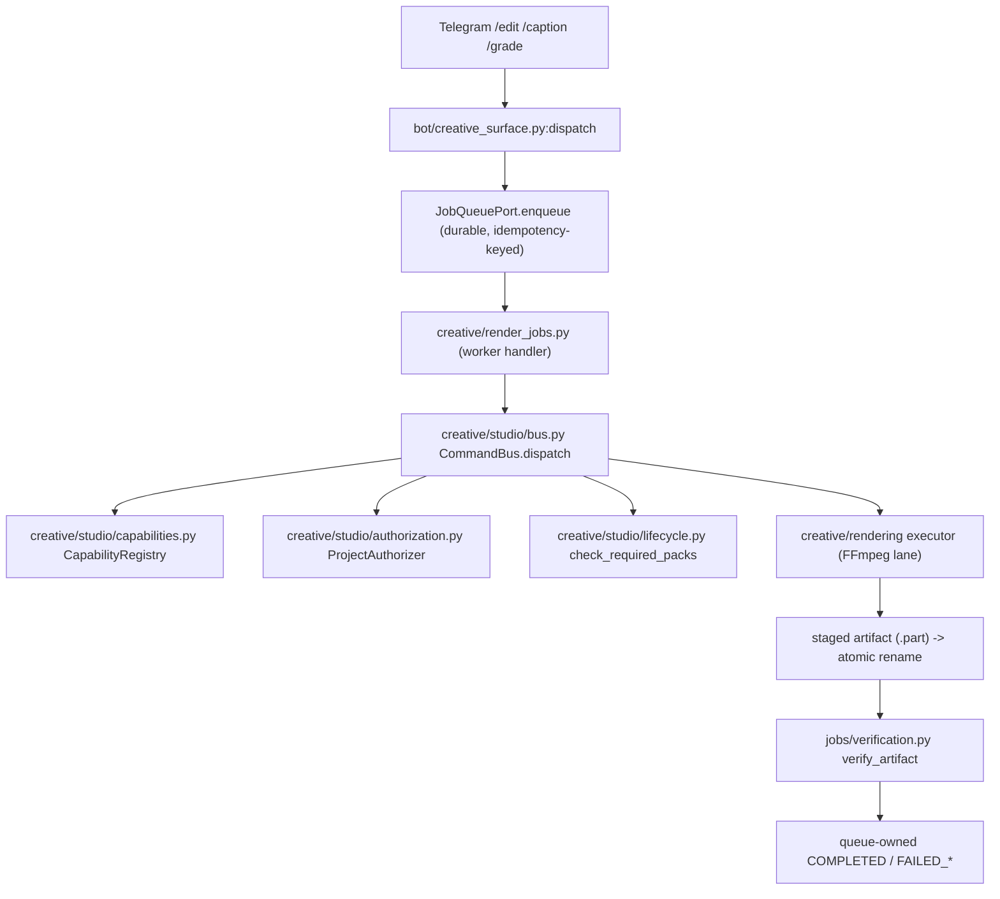

# RECON — Nagar live architecture reconnaissance (overnight/nagar-20261004)

Read-only reconnaissance of `main` @ `e5b326b2eaf691a638d030ad57acf1ce60016ef0`
(the historical main SHA quoted in the mission is **still live**). Every
claim below carries a `file:line` anchor that was read from the tree, not
inferred from a name.

Scope note: this is a *record* of what was inspected. It is not an
architecture page; the durable design lives in
[MODEL_OPTIONAL.md](MODEL_OPTIONAL.md).

## A. Current topology (real call graph, not folders)

The canonical one-shot creative chain, as actually wired:

Evidence:

- surface entry: `src/nexus_ai_agent/bot/creative_surface.py:1` (module docstring
  names the full chain) and the `job_queue.enqueue(...)` call in
  `build_creative_handlers`.
- worker: `src/nexus_ai_agent/creative/render_jobs.py:224-227` imports
  `CommandBus` and builds it; the module docstring at line 1 spells the chain.
- bus: `src/nexus_ai_agent/creative/studio/bus.py:149` (`class CommandBus`),
  `dispatch` at line 197.
- registry: `src/nexus_ai_agent/creative/studio/capabilities.py:159`
  (`class CapabilityRegistry`), `build_wave1_registry` at line 503.
- authorizer: `src/nexus_ai_agent/creative/studio/authorization.py:33`
  (`class ProjectAuthorizer(Protocol)`).
- pack lifecycle gate: `src/nexus_ai_agent/creative/studio/lifecycle.py:149`
  (`check_required_packs`), called from `bus.py:248`.
- render lane: `src/nexus_ai_agent/creative/rendering/executor.py:159`
  (`produced_by: nagar.local.apply-lane.v1`); FFmpeg subprocess in
  `src/nexus_ai_agent/creative/ffmpeg_executor.py`.
- verifier: `src/nexus_ai_agent/jobs/verification.py:168` (`verify_artifact`),
  `default_media_probe` at line 149.

## B. Direct model calls

The model surface on `main` is the legacy `LLMProvider` ABC, **not** a
cognition boundary:

| Provider | File:line | Responsibility |
|---|---|---|
| `LLMProvider` (ABC) | `src/nexus_ai_agent/llm/provider.py:6` | `generate()` / `embed()` |
| `GeminiProvider` | `src/nexus_ai_agent/llm/gemini_provider.py:18` | cloud text |
| `LiteLLMRoutingProvider` | `src/nexus_ai_agent/llm/litellm_provider.py` | multi-provider routing |
| `LocalLlamaServerProvider` | `src/nexus_ai_agent/llm/local_server_provider.py:36` | local HTTP model |
| `FallbackProvider` | `src/nexus_ai_agent/llm/fallback_provider.py:30` | degrade on rate limit |
| `FakeLLMProvider` | `src/nexus_ai_agent/llm/fake_llm.py:8` | test double |

Direct call sites (unmediated by any port): `agents/chat_agent.py:13`,
`agents/qwen_agent.py:26`, `agents/gemma_agent.py:32`, `agents/phi_agent.py:27`,
`memory/short_term.py:20`, `agents/store/base_agent.py:29`.

Honest finding: the provider ABC is `generate(prompt) -> str`. There is **no
typed proposal, no refusal, no budget, no schema and no authority separation**
at this boundary. This is exactly the gap the mission's cognition port
addresses.

## C. Duplicate reasoning / D. duplicate context / E. duplicate memory

- Reasoning: two orchestration styles coexist — a LangGraph planner/executor
  (`orchestration/graph.py:48,185`) and the deterministic pack
  `plan_slideshow` (`creative/packs/slideshow/planning.py:211`). They do not
  share a context type.
- Memory: `memory/long_term.py:10` and `memory/short_term.py:6` are separate;
  checkpoint lineage is tracked independently in
  `storage/checkpoint_adapter.py:156` (`verify_lineage`).
- Context: each feature module builds its own prompt context; there is no
  single "governed shared context" object on `main`.

## F. Hidden authority

Authority is *explicit* in the studio core (good): the bus refuses an actor
claim without an authorizer (`bus.py:234-241`), the pack gate runs after the
actor grant (`bus.py:248`), and `allow_experimental` is composition-root
state, never an envelope field (`bus.py:165-168`). The **hidden** authority
risk is upstream: the legacy LLM call sites return free text that a caller
could treat as a decision. The mission's "never MODEL → EXECUTION" rule is
enforced for the studio path (a command must pass the bus) but is not
structurally enforced for the legacy chat/agent paths.

## G. Parallel execution paths

- Canonical: durable queue → worker → CommandBus → lane → verifier.
- Legacy: direct in-process `/creative/*` HTTP lane (the board's task-173
  records this as scheduled for removal under D-0010).
- Legacy: `creative/ffmpeg_executor.py` builds its own FFmpeg command from a
  `VideoEditPlan`, parallel to the canonical rendering lane.

## H. In-memory-only state

`CommandBus` state, `_history` and `_idempotency` are per-bus in-memory
(`bus.py:171-174`; the docstring at line 40 is explicit: reservations "do not
claim cross-process or cross-restart durability"). Durable identity lives in
the job row (`jobs/lifecycle.py`).

## I. Fragmentation scoring (highest-value candidates)

| Fragmentation | Merge value | Risk | Evidence | Disposition |
|---|---|---|---|---|
| Legacy LLM call sites vs a typed boundary | 4 | 3 | §B above | **Additive cognition port** (this session) |
| Two FFmpeg paths (`ffmpeg_executor` vs rendering lane) | 3 | 4 | §G | Defer (touches working capability) |
| LangGraph planner vs pack planner | 3 | 4 | §C | Defer (separate zones) |
| Long-term vs short-term memory | 2 | 3 | §E | Defer |

## J. Cognitive Cell candidates (top 5)

1. **Cognition boundary** — context + schema + budget + typed proposal +
   refusal + null provider. Highest value, lowest risk, purely additive.
2. **Causal project graph** — project → … → artifact → verification →
   receipt. High value, needs durable storage design.
3. **Artifact passport** — a projection over §2 evidence. Depends on §2.
4. **Deterministic reactor** — Event → Rule → Action. Depends on an event log.
5. **Model gateway** — one path to any provider behind the cognition port.

## K. KEEP SEPARATE (non-negotiable)

- **Judgment / verification** (`jobs/verification.py`) — the producer must
  never be the sole judge; keep the queue-owned independent verifier.
- **Policy / authority** (`studio/authorization.py`, `studio/lifecycle.py`) —
  never merged into cognition.
- **Execution fencing** (`jobs/lifecycle.py` fencing token) — keep.
- **Project/tenant isolation** (bus `target.project_id` check) — keep.
- **Security trust roots** (`creative/packs/trust.py`, `ed25519.py`) — keep.

## What is FOUND / NOT-FOUND on main

| Item | Status | Evidence |
|---|---|---|
| CommandBus | FOUND-ON-MAIN | `studio/bus.py:149` |
| Capability registry | FOUND-ON-MAIN | `studio/capabilities.py:159` |
| authorization / authorizer | FOUND-ON-MAIN | `studio/authorization.py:33` |
| FFmpeg render lane | FOUND-ON-MAIN | `creative/rendering/executor.py`, `ffmpeg_executor.py` |
| independent verification | FOUND-ON-MAIN | `jobs/verification.py:168` |
| probe / hash | FOUND-ON-MAIN | `slideshow/ffmpeg.py:543,572` |
| durable jobs / attempts / fencing | FOUND-ON-MAIN | `jobs/lifecycle.py:141` |
| `timeline.trim` | FOUND-ON-MAIN | `creative/packs/edit/models.py:29`, `operations.py:61` |
| Artifact passport | NOT-FOUND | zero references |
| lineage (artifact) | NOT-FOUND (only checkpoint lineage) | `storage/checkpoint_adapter.py:156` |
| Project graph | NOT-FOUND | zero references |
| Assurance plane | NOT-FOUND | zero references |
| cognition / typed proposal / refusal / budget | NOT-FOUND | zero references |
| model adapters (as a gateway) | NOT-FOUND (only legacy provider ABC) | `llm/provider.py:6` |
| reactor / event bus | NOT-FOUND | zero references |
